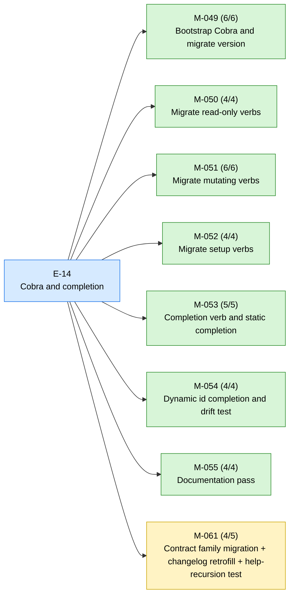
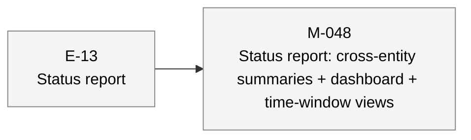

# aiwf status — 2026-05-07

_129 entities · 0 errors · 0 warnings_

## In flight

### E-14 — Cobra and completion _(active)_

- ✓ **M-049** — Bootstrap Cobra and migrate version _(done)_ — ACs 6/6 met
- ✓ **M-050** — Migrate read-only verbs _(done)_ — ACs 4/4 met
- ✓ **M-051** — Migrate mutating verbs _(done)_ — ACs 6/6 met
- ✓ **M-052** — Migrate setup verbs _(done)_ — ACs 4/4 met
- ✓ **M-053** — Completion verb and static completion _(done)_ — ACs 5/5 met
- ✓ **M-054** — Dynamic id completion and drift test _(done)_ — ACs 4/4 met
- ✓ **M-055** — Documentation pass _(done)_ — ACs 4/4 met
- → **M-061** — Contract family migration + changelog retrofill + help-recursion test _(in_progress)_ — ACs 4/5 met (1 open)

## Roadmap

### E-13 — Status report _(proposed)_

- **M-048** — Status report: cross-entity summaries + dashboard + time-window views _(draft)_

## Open decisions

_(none)_

## Open gaps

| ID | Title | Discovered in |
|----|-------|---------------|
| G-022 | Provenance model extension surface |  |
| G-023 | Delegated \`--force\` via \`aiwf authorize --allow-force\` |  |

## Warnings

_(none)_

## Recent activity

| Date | Actor | Verb | Detail |
|------|-------|------|--------|
| 2026-05-07 | human/peter | promote | aiwf promote M-061/AC-3 open -> met |
| 2026-05-07 | human/peter | promote | aiwf promote M-061/AC-2 open -> met |
| 2026-05-07 | human/peter | promote | aiwf promote M-061/AC-1 open -> met |
| 2026-05-07 | human/peter | promote | aiwf promote M-061 draft -> in_progress |
| 2026-05-07 | human/peter | add | aiwf add ac M-061 AC-1..AC-5 (5 criteria) |

