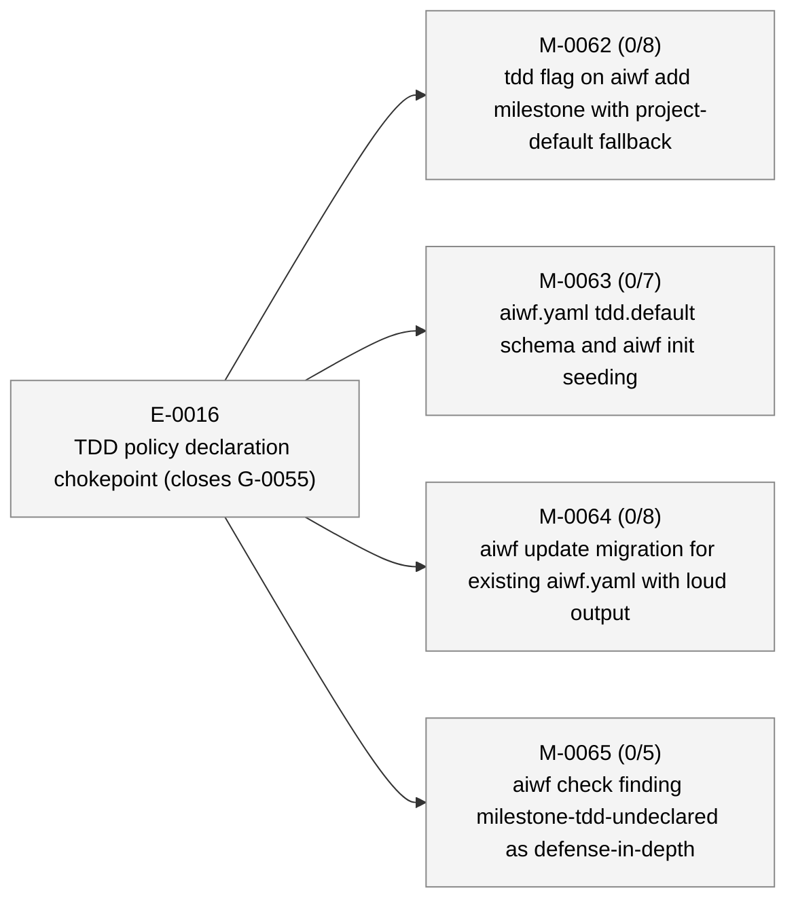
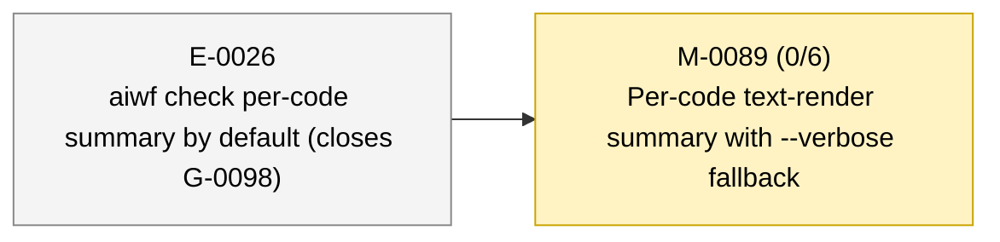

# aiwf status — 2026-05-11

_221 entities · 0 errors · 185 warnings · run `aiwf check` for details_

> Sweep pending: 176 terminal entities not yet archived (run `aiwf archive --dry-run` to preview)

## In flight

_(no active epics)_

## Roadmap

### E-0016 — TDD policy declaration chokepoint (closes G-0055) _(proposed)_

- **M-0062** — tdd flag on aiwf add milestone with project-default fallback _(draft)_ — ACs 0/8 met (8 open) — tdd: required
- **M-0063** — aiwf.yaml tdd.default schema and aiwf init seeding _(draft)_ — ACs 0/7 met (7 open) — tdd: required
- **M-0064** — aiwf update migration for existing aiwf.yaml with loud output _(draft)_ — ACs 0/8 met (8 open) — tdd: required
- **M-0065** — aiwf check finding milestone-tdd-undeclared as defense-in-depth _(draft)_ — ACs 0/5 met (5 open) — tdd: required

### E-0019 — Parallel TDD subagents with finding-gated AC closure _(proposed)_

_(no milestones)_

### E-0025 — Test-suite parallelism and fixture-sharing pass — closes G-0097 _(proposed)_

_(no milestones)_

### E-0026 — aiwf check per-code summary by default (closes G-0098) _(proposed)_

- → **M-0089** — Per-code text-render summary with --verbose fallback _(in_progress)_ — ACs 0/6 met (6 open) — tdd: required

## Open decisions

| ID | Kind | Title | Status |
|----|------|-------|--------|
| ADR-0001 | adr | Mint entity ids at trunk integration via per-kind inbox state | proposed |
| ADR-0005 | adr | Verb hygiene contract: complete, consistent, pre-flighted aiwf verbs | proposed |

## Open gaps

| ID | Title | Discovered in |
|----|-------|---------------|
| G-0022 | Provenance model extension surface |  |
| G-0023 | Delegated \`--force\` via \`aiwf authorize --allow-force\` |  |
| G-0059 | Branch model: no canonical mapping from entity hierarchy to git branches; epic/milestone work lands on whichever branch is current | M-0069 |
| G-0060 | Patch ritual is loosely defined; no kernel-level rules for shape, scope, branch, or audit trail |  |
| G-0063 | No defined start-epic ritual: epic activation is a deliberate sovereign act with preflight + optional delegation, but kernel treats it as a one-line FSM flip |  |
| G-0067 | wf-tdd-cycle is LLM-honor-system advisory; under load the LLM bypasses RED-first and the branch-coverage HARD RULE without anything mechanical catching it (M-0066/AC-1 cycle wrote ~165 lines of impl before any test existed) | M-0066 |
| G-0068 | Discoverability policy misses dynamic finding subcodes | M-0066 |
| G-0069 | aiwf init's printRitualsSuggestion hardcodes the CLI install form, which defaults to user scope and won't satisfy doctor.recommended_plugins; nudge silently steers fresh operators away from project-scope outcome | M-0070 |
| G-0070 | aiwf doctor has no --format=json envelope; M-0070's recommended-plugin-not-installed finding-code surfaces only as human text. Add JSON envelope when a JSON-consuming caller appears | M-0070 |
| G-0073 | depends_on is restricted to milestone→milestone edges; cross-kind blocking lives in body prose only; subsumes G-0072 in scope | E-0021 |
| G-0074 | docs/pocv3/ body prose still uses PoC framing; needs sweep |  |
| G-0075 | docs/pocv3/ directory naming is now historical; rename or accept |  |
| G-0076 | CONTRIBUTING.md describes PR-based workflow at odds with trunk-based model on main |  |
| G-0077 | Post-promotion working paper (aiwf's thesis) not yet written |  |
| G-0078 | No priority field on entities; backlog isn't filterable or sortable by importance |  |
| G-0079 | aiwfx-plan-milestones plugin skill needs --depends-on documentation; M-0076 added the verb but the plugin lives in ai-workflow-rituals upstream | M-0076 |
| G-0080 | Wide-table verbs wrap mid-row and break column scan; no TTY-aware sizing, glyph palette, or truncation surface | M-0076 |
| G-0081 | aiwf rename does not pre-flight trunk-collision check | E-0021 |
| G-0082 | Planning closure should default-merge to main before implementation begins | E-0021 |
| G-0083 | aiwf retitle does not sync entity body H1 with frontmatter title | E-0021 |
| G-0084 | Verb hygiene contract is undocumented; G-0081/G-0082/G-0083 lack umbrella | E-0021 |
| G-0087 | no aiwf-show embedded skill; show is the per-entity inspection verb every AI reaches for, but --help-only coverage misses body-rendering and composite-id discovery | M-0074 |
| G-0088 | Skill-coverage policy walks internal/skills/embedded/ only; plugin skills (aiwf-extensions/skills/aiwfx-*) are not policed by the kernel — equivalent invariants must be re-applied per-skill in test code as M-0079 did | M-0079 |
| G-0090 | AC-8 materialisation drift-check has three branches not unit-tested; refactor lookup to take cache root as parameter for hermetic testing with synthetic temp dirs | M-0079 |
| G-0091 | No preventive check for body-prose path-form refs to entity files; archive-move drift surfaces only via post-hoc CI link-check, after the break has already shipped |  |
| G-0092 | No documented hierarchy of doc authority across docs/; LLMs and humans cannot tell normative from exploratory from archival without reading every file |  |
| G-0097 | Test-suite wall time dominated by serial execution and per-test fixture setup; internal/verb spike shows ~4× headroom |  |
| G-0098 | aiwf check default output dumps every leaf finding; per-code summary + --verbose would make the surface scannable, especially when an aggregate finding (e.g. archive-sweep-pending) already covers N leaves | M-0086 |

## Warnings

| Code | Entity | Path | Message |
|------|--------|------|---------|
| entity-body-empty | M-0089/AC-1 | work/epics/E-0026-aiwf-check-per-code-summary-by-default-closes-g-0098/M-0089-per-code-text-render-summary-with-verbose-fallback.md | M-0089/AC-1 body under \`### AC-1\` is empty |
| entity-body-empty | M-0089/AC-2 | work/epics/E-0026-aiwf-check-per-code-summary-by-default-closes-g-0098/M-0089-per-code-text-render-summary-with-verbose-fallback.md | M-0089/AC-2 body under \`### AC-2\` is empty |
| entity-body-empty | M-0089/AC-3 | work/epics/E-0026-aiwf-check-per-code-summary-by-default-closes-g-0098/M-0089-per-code-text-render-summary-with-verbose-fallback.md | M-0089/AC-3 body under \`### AC-3\` is empty |
| entity-body-empty | M-0089/AC-4 | work/epics/E-0026-aiwf-check-per-code-summary-by-default-closes-g-0098/M-0089-per-code-text-render-summary-with-verbose-fallback.md | M-0089/AC-4 body under \`### AC-4\` is empty |
| entity-body-empty | M-0089/AC-5 | work/epics/E-0026-aiwf-check-per-code-summary-by-default-closes-g-0098/M-0089-per-code-text-render-summary-with-verbose-fallback.md | M-0089/AC-5 body under \`### AC-5\` is empty |
| entity-body-empty | M-0089/AC-6 | work/epics/E-0026-aiwf-check-per-code-summary-by-default-closes-g-0098/M-0089-per-code-text-render-summary-with-verbose-fallback.md | M-0089/AC-6 body under \`### AC-6\` is empty |
| entity-body-empty | G-0098 | work/gaps/G-0098-aiwf-check-default-output-dumps-every-leaf-finding-per-code-summary-verbose-would-make-the-surface-scannable-especially-when-an-aggregate-finding-e-g-archive-sweep-pending-already-covers-n-leaves.md | G-0098 body section \`## What's missing\` is empty |
| entity-body-empty | G-0098 | work/gaps/G-0098-aiwf-check-default-output-dumps-every-leaf-finding-per-code-summary-verbose-would-make-the-surface-scannable-especially-when-an-aggregate-finding-e-g-archive-sweep-pending-already-covers-n-leaves.md | G-0098 body section \`## Why it matters\` is empty |
| terminal-entity-not-archived | ADR-0002 | docs/adr/ADR-0002-test-dry-run-delete-me.md | entity ADR-0002 has terminal status 'rejected' but file is still in the active tree; awaiting \`aiwf archive --apply\` sweep |
| terminal-entity-not-archived | M-0001 | work/epics/E-0001-foundations-and-aiwf-check/M-0001-session-1-deliverable-aiwf-check-end-to-end.md | entity M-0001 has terminal status 'done' but file is still in the active tree; awaiting \`aiwf archive --apply\` sweep |
| terminal-entity-not-archived | E-0001 | work/epics/E-0001-foundations-and-aiwf-check/epic.md | entity E-0001 has terminal status 'done' but file is still in the active tree; awaiting \`aiwf archive --apply\` sweep |
| terminal-entity-not-archived | M-0002 | work/epics/E-0002-mutating-verbs-and-commit-trailers/M-0002-session-2-deliverable-mutating-verbs-structured-trailers.md | entity M-0002 has terminal status 'done' but file is still in the active tree; awaiting \`aiwf archive --apply\` sweep |
| terminal-entity-not-archived | E-0002 | work/epics/E-0002-mutating-verbs-and-commit-trailers/epic.md | entity E-0002 has terminal status 'done' but file is still in the active tree; awaiting \`aiwf archive --apply\` sweep |
| terminal-entity-not-archived | M-0003 | work/epics/E-0003-skills-history-hooks/M-0003-session-3-deliverable-skills-history-hooks.md | entity M-0003 has terminal status 'done' but file is still in the active tree; awaiting \`aiwf archive --apply\` sweep |
| terminal-entity-not-archived | E-0003 | work/epics/E-0003-skills-history-hooks/epic.md | entity E-0003 has terminal status 'done' but file is still in the active tree; awaiting \`aiwf archive --apply\` sweep |
| terminal-entity-not-archived | M-0004 | work/epics/E-0004-polish-for-real-use/M-0004-session-4-deliverable-polish-doctor-render.md | entity M-0004 has terminal status 'done' but file is still in the active tree; awaiting \`aiwf archive --apply\` sweep |
| terminal-entity-not-archived | E-0004 | work/epics/E-0004-polish-for-real-use/epic.md | entity E-0004 has terminal status 'done' but file is still in the active tree; awaiting \`aiwf archive --apply\` sweep |
| terminal-entity-not-archived | M-0005 | work/epics/E-0005-adoption-surface/M-0005-session-5-deliverable-import-dry-run-skip-hook.md | entity M-0005 has terminal status 'done' but file is still in the active tree; awaiting \`aiwf archive --apply\` sweep |
| terminal-entity-not-archived | E-0005 | work/epics/E-0005-adoption-surface/epic.md | entity E-0005 has terminal status 'done' but file is still in the active tree; awaiting \`aiwf archive --apply\` sweep |
| terminal-entity-not-archived | M-0006 | work/epics/E-0006-iteration-i1-contracts/M-0006-i1-1-aiwfyaml-package-parse-validate-round-trip-the-contracts-block.md | entity M-0006 has terminal status 'done' but file is still in the active tree; awaiting \`aiwf archive --apply\` sweep |
| terminal-entity-not-archived | M-0007 | work/epics/E-0006-iteration-i1-contracts/M-0007-i1-2-narrow-contract-entity-drop-format-artifact-status-set-proposed-accepted-deprecated-retired-rejected.md | entity M-0007 has terminal status 'done' but file is still in the active tree; awaiting \`aiwf archive --apply\` sweep |
| terminal-entity-not-archived | M-0008 | work/epics/E-0006-iteration-i1-contracts/M-0008-i1-3-contractverify-package-verify-evolve-passes-substitution-runner-result-reclassification.md | entity M-0008 has terminal status 'done' but file is still in the active tree; awaiting \`aiwf archive --apply\` sweep |
| terminal-entity-not-archived | M-0009 | work/epics/E-0006-iteration-i1-contracts/M-0009-i1-4-contractcheck-package-structural-correspondence-between-bindings-and-tree.md | entity M-0009 has terminal status 'done' but file is still in the active tree; awaiting \`aiwf archive --apply\` sweep |
| terminal-entity-not-archived | M-0010 | work/epics/E-0006-iteration-i1-contracts/M-0010-i1-5-aiwf-contract-bind-unbind-verbs-aiwf-add-contract-validator-schema-fixtures.md | entity M-0010 has terminal status 'done' but file is still in the active tree; awaiting \`aiwf archive --apply\` sweep |
| terminal-entity-not-archived | M-0011 | work/epics/E-0006-iteration-i1-contracts/M-0011-i1-6-aiwf-contract-recipe-verbs-embedded-cue-json-schema-recipes-from-path.md | entity M-0011 has terminal status 'done' but file is still in the active tree; awaiting \`aiwf archive --apply\` sweep |
| terminal-entity-not-archived | M-0012 | work/epics/E-0006-iteration-i1-contracts/M-0012-i1-7-pre-push-integration-aiwf-check-runs-verify-evolve-when-bindings-are-present.md | entity M-0012 has terminal status 'done' but file is still in the active tree; awaiting \`aiwf archive --apply\` sweep |
| terminal-entity-not-archived | M-0013 | work/epics/E-0006-iteration-i1-contracts/M-0013-i1-8-aiwf-contract-skill-embedded-into-claude-skills-aiwf-contract.md | entity M-0013 has terminal status 'done' but file is still in the active tree; awaiting \`aiwf archive --apply\` sweep |
| terminal-entity-not-archived | E-0006 | work/epics/E-0006-iteration-i1-contracts/epic.md | entity E-0006 has terminal status 'done' but file is still in the active tree; awaiting \`aiwf archive --apply\` sweep |
| terminal-entity-not-archived | M-0014 | work/epics/E-0007-iteration-i2-acceptance-criteria-tdd/M-0014-i2-1-milestone-schema-additions-for-acs-and-tdd.md | entity M-0014 has terminal status 'done' but file is still in the active tree; awaiting \`aiwf archive --apply\` sweep |
| terminal-entity-not-archived | M-0015 | work/epics/E-0007-iteration-i2-acceptance-criteria-tdd/M-0015-i2-2-composite-id-grammar-m-nnn-ac-n.md | entity M-0015 has terminal status 'done' but file is still in the active tree; awaiting \`aiwf archive --apply\` sweep |
| terminal-entity-not-archived | M-0016 | work/epics/E-0007-iteration-i2-acceptance-criteria-tdd/M-0016-i2-3-ac-and-tdd-phase-fsms-milestone-done-precondition.md | entity M-0016 has terminal status 'done' but file is still in the active tree; awaiting \`aiwf archive --apply\` sweep |
| terminal-entity-not-archived | M-0017 | work/epics/E-0007-iteration-i2-acceptance-criteria-tdd/M-0017-i2-4-force-reason-on-promote-and-cancel.md | entity M-0017 has terminal status 'done' but file is still in the active tree; awaiting \`aiwf archive --apply\` sweep |
| terminal-entity-not-archived | M-0018 | work/epics/E-0007-iteration-i2-acceptance-criteria-tdd/M-0018-i2-5-aiwf-to-trailer-history-renders-to-forced-columns.md | entity M-0018 has terminal status 'done' but file is still in the active tree; awaiting \`aiwf archive --apply\` sweep |
| terminal-entity-not-archived | M-0019 | work/epics/E-0007-iteration-i2-acceptance-criteria-tdd/M-0019-i2-6-check-rules-for-acs-tdd-audit-milestone-done.md | entity M-0019 has terminal status 'done' but file is still in the active tree; awaiting \`aiwf archive --apply\` sweep |
| terminal-entity-not-archived | M-0020 | work/epics/E-0007-iteration-i2-acceptance-criteria-tdd/M-0020-i2-7a-aiwf-add-ac-composite-id-verbs-history-prefix-match.md | entity M-0020 has terminal status 'done' but file is still in the active tree; awaiting \`aiwf archive --apply\` sweep |
| terminal-entity-not-archived | M-0021 | work/epics/E-0007-iteration-i2-acceptance-criteria-tdd/M-0021-i2-7b-phase-flag-for-promote-tdd-pre-cycle-entry.md | entity M-0021 has terminal status 'done' but file is still in the active tree; awaiting \`aiwf archive --apply\` sweep |
| terminal-entity-not-archived | M-0022 | work/epics/E-0007-iteration-i2-acceptance-criteria-tdd/M-0022-i2-7c-aiwf-show-per-entity-aggregator.md | entity M-0022 has terminal status 'done' but file is still in the active tree; awaiting \`aiwf archive --apply\` sweep |
| terminal-entity-not-archived | M-0023 | work/epics/E-0007-iteration-i2-acceptance-criteria-tdd/M-0023-i2-8-status-md-renders-ac-progress-per-milestone.md | entity M-0023 has terminal status 'done' but file is still in the active tree; awaiting \`aiwf archive --apply\` sweep |
| terminal-entity-not-archived | E-0007 | work/epics/E-0007-iteration-i2-acceptance-criteria-tdd/epic.md | entity E-0007 has terminal status 'done' but file is still in the active tree; awaiting \`aiwf archive --apply\` sweep |
| terminal-entity-not-archived | M-0024 | work/epics/E-0008-iteration-i2-5-provenance-model/M-0024-step-1-drop-aiwf-yaml-actor-runtime-derive-identity-from-git-config-user-email.md | entity M-0024 has terminal status 'done' but file is still in the active tree; awaiting \`aiwf archive --apply\` sweep |
| terminal-entity-not-archived | M-0025 | work/epics/E-0008-iteration-i2-5-provenance-model/M-0025-step-2-trailer-writer-extensions-aiwf-principal-aiwf-on-behalf-of-aiwf-authorized-by-aiwf-scope-aiwf-scope-ends-aiwf-reason.md | entity M-0025 has terminal status 'done' but file is still in the active tree; awaiting \`aiwf archive --apply\` sweep |
| terminal-entity-not-archived | M-0026 | work/epics/E-0008-iteration-i2-5-provenance-model/M-0026-step-3-required-together-mutually-exclusive-trailer-coherence-rules.md | entity M-0026 has terminal status 'done' but file is still in the active tree; awaiting \`aiwf archive --apply\` sweep |
| terminal-entity-not-archived | M-0027 | work/epics/E-0008-iteration-i2-5-provenance-model/M-0027-step-4-scope-fsm-package.md | entity M-0027 has terminal status 'done' but file is still in the active tree; awaiting \`aiwf archive --apply\` sweep |
| terminal-entity-not-archived | M-0028 | work/epics/E-0008-iteration-i2-5-provenance-model/M-0028-step-5-aiwf-authorize-verb-open-pause-resume.md | entity M-0028 has terminal status 'done' but file is still in the active tree; awaiting \`aiwf archive --apply\` sweep |
| terminal-entity-not-archived | M-0029 | work/epics/E-0008-iteration-i2-5-provenance-model/M-0029-step-5b-audit-only-reason-recovery-mode-g24.md | entity M-0029 has terminal status 'done' but file is still in the active tree; awaiting \`aiwf archive --apply\` sweep |
| terminal-entity-not-archived | M-0030 | work/epics/E-0008-iteration-i2-5-provenance-model/M-0030-step-5c-apply-lock-contention-diagnostic-g24.md | entity M-0030 has terminal status 'done' but file is still in the active tree; awaiting \`aiwf archive --apply\` sweep |
| terminal-entity-not-archived | M-0031 | work/epics/E-0008-iteration-i2-5-provenance-model/M-0031-step-6-allow-rule-scope-aware-verb-dispatch-prior-entity-chain-resolution.md | entity M-0031 has terminal status 'done' but file is still in the active tree; awaiting \`aiwf archive --apply\` sweep |
| terminal-entity-not-archived | M-0032 | work/epics/E-0008-iteration-i2-5-provenance-model/M-0032-step-7-aiwf-check-provenance-standing-rules.md | entity M-0032 has terminal status 'done' but file is still in the active tree; awaiting \`aiwf archive --apply\` sweep |
| terminal-entity-not-archived | M-0033 | work/epics/E-0008-iteration-i2-5-provenance-model/M-0033-step-7b-pre-push-trailer-audit-g24-surface-the-gap-half.md | entity M-0033 has terminal status 'done' but file is still in the active tree; awaiting \`aiwf archive --apply\` sweep |
| terminal-entity-not-archived | M-0034 | work/epics/E-0008-iteration-i2-5-provenance-model/M-0034-step-8-aiwf-history-rendering-for-provenance.md | entity M-0034 has terminal status 'done' but file is still in the active tree; awaiting \`aiwf archive --apply\` sweep |
| terminal-entity-not-archived | M-0035 | work/epics/E-0008-iteration-i2-5-provenance-model/M-0035-step-9-aiwf-show-scopes-block.md | entity M-0035 has terminal status 'done' but file is still in the active tree; awaiting \`aiwf archive --apply\` sweep |
| terminal-entity-not-archived | M-0036 | work/epics/E-0008-iteration-i2-5-provenance-model/M-0036-step-10-provenance-docs-and-embedded-skills.md | entity M-0036 has terminal status 'done' but file is still in the active tree; awaiting \`aiwf archive --apply\` sweep |
| terminal-entity-not-archived | M-0037 | work/epics/E-0008-iteration-i2-5-provenance-model/M-0037-step-11-render-integration-handoff-to-i3.md | entity M-0037 has terminal status 'done' but file is still in the active tree; awaiting \`aiwf archive --apply\` sweep |
| terminal-entity-not-archived | E-0008 | work/epics/E-0008-iteration-i2-5-provenance-model/epic.md | entity E-0008 has terminal status 'done' but file is still in the active tree; awaiting \`aiwf archive --apply\` sweep |
| terminal-entity-not-archived | M-0038 | work/epics/E-0009-iteration-i3-governance-html-render/M-0038-i3-step-1-json-completeness-on-aiwf-show.md | entity M-0038 has terminal status 'done' but file is still in the active tree; awaiting \`aiwf archive --apply\` sweep |
| terminal-entity-not-archived | M-0039 | work/epics/E-0009-iteration-i3-governance-html-render/M-0039-i3-step-2-aiwf-tests-trailer-kernel-write-path-opt-in-warning.md | entity M-0039 has terminal status 'done' but file is still in the active tree; awaiting \`aiwf archive --apply\` sweep |
| terminal-entity-not-archived | M-0040 | work/epics/E-0009-iteration-i3-governance-html-render/M-0040-i3-step-3-render-package-skeleton.md | entity M-0040 has terminal status 'done' but file is still in the active tree; awaiting \`aiwf archive --apply\` sweep |
| terminal-entity-not-archived | M-0041 | work/epics/E-0009-iteration-i3-governance-html-render/M-0041-i3-step-4-aiwf-render-format-html-verb.md | entity M-0041 has terminal status 'done' but file is still in the active tree; awaiting \`aiwf archive --apply\` sweep |
| terminal-entity-not-archived | M-0042 | work/epics/E-0009-iteration-i3-governance-html-render/M-0042-i3-step-5-templates-and-css-epic-milestone-entity-templates-dark-mode.md | entity M-0042 has terminal status 'done' but file is still in the active tree; awaiting \`aiwf archive --apply\` sweep |
| terminal-entity-not-archived | M-0043 | work/epics/E-0009-iteration-i3-governance-html-render/M-0043-i3-step-6-cross-cutting-render-details-linear-palette-sidebar-render-report.md | entity M-0043 has terminal status 'done' but file is still in the active tree; awaiting \`aiwf archive --apply\` sweep |
| terminal-entity-not-archived | M-0044 | work/epics/E-0009-iteration-i3-governance-html-render/M-0044-i3-step-7-documentation.md | entity M-0044 has terminal status 'done' but file is still in the active tree; awaiting \`aiwf archive --apply\` sweep |
| terminal-entity-not-archived | E-0009 | work/epics/E-0009-iteration-i3-governance-html-render/epic.md | entity E-0009 has terminal status 'done' but file is still in the active tree; awaiting \`aiwf archive --apply\` sweep |
| terminal-entity-not-archived | M-0045 | work/epics/E-0010-upgrade-flow/M-0045-upgrade-flow-ship-aiwf-upgrade-verb-doctor-skew-rows-version-package.md | entity M-0045 has terminal status 'done' but file is still in the active tree; awaiting \`aiwf archive --apply\` sweep |
| terminal-entity-not-archived | E-0010 | work/epics/E-0010-upgrade-flow/epic.md | entity E-0010 has terminal status 'done' but file is still in the active tree; awaiting \`aiwf archive --apply\` sweep |
| terminal-entity-not-archived | M-0046 | work/epics/E-0011-update-broaden/M-0046-update-broaden-ship-shared-installer-pipeline-pre-commit-status-md-regen-opt-out-flag-doctor-reporting.md | entity M-0046 has terminal status 'done' but file is still in the active tree; awaiting \`aiwf archive --apply\` sweep |
| terminal-entity-not-archived | E-0011 | work/epics/E-0011-update-broaden/epic.md | entity E-0011 has terminal status 'done' but file is still in the active tree; awaiting \`aiwf archive --apply\` sweep |
| terminal-entity-not-archived | M-0047 | work/epics/E-0012-companion-repo-rituals-plugin/M-0047-rituals-plugin-scaffolding-aiwfx-and-wf-namespaces-two-plugins-in-marketplace.md | entity M-0047 has terminal status 'done' but file is still in the active tree; awaiting \`aiwf archive --apply\` sweep |
| terminal-entity-not-archived | E-0012 | work/epics/E-0012-companion-repo-rituals-plugin/epic.md | entity E-0012 has terminal status 'done' but file is still in the active tree; awaiting \`aiwf archive --apply\` sweep |
| terminal-entity-not-archived | M-0048 | work/epics/E-0013-status-report/M-0048-status-report-cross-entity-summaries-dashboard-time-window-views.md | entity M-0048 has terminal status 'done' but file is still in the active tree; awaiting \`aiwf archive --apply\` sweep |
| terminal-entity-not-archived | E-0013 | work/epics/E-0013-status-report/epic.md | entity E-0013 has terminal status 'done' but file is still in the active tree; awaiting \`aiwf archive --apply\` sweep |
| terminal-entity-not-archived | M-0049 | work/epics/E-0014-cobra-and-completion/M-0049-bootstrap-cobra-and-migrate-version.md | entity M-0049 has terminal status 'done' but file is still in the active tree; awaiting \`aiwf archive --apply\` sweep |
| terminal-entity-not-archived | M-0050 | work/epics/E-0014-cobra-and-completion/M-0050-migrate-read-only-verbs.md | entity M-0050 has terminal status 'done' but file is still in the active tree; awaiting \`aiwf archive --apply\` sweep |
| terminal-entity-not-archived | M-0051 | work/epics/E-0014-cobra-and-completion/M-0051-migrate-mutating-verbs.md | entity M-0051 has terminal status 'done' but file is still in the active tree; awaiting \`aiwf archive --apply\` sweep |
| terminal-entity-not-archived | M-0052 | work/epics/E-0014-cobra-and-completion/M-0052-migrate-setup-verbs.md | entity M-0052 has terminal status 'done' but file is still in the active tree; awaiting \`aiwf archive --apply\` sweep |
| terminal-entity-not-archived | M-0053 | work/epics/E-0014-cobra-and-completion/M-0053-completion-verb-and-static-completion.md | entity M-0053 has terminal status 'done' but file is still in the active tree; awaiting \`aiwf archive --apply\` sweep |
| terminal-entity-not-archived | M-0054 | work/epics/E-0014-cobra-and-completion/M-0054-dynamic-id-completion-and-drift-test.md | entity M-0054 has terminal status 'done' but file is still in the active tree; awaiting \`aiwf archive --apply\` sweep |
| terminal-entity-not-archived | M-0055 | work/epics/E-0014-cobra-and-completion/M-0055-documentation-pass.md | entity M-0055 has terminal status 'done' but file is still in the active tree; awaiting \`aiwf archive --apply\` sweep |
| terminal-entity-not-archived | M-0061 | work/epics/E-0014-cobra-and-completion/M-0061-contract-family-migration-changelog-retrofill-help-recursion-test.md | entity M-0061 has terminal status 'done' but file is still in the active tree; awaiting \`aiwf archive --apply\` sweep |
| terminal-entity-not-archived | M-0069 | work/epics/E-0014-cobra-and-completion/M-0069-retrofit-tdd-shaped-tests-for-e-14.md | entity M-0069 has terminal status 'done' but file is still in the active tree; awaiting \`aiwf archive --apply\` sweep |
| terminal-entity-not-archived | E-0014 | work/epics/E-0014-cobra-and-completion/epic.md | entity E-0014 has terminal status 'done' but file is still in the active tree; awaiting \`aiwf archive --apply\` sweep |
| terminal-entity-not-archived | M-0056 | work/epics/E-0015-reduce-planning-verb-commit-cardinality/M-0056-add-body-file-to-aiwf-add-variants.md | entity M-0056 has terminal status 'done' but file is still in the active tree; awaiting \`aiwf archive --apply\` sweep |
| terminal-entity-not-archived | M-0057 | work/epics/E-0015-reduce-planning-verb-commit-cardinality/M-0057-batched-title-on-aiwf-add-ac.md | entity M-0057 has terminal status 'done' but file is still in the active tree; awaiting \`aiwf archive --apply\` sweep |
| terminal-entity-not-archived | M-0058 | work/epics/E-0015-reduce-planning-verb-commit-cardinality/M-0058-add-aiwf-edit-body-verb-and-reconcile-skill.md | entity M-0058 has terminal status 'done' but file is still in the active tree; awaiting \`aiwf archive --apply\` sweep |
| terminal-entity-not-archived | M-0059 | work/epics/E-0015-reduce-planning-verb-commit-cardinality/M-0059-add-resolver-pointer-flags-to-status-transition-verbs.md | entity M-0059 has terminal status 'done' but file is still in the active tree; awaiting \`aiwf archive --apply\` sweep |
| terminal-entity-not-archived | M-0060 | work/epics/E-0015-reduce-planning-verb-commit-cardinality/M-0060-bless-current-edits-mode-for-aiwf-edit-body.md | entity M-0060 has terminal status 'done' but file is still in the active tree; awaiting \`aiwf archive --apply\` sweep |
| terminal-entity-not-archived | E-0015 | work/epics/E-0015-reduce-planning-verb-commit-cardinality/epic.md | entity E-0015 has terminal status 'done' but file is still in the active tree; awaiting \`aiwf archive --apply\` sweep |
| terminal-entity-not-archived | M-0066 | work/epics/E-0017-entity-body-prose-chokepoint-closes-g-058/M-0066-aiwf-check-finding-entity-body-empty.md | entity M-0066 has terminal status 'done' but file is still in the active tree; awaiting \`aiwf archive --apply\` sweep |
| terminal-entity-not-archived | M-0067 | work/epics/E-0017-entity-body-prose-chokepoint-closes-g-058/M-0067-aiwf-add-ac-body-file-flag-for-in-verb-body-scaffolding.md | entity M-0067 has terminal status 'done' but file is still in the active tree; awaiting \`aiwf archive --apply\` sweep |
| terminal-entity-not-archived | M-0068 | work/epics/E-0017-entity-body-prose-chokepoint-closes-g-058/M-0068-aiwf-add-skill-names-fill-in-body-as-required-next-step.md | entity M-0068 has terminal status 'done' but file is still in the active tree; awaiting \`aiwf archive --apply\` sweep |
| terminal-entity-not-archived | E-0017 | work/epics/E-0017-entity-body-prose-chokepoint-closes-g-058/epic.md | entity E-0017 has terminal status 'done' but file is still in the active tree; awaiting \`aiwf archive --apply\` sweep |
| terminal-entity-not-archived | M-0070 | work/epics/E-0018-operator-side-dogfooding-completion-closes-g-062-g-064/M-0070-aiwf-doctor-warning-for-missing-recommended-plugins.md | entity M-0070 has terminal status 'done' but file is still in the active tree; awaiting \`aiwf archive --apply\` sweep |
| terminal-entity-not-archived | M-0071 | work/epics/E-0018-operator-side-dogfooding-completion-closes-g-062-g-064/M-0071-install-ritual-plugins-in-kernel-repo-document-operator-setup-path.md | entity M-0071 has terminal status 'done' but file is still in the active tree; awaiting \`aiwf archive --apply\` sweep |
| terminal-entity-not-archived | E-0018 | work/epics/E-0018-operator-side-dogfooding-completion-closes-g-062-g-064/epic.md | entity E-0018 has terminal status 'done' but file is still in the active tree; awaiting \`aiwf archive --apply\` sweep |
| terminal-entity-not-archived | M-0072 | work/epics/E-0020-add-list-verb-closes-g-061/M-0072-aiwf-list-verb-status-filter-helper-refactor-contract-skill-drift-fix.md | entity M-0072 has terminal status 'done' but file is still in the active tree; awaiting \`aiwf archive --apply\` sweep |
| terminal-entity-not-archived | M-0073 | work/epics/E-0020-add-list-verb-closes-g-061/M-0073-aiwf-list-skill-aiwf-status-skill-tightening.md | entity M-0073 has terminal status 'done' but file is still in the active tree; awaiting \`aiwf archive --apply\` sweep |
| terminal-entity-not-archived | M-0074 | work/epics/E-0020-add-list-verb-closes-g-061/M-0074-skill-coverage-policy-judgment-adr-claude-md-skills-section-g-061-closure.md | entity M-0074 has terminal status 'done' but file is still in the active tree; awaiting \`aiwf archive --apply\` sweep |
| terminal-entity-not-archived | E-0020 | work/epics/E-0020-add-list-verb-closes-g-061/epic.md | entity E-0020 has terminal status 'done' but file is still in the active tree; awaiting \`aiwf archive --apply\` sweep |
| terminal-entity-not-archived | M-0078 | work/epics/E-0021-open-work-synthesis-recommended-sequence-skill-replaces-critical-path-md/M-0078-planning-conversation-skills-design-adr-placement-tiering-name-rationale.md | entity M-0078 has terminal status 'done' but file is still in the active tree; awaiting \`aiwf archive --apply\` sweep |
| terminal-entity-not-archived | M-0079 | work/epics/E-0021-open-work-synthesis-recommended-sequence-skill-replaces-critical-path-md/M-0079-aiwfx-whiteboard-skill-classification-rubric-output-template-q-a-gate.md | entity M-0079 has terminal status 'done' but file is still in the active tree; awaiting \`aiwf archive --apply\` sweep |
| terminal-entity-not-archived | M-0080 | work/epics/E-0021-open-work-synthesis-recommended-sequence-skill-replaces-critical-path-md/M-0080-whiteboard-skill-fixture-validation-retire-critical-path-md-close-e-21.md | entity M-0080 has terminal status 'done' but file is still in the active tree; awaiting \`aiwf archive --apply\` sweep |
| terminal-entity-not-archived | E-0021 | work/epics/E-0021-open-work-synthesis-recommended-sequence-skill-replaces-critical-path-md/epic.md | entity E-0021 has terminal status 'done' but file is still in the active tree; awaiting \`aiwf archive --apply\` sweep |
| terminal-entity-not-archived | M-0075 | work/epics/E-0022-planning-toolchain-fixes-closes-g-071-g-072-g-065/M-0075-lifecycle-gate-entity-body-empty-rule-closes-g-071.md | entity M-0075 has terminal status 'done' but file is still in the active tree; awaiting \`aiwf archive --apply\` sweep |
| terminal-entity-not-archived | M-0076 | work/epics/E-0022-planning-toolchain-fixes-closes-g-071-g-072-g-065/M-0076-writer-surface-for-milestone-depends-on-closes-g-072.md | entity M-0076 has terminal status 'done' but file is still in the active tree; awaiting \`aiwf archive --apply\` sweep |
| terminal-entity-not-archived | M-0077 | work/epics/E-0022-planning-toolchain-fixes-closes-g-071-g-072-g-065/M-0077-aiwf-retitle-verb-for-entities-and-acs-closes-g-065.md | entity M-0077 has terminal status 'done' but file is still in the active tree; awaiting \`aiwf archive --apply\` sweep |
| terminal-entity-not-archived | E-0022 | work/epics/E-0022-planning-toolchain-fixes-closes-g-071-g-072-g-065/epic.md | entity E-0022 has terminal status 'done' but file is still in the active tree; awaiting \`aiwf archive --apply\` sweep |
| terminal-entity-not-archived | M-0081 | work/epics/E-0023-uniform-4-digit-kernel-id-width-closes-g-093/M-0081-canonical-4-digit-ids-in-parser-renderer-and-allocator.md | entity M-0081 has terminal status 'done' but file is still in the active tree; awaiting \`aiwf archive --apply\` sweep |
| terminal-entity-not-archived | M-0082 | work/epics/E-0023-uniform-4-digit-kernel-id-width-closes-g-093/M-0082-implement-aiwf-rewidth-verb-and-apply-to-this-repo-s-tree.md | entity M-0082 has terminal status 'done' but file is still in the active tree; awaiting \`aiwf archive --apply\` sweep |
| terminal-entity-not-archived | M-0083 | work/epics/E-0023-uniform-4-digit-kernel-id-width-closes-g-093/M-0083-drift-check-normative-doc-amendments-and-skill-content-refresh.md | entity M-0083 has terminal status 'done' but file is still in the active tree; awaiting \`aiwf archive --apply\` sweep |
| terminal-entity-not-archived | E-0023 | work/epics/E-0023-uniform-4-digit-kernel-id-width-closes-g-093/epic.md | entity E-0023 has terminal status 'done' but file is still in the active tree; awaiting \`aiwf archive --apply\` sweep |
| terminal-entity-not-archived | M-0084 | work/epics/E-0024-implement-uniform-archive-convention-adr-0004/M-0084-loader-and-id-resolver-span-active-and-archive-directories.md | entity M-0084 has terminal status 'done' but file is still in the active tree; awaiting \`aiwf archive --apply\` sweep |
| terminal-entity-not-archived | M-0085 | work/epics/E-0024-implement-uniform-archive-convention-adr-0004/M-0085-aiwf-archive-verb-dry-run-default-apply-kind.md | entity M-0085 has terminal status 'done' but file is still in the active tree; awaiting \`aiwf archive --apply\` sweep |
| terminal-entity-not-archived | M-0086 | work/epics/E-0024-implement-uniform-archive-convention-adr-0004/M-0086-three-new-archive-check-rule-findings-and-existing-rule-scoping.md | entity M-0086 has terminal status 'done' but file is still in the active tree; awaiting \`aiwf archive --apply\` sweep |
| terminal-entity-not-archived | M-0087 | work/epics/E-0024-implement-uniform-archive-convention-adr-0004/M-0087-display-surfaces-for-archived-entities-status-show-render.md | entity M-0087 has terminal status 'done' but file is still in the active tree; awaiting \`aiwf archive --apply\` sweep |
| terminal-entity-not-archived | M-0088 | work/epics/E-0024-implement-uniform-archive-convention-adr-0004/M-0088-configuration-knob-embedded-skill-and-claude-md-amendment.md | entity M-0088 has terminal status 'done' but file is still in the active tree; awaiting \`aiwf archive --apply\` sweep |
| terminal-entity-not-archived | E-0024 | work/epics/E-0024-implement-uniform-archive-convention-adr-0004/epic.md | entity E-0024 has terminal status 'done' but file is still in the active tree; awaiting \`aiwf archive --apply\` sweep |
| terminal-entity-not-archived | G-0001 | work/gaps/G-0001-contract-paths-can-escape-the-repo-via-or-symlinks.md | entity G-0001 has terminal status 'addressed' but file is still in the active tree; awaiting \`aiwf archive --apply\` sweep |
| terminal-entity-not-archived | G-0002 | work/gaps/G-0002-apply-is-not-atomic-on-partial-failure.md | entity G-0002 has terminal status 'addressed' but file is still in the active tree; awaiting \`aiwf archive --apply\` sweep |
| terminal-entity-not-archived | G-0003 | work/gaps/G-0003-pre-push-hook-fails-opaquely-when-validators-are-missing.md | entity G-0003 has terminal status 'addressed' but file is still in the active tree; awaiting \`aiwf archive --apply\` sweep |
| terminal-entity-not-archived | G-0004 | work/gaps/G-0004-no-concurrent-invocation-guard.md | entity G-0004 has terminal status 'addressed' but file is still in the active tree; awaiting \`aiwf archive --apply\` sweep |
| terminal-entity-not-archived | G-0005 | work/gaps/G-0005-reallocate-s-prose-references-are-warnings-not-errors.md | entity G-0005 has terminal status 'addressed' but file is still in the active tree; awaiting \`aiwf archive --apply\` sweep |
| terminal-entity-not-archived | G-0006 | work/gaps/G-0006-design-docs-are-stale-relative-to-i1-contracts.md | entity G-0006 has terminal status 'addressed' but file is still in the active tree; awaiting \`aiwf archive --apply\` sweep |
| terminal-entity-not-archived | G-0007 | work/gaps/G-0007-skill-namespace-is-a-convention-not-a-guard.md | entity G-0007 has terminal status 'addressed' but file is still in the active tree; awaiting \`aiwf archive --apply\` sweep |
| terminal-entity-not-archived | G-0008 | work/gaps/G-0008-slugify-silently-drops-non-ascii.md | entity G-0008 has terminal status 'addressed' but file is still in the active tree; awaiting \`aiwf archive --apply\` sweep |
| terminal-entity-not-archived | G-0009 | work/gaps/G-0009-aiwf-doctor-self-check-is-not-run-in-ci.md | entity G-0009 has terminal status 'addressed' but file is still in the active tree; awaiting \`aiwf archive --apply\` sweep |
| terminal-entity-not-archived | G-0010 | work/gaps/G-0010-macos-case-insensitive-filesystem-assumption.md | entity G-0010 has terminal status 'addressed' but file is still in the active tree; awaiting \`aiwf archive --apply\` sweep |
| terminal-entity-not-archived | G-0011 | work/gaps/G-0011-context-context-not-threaded-through-mutation-verbs.md | entity G-0011 has terminal status 'addressed' but file is still in the active tree; awaiting \`aiwf archive --apply\` sweep |
| terminal-entity-not-archived | G-0012 | work/gaps/G-0012-pre-push-hook-hard-codes-binary-path-at-install-time.md | entity G-0012 has terminal status 'addressed' but file is still in the active tree; awaiting \`aiwf archive --apply\` sweep |
| terminal-entity-not-archived | G-0013 | work/gaps/G-0013-no-windows-guard.md | entity G-0013 has terminal status 'addressed' but file is still in the active tree; awaiting \`aiwf archive --apply\` sweep |
| terminal-entity-not-archived | G-0014 | work/gaps/G-0014-parse-failure-cascades-into-refs-resolve-findings.md | entity G-0014 has terminal status 'addressed' but file is still in the active tree; awaiting \`aiwf archive --apply\` sweep |
| terminal-entity-not-archived | G-0015 | work/gaps/G-0015-no-published-per-kind-schema-for-skill-authors.md | entity G-0015 has terminal status 'addressed' but file is still in the active tree; awaiting \`aiwf archive --apply\` sweep |
| terminal-entity-not-archived | G-0017 | work/gaps/G-0017-no-published-per-kind-body-template-for-skill-authors.md | entity G-0017 has terminal status 'addressed' but file is still in the active tree; awaiting \`aiwf archive --apply\` sweep |
| terminal-entity-not-archived | G-0018 | work/gaps/G-0018-contract-config-validation-is-hook-only-on-contract-bind-and-add-contract-validator.md | entity G-0018 has terminal status 'addressed' but file is still in the active tree; awaiting \`aiwf archive --apply\` sweep |
| terminal-entity-not-archived | G-0019 | work/gaps/G-0019-aiwf-init-writes-per-skill-gitignore-entries-new-skills-aren-t-covered.md | entity G-0019 has terminal status 'addressed' but file is still in the active tree; awaiting \`aiwf archive --apply\` sweep |
| terminal-entity-not-archived | G-0020 | work/gaps/G-0020-aiwf-add-ac-accepts-prose-titles-renders-one-giant-ac-n-title-heading.md | entity G-0020 has terminal status 'addressed' but file is still in the active tree; awaiting \`aiwf archive --apply\` sweep |
| terminal-entity-not-archived | G-0021 | work/gaps/G-0021-kernel-surface-is-partially-undocumented-for-ai-assistants.md | entity G-0021 has terminal status 'addressed' but file is still in the active tree; awaiting \`aiwf archive --apply\` sweep |
| terminal-entity-not-archived | G-0024 | work/gaps/G-0024-manual-commits-bypass-aiwf-verb-trailers-no-first-class-repair-path.md | entity G-0024 has terminal status 'addressed' but file is still in the active tree; awaiting \`aiwf archive --apply\` sweep |
| terminal-entity-not-archived | G-0025 | work/gaps/G-0025-pre-commit-policy-hook-is-per-clone-install-by-copy-drifts-silently.md | entity G-0025 has terminal status 'addressed' but file is still in the active tree; awaiting \`aiwf archive --apply\` sweep |
| terminal-entity-not-archived | G-0026 | work/gaps/G-0026-findings-have-tests-policy-mirrors-g21-s-old-shape-only-sees-named-constant-codes.md | entity G-0026 has terminal status 'addressed' but file is still in the active tree; awaiting \`aiwf archive --apply\` sweep |
| terminal-entity-not-archived | G-0027 | work/gaps/G-0027-test-the-seam-policy-missing-verb-level-integration-tests-skipped-the-cmd-helper-integration.md | entity G-0027 has terminal status 'addressed' but file is still in the active tree; awaiting \`aiwf archive --apply\` sweep |
| terminal-entity-not-archived | G-0028 | work/gaps/G-0028-version-latest-test-was-implementation-driven-not-contract-driven-stale-latest-cache-went-unnoticed.md | entity G-0028 has terminal status 'addressed' but file is still in the active tree; awaiting \`aiwf archive --apply\` sweep |
| terminal-entity-not-archived | G-0029 | work/gaps/G-0029-pseudo-version-regex-was-example-driven-not-spec-driven-initial-test-set-missed-two-of-three-forms-plus-dirty.md | entity G-0029 has terminal status 'addressed' but file is still in the active tree; awaiting \`aiwf archive --apply\` sweep |
| terminal-entity-not-archived | G-0030 | work/gaps/G-0030-git-log-grep-false-positives-leak-prose-mention-commits-into-recent-activity-aiwf-history.md | entity G-0030 has terminal status 'addressed' but file is still in the active tree; awaiting \`aiwf archive --apply\` sweep |
| terminal-entity-not-archived | G-0031 | work/gaps/G-0031-squash-merge-from-the-github-ui-defeats-the-trailer-survival-contract.md | entity G-0031 has terminal status 'addressed' but file is still in the active tree; awaiting \`aiwf archive --apply\` sweep |
| terminal-entity-not-archived | G-0032 | work/gaps/G-0032-merge-commits-silently-bypass-the-untrailered-entity-audit.md | entity G-0032 has terminal status 'addressed' but file is still in the active tree; awaiting \`aiwf archive --apply\` sweep |
| terminal-entity-not-archived | G-0033 | work/gaps/G-0033-aiwf-doctor-self-check-doesn-t-exercise-the-audit-only-recovery-path.md | entity G-0033 has terminal status 'addressed' but file is still in the active tree; awaiting \`aiwf archive --apply\` sweep |
| terminal-entity-not-archived | G-0034 | work/gaps/G-0034-mutating-verbs-sweep-pre-staged-unrelated-changes-into-their-commit.md | entity G-0034 has terminal status 'addressed' but file is still in the active tree; awaiting \`aiwf archive --apply\` sweep |
| terminal-entity-not-archived | G-0035 | work/gaps/G-0035-html-site-only-generates-pages-for-epic-and-milestone-gap-adr-decision-contract-links-404.md | entity G-0035 has terminal status 'addressed' but file is still in the active tree; awaiting \`aiwf archive --apply\` sweep |
| terminal-entity-not-archived | G-0036 | work/gaps/G-0036-entity-body-markdown-rendered-as-escaped-raw-text-in-html.md | entity G-0036 has terminal status 'addressed' but file is still in the active tree; awaiting \`aiwf archive --apply\` sweep |
| terminal-entity-not-archived | G-0037 | work/gaps/G-0037-cross-branch-id-collisions-split-the-audit-trail-allocator-is-local-tree-only.md | entity G-0037 has terminal status 'addressed' but file is still in the active tree; awaiting \`aiwf archive --apply\` sweep |
| terminal-entity-not-archived | G-0038 | work/gaps/G-0038-the-kernel-repo-does-not-dogfood-aiwf-feasibility-and-fit-need-investigation.md | entity G-0038 has terminal status 'addressed' but file is still in the active tree; awaiting \`aiwf archive --apply\` sweep |
| terminal-entity-not-archived | G-0039 | work/gaps/G-0039-aiwf-upgrade-mis-parses-go-env-output-when-gobin-is-unset.md | entity G-0039 has terminal status 'addressed' but file is still in the active tree; awaiting \`aiwf archive --apply\` sweep |
| terminal-entity-not-archived | G-0040 | work/gaps/G-0040-work-is-mechanically-unprotected-aiwf-check-silently-ignores-stray-files.md | entity G-0040 has terminal status 'addressed' but file is still in the active tree; awaiting \`aiwf archive --apply\` sweep |
| terminal-entity-not-archived | G-0041 | work/gaps/G-0041-tree-discipline-ran-only-at-pre-push-llm-loop-signal-lands-too-late.md | entity G-0041 has terminal status 'addressed' but file is still in the active tree; awaiting \`aiwf archive --apply\` sweep |
| terminal-entity-not-archived | G-0042 | work/gaps/G-0042-pre-commit-hook-coupled-enforcement-and-convenience-status-md-auto-update-false-removed-the-tree-discipline-gate-too.md | entity G-0042 has terminal status 'addressed' but file is still in the active tree; awaiting \`aiwf archive --apply\` sweep |
| terminal-entity-not-archived | G-0043 | work/gaps/G-0043-go-toolchain-and-lint-surface-trail-current-best-practice-llm-generated-go-drifts-toward-stale-idioms.md | entity G-0043 has terminal status 'addressed' but file is still in the active tree; awaiting \`aiwf archive --apply\` sweep |
| terminal-entity-not-archived | G-0044 | work/gaps/G-0044-test-surface-is-example-driven-only-no-fuzz-property-or-mutation-coverage-of-high-value-parsers-and-fsms.md | entity G-0044 has terminal status 'addressed' but file is still in the active tree; awaiting \`aiwf archive --apply\` sweep |
| terminal-entity-not-archived | G-0045 | work/gaps/G-0045-aiwf-managed-git-hooks-don-t-compose-with-consumer-written-hooks.md | entity G-0045 has terminal status 'addressed' but file is still in the active tree; awaiting \`aiwf archive --apply\` sweep |
| terminal-entity-not-archived | G-0046 | work/gaps/G-0046-aiwf-upgrade-fails-opaquely-when-the-install-package-path-changes-between-releases.md | entity G-0046 has terminal status 'addressed' but file is still in the active tree; awaiting \`aiwf archive --apply\` sweep |
| terminal-entity-not-archived | G-0047 | work/gaps/G-0047-aiwf-version-pin-is-required-set-once-and-never-auto-maintained-chronic-doctor-noise.md | entity G-0047 has terminal status 'addressed' but file is still in the active tree; awaiting \`aiwf archive --apply\` sweep |
| terminal-entity-not-archived | G-0048 | work/gaps/G-0048-aiwf-init-doesn-t-honor-core-hookspath-installs-hooks-into-git-hooks-regardless.md | entity G-0048 has terminal status 'addressed' but file is still in the active tree; awaiting \`aiwf archive --apply\` sweep |
| terminal-entity-not-archived | G-0049 | work/gaps/G-0049-gap-resolved-has-resolver-fires-chronically-on-legacy-imported-gaps.md | entity G-0049 has terminal status 'addressed' but file is still in the active tree; awaiting \`aiwf archive --apply\` sweep |
| terminal-entity-not-archived | G-0050 | work/gaps/G-0050-pre-commit-hook-aborts-when-status-md-is-gitignored-violates-tolerant-by-design-contract-orphans-git-index-lock.md | entity G-0050 has terminal status 'addressed' but file is still in the active tree; awaiting \`aiwf archive --apply\` sweep |
| terminal-entity-not-archived | G-0051 | work/gaps/G-0051-planning-sessions-emit-one-commit-per-entity-not-per-logical-mutation.md | entity G-0051 has terminal status 'addressed' but file is still in the active tree; awaiting \`aiwf archive --apply\` sweep |
| terminal-entity-not-archived | G-0052 | work/gaps/G-0052-plain-git-body-edits-trigger-warnings-despite-skill-permitting-them.md | entity G-0052 has terminal status 'addressed' but file is still in the active tree; awaiting \`aiwf archive --apply\` sweep |
| terminal-entity-not-archived | G-0053 | work/gaps/G-0053-no-verb-flag-populates-resolver-pointer-fields-on-status-transitions.md | entity G-0053 has terminal status 'addressed' but file is still in the active tree; awaiting \`aiwf archive --apply\` sweep |
| terminal-entity-not-archived | G-0054 | work/gaps/G-0054-aiwf-edit-body-lacks-bless-current-edits-mode-for-the-natural-human-workflow.md | entity G-0054 has terminal status 'addressed' but file is still in the active tree; awaiting \`aiwf archive --apply\` sweep |
| terminal-entity-not-archived | G-0055 | work/gaps/G-0055-milestone-creation-does-not-require-a-tdd-policy-declaration.md | entity G-0055 has terminal status 'addressed' but file is still in the active tree; awaiting \`aiwf archive --apply\` sweep |
| terminal-entity-not-archived | G-0056 | work/gaps/G-0056-aiwf-render-output-site-is-not-gitignored-pollutes-consumer-working-tree.md | entity G-0056 has terminal status 'addressed' but file is still in the active tree; awaiting \`aiwf archive --apply\` sweep |
| terminal-entity-not-archived | G-0057 | work/gaps/G-0057-stray-aiwf-binary-in-repo-root-from-local-builds-is-not-gitignored.md | entity G-0057 has terminal status 'addressed' but file is still in the active tree; awaiting \`aiwf archive --apply\` sweep |
| terminal-entity-not-archived | G-0058 | work/gaps/G-0058-ac-body-sections-ship-empty-no-chokepoint-enforces-prose-intent.md | entity G-0058 has terminal status 'addressed' but file is still in the active tree; awaiting \`aiwf archive --apply\` sweep |
| terminal-entity-not-archived | G-0061 | work/gaps/G-0061-generic-aiwf-list-kind-verb-referenced-as-canonical-in-contracts-plan-and-shipped-contract-skill-but-never-implemented-ai-assistants-are-instructed-to-invoke-a-non-existent-verb.md | entity G-0061 has terminal status 'addressed' but file is still in the active tree; awaiting \`aiwf archive --apply\` sweep |
| terminal-entity-not-archived | G-0062 | work/gaps/G-0062-aiwf-doctor-does-not-surface-missing-recommended-plugins-ritual-skills-aiwf-extensions-wf-rituals-can-be-silently-absent-from-a-consumer-repo-with-no-signal-to-operator-or-ai-assistant.md | entity G-0062 has terminal status 'addressed' but file is still in the active tree; awaiting \`aiwf archive --apply\` sweep |
| terminal-entity-not-archived | G-0064 | work/gaps/G-0064-kernel-repo-dogfooding-closed-partial-g-038-without-installing-the-ritual-plugins-aiwf-extensions-wf-rituals-operator-side-surface-incomplete-here-despite-framework-design-assuming-rituals-are-present.md | entity G-0064 has terminal status 'addressed' but file is still in the active tree; awaiting \`aiwf archive --apply\` sweep |
| terminal-entity-not-archived | G-0065 | work/gaps/G-0065-no-aiwf-retitle-verb-scope-refactors-that-change-an-entity-s-or-ac-s-intent-leave-frontmatter-title-fields-permanently-misleading-only-slug-rename-is-supported.md | entity G-0065 has terminal status 'addressed' but file is still in the active tree; awaiting \`aiwf archive --apply\` sweep |
| terminal-entity-not-archived | G-0066 | work/gaps/G-0066-aiwf-add-epic-milestone-gap-adr-decision-contract-verbs-lack-body-file-flag-for-in-verb-body-scaffolding-only-aiwf-add-ac-will-gain-it-via-m-067-leaving-the-other-six-entity-creation-verbs-reliant-on-post-add-aiwf-edit-body.md | entity G-0066 has terminal status 'addressed' but file is still in the active tree; awaiting \`aiwf archive --apply\` sweep |
| terminal-entity-not-archived | G-0071 | work/gaps/G-0071-entity-body-empty-ac-fires-on-freshly-allocated-acs-in-draft-milestones-conflicts-with-plan-milestones-shape-now-detail-later-discipline.md | entity G-0071 has terminal status 'addressed' but file is still in the active tree; awaiting \`aiwf archive --apply\` sweep |
| terminal-entity-not-archived | G-0072 | work/gaps/G-0072-milestone-depends-on-has-six-kernel-read-sites-and-zero-writer-verbs-populating-it-requires-a-hand-edit-aiwf-edit-body-refuses-and-neither-aiwf-add-nor-aiwfx-plan-milestones-tells-the-full-story.md | entity G-0072 has terminal status 'addressed' but file is still in the active tree; awaiting \`aiwf archive --apply\` sweep |
| terminal-entity-not-archived | G-0085 | work/gaps/G-0085-aiwf-status-kind-gap-advertised-in-claude-md-docs-pocv3-3-files-and-a-gap-body-but-kind-flag-doesn-t-exist-on-the-status-verb-canonical-fix-is-aiwf-list-kind-gap-once-e-20-ships.md | entity G-0085 has terminal status 'addressed' but file is still in the active tree; awaiting \`aiwf archive --apply\` sweep |
| terminal-entity-not-archived | G-0086 | work/gaps/G-0086-docs-pocv3-contracts-md-still-references-non-existent-aiwf-list-contracts-lines-98-114-117-same-drift-class-as-g-061-g-085-different-file.md | entity G-0086 has terminal status 'addressed' but file is still in the active tree; awaiting \`aiwf archive --apply\` sweep |
| terminal-entity-not-archived | G-0089 | work/gaps/G-0089-aiwfx-whiteboard-skill-should-write-a-gitignored-whiteboard-md-cache-after-invocation-skill-md-anti-pattern-3-currently-forbids-it-but-the-rule-is-over-restrictive-status-md-is-a-counter-example-of-acceptable-hook-regenerated-persistence.md | entity G-0089 has terminal status 'addressed' but file is still in the active tree; awaiting \`aiwf archive --apply\` sweep |
| terminal-entity-not-archived | G-0093 | work/gaps/G-0093-mixed-kernel-id-widths-can-t-survive-poc-graduation-e-nn-exhausts-at-99-and-the-07-proposal-silently-drifts-f-nnn-to-f-nnnn.md | entity G-0093 has terminal status 'addressed' but file is still in the active tree; awaiting \`aiwf archive --apply\` sweep |
| terminal-entity-not-archived | G-0094 | work/gaps/G-0094-github-repo-name-ai-workflow-v2-is-post-promotion-historical-mismatches-kernel-identity-aiwf-across-go-install-path-internal-version-proxy-queries-and-155-in-repo-references.md | entity G-0094 has terminal status 'addressed' but file is still in the active tree; awaiting \`aiwf archive --apply\` sweep |
| terminal-entity-not-archived | G-0095 | work/gaps/G-0095-internal-policies-walker-doesn-t-exclude-claude-false-positive-flags-from-sibling-worktree-go-files.md | entity G-0095 has terminal status 'addressed' but file is still in the active tree; awaiting \`aiwf archive --apply\` sweep |
| terminal-entity-not-archived | G-0096 | work/gaps/G-0096-aiwf-promote-doesn-t-require-resolver-pointer-on-resolution-class-transitions-back-fill-blocked-by-terminal-status-fsm.md | entity G-0096 has terminal status 'addressed' but file is still in the active tree; awaiting \`aiwf archive --apply\` sweep |

## Recent activity

| Date | Actor | Verb | Detail |
|------|-------|------|--------|
| 2026-05-11 | human/peter | add | aiwf add ac M-0089/AC-5 'aiwf check --help documents --verbose' |
| 2026-05-11 | human/peter | add | aiwf add ac M-0089/AC-4 'JSON envelope is unchanged' |
| 2026-05-11 | human/peter | add | aiwf add ac M-0089/AC-3 '--verbose flag restores full per-instance output' |
| 2026-05-11 | human/peter | add | aiwf add ac M-0089/AC-2 'Errors still print per-instance in default text' |
| 2026-05-11 | human/peter | add | aiwf add ac M-0089/AC-1 'Default text output is per-code-summarized for warnings' |

