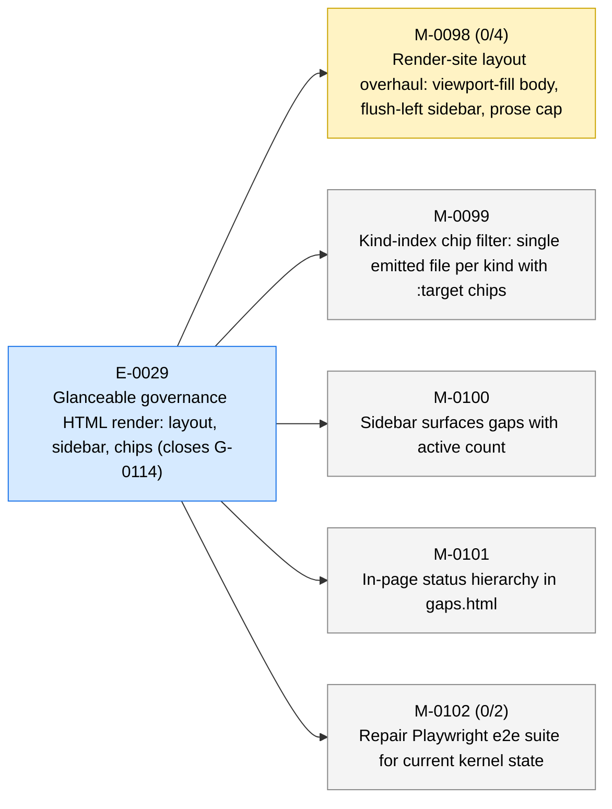
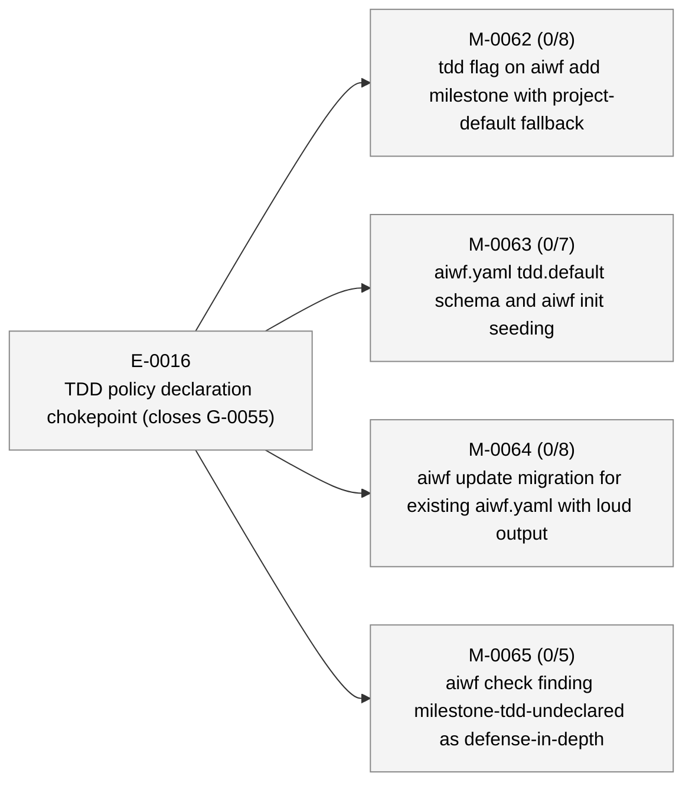
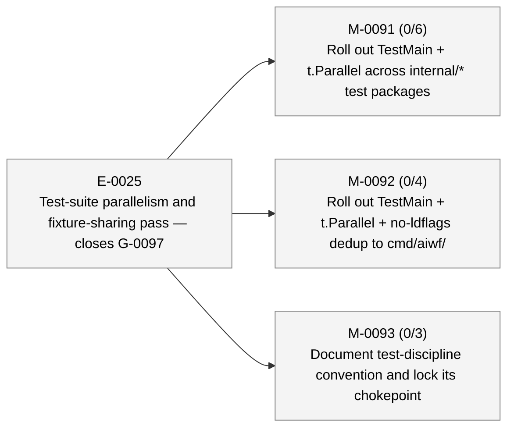

# aiwf status — 2026-05-11

_256 entities · 0 errors · 3 warnings · run `aiwf check` for details_

> Sweep pending: 2 terminal entities not yet archived (run `aiwf archive --dry-run` to preview)

## In flight

### E-0029 — Glanceable governance HTML render: layout, sidebar, chips (closes G-0114) _(active)_

- → **M-0098** — Render-site layout overhaul: viewport-fill body, flush-left sidebar, prose cap _(in_progress)_ — ACs 0/4 met (4 open) — tdd: required
- **M-0099** — Kind-index chip filter: single emitted file per kind with :target chips _(draft)_ — tdd: required
- **M-0100** — Sidebar surfaces gaps with active count _(draft)_ — tdd: required
- **M-0101** — In-page status hierarchy in gaps.html _(draft)_ — tdd: required
- **M-0102** — Repair Playwright e2e suite for current kernel state _(draft)_ — ACs 0/2 met (2 open) — tdd: advisory

## Roadmap

### E-0016 — TDD policy declaration chokepoint (closes G-0055) _(proposed)_

- **M-0062** — tdd flag on aiwf add milestone with project-default fallback _(draft)_ — ACs 0/8 met (8 open) — tdd: required
- **M-0063** — aiwf.yaml tdd.default schema and aiwf init seeding _(draft)_ — ACs 0/7 met (7 open) — tdd: required
- **M-0064** — aiwf update migration for existing aiwf.yaml with loud output _(draft)_ — ACs 0/8 met (8 open) — tdd: required
- **M-0065** — aiwf check finding milestone-tdd-undeclared as defense-in-depth _(draft)_ — ACs 0/5 met (5 open) — tdd: required

### E-0019 — Parallel TDD subagents with finding-gated AC closure _(proposed)_

_(no milestones)_

### E-0025 — Test-suite parallelism and fixture-sharing pass — closes G-0097 _(proposed)_

- **M-0091** — Roll out TestMain + t.Parallel across internal/* test packages _(draft)_ — ACs 0/6 met (6 open) — tdd: none
- **M-0092** — Roll out TestMain + t.Parallel + no-ldflags dedup to cmd/aiwf/ _(draft)_ — ACs 0/4 met (4 open) — tdd: none
- **M-0093** — Document test-discipline convention and lock its chokepoint _(draft)_ — ACs 0/3 met (3 open) — tdd: none

## Open decisions

| ID | Kind | Title | Status |
|----|------|-------|--------|
| ADR-0001 | adr | Mint entity ids at trunk integration via per-kind inbox state | proposed |
| ADR-0009 | adr | Orchestration substrate: substrate-vs-driver split with trailer-only events | proposed |

## Open gaps

| ID | Title | Discovered in |
|----|-------|---------------|
| G-0022 | Provenance model extension surface |  |
| G-0023 | Delegated \`--force\` via \`aiwf authorize --allow-force\` |  |
| G-0059 | Branch model: no canonical entity-hierarchy-to-git-branches mapping | M-0069 |
| G-0060 | Patch ritual is loosely defined; no kernel-level rules for shape, scope, branch, or audit trail |  |
| G-0067 | wf-tdd-cycle is LLM-honor-system advisory; no mechanical RED-first guard | M-0066 |
| G-0068 | Discoverability policy misses dynamic finding subcodes | M-0066 |
| G-0069 | aiwf init's plugins nudge hardcodes user-scope CLI install form | M-0070 |
| G-0070 | aiwf doctor lacks --format=json envelope | M-0070 |
| G-0073 | depends_on restricted to milestone→milestone; cross-kind blocking via body prose | E-0021 |
| G-0074 | docs/pocv3/ body prose still uses PoC framing; needs sweep |  |
| G-0075 | docs/pocv3/ directory naming is now historical; rename or accept |  |
| G-0076 | CONTRIBUTING.md describes PR-based workflow at odds with trunk-based model on main |  |
| G-0077 | Post-promotion working paper (aiwf's thesis) not yet written |  |
| G-0078 | No priority field on entities; backlog isn't filterable or sortable by importance |  |
| G-0079 | aiwfx-plan-milestones plugin skill needs --depends-on documentation | M-0076 |
| G-0080 | Wide-table verbs wrap mid-row; no TTY-aware sizing or truncation | M-0076 |
| G-0087 | No aiwf-show embedded skill | M-0074 |
| G-0088 | Skill-coverage policy doesn't police plugin skills under aiwf-extensions/ | M-0079 |
| G-0090 | M-0079 AC-8 drift-check has untested branches; refactor for hermetic tests | M-0079 |
| G-0092 | No documented hierarchy of doc authority across docs/ |  |
| G-0097 | Test-suite wall time dominated by serial execution and per-test setup |  |
| G-0099 | Worktree isolation must be a parent-side precondition, not an Agent kwarg honor |  |
| G-0103 | absolute-path leak lint | M-0089 |
| G-0104 | Test-parallelism discipline: ship to consumers via wf-rituals or BYO? | E-0025 |
| G-0107 | reorganize cmd/aiwf into idiomatic per-verb packages |  |
| G-0110 | gremlins --diff <ref> filter excludes new files entirely; manual mutation review needed for M-0094/95/96 | M-0097 |
| G-0111 | Wrap-side ritual: scope ends before done, human-only on done, wrap-epic update | M-0096 |
| G-0112 | STATUS.md pre-commit regen produces merge conflicts on a derived artifact |  |
| G-0113 | rendered HTML site has no publish path; only viewable via local aiwf render |  |
| G-0114 | HTML render gap surface: status and archive state not glanceable from sidebar |  |
| G-0115 | aiwf render roadmap --write rewrites entity refs in epic prose to broken paths |  |
| G-0116 | aiwfx-start-epic creates worktree before promote/authorize on trunk-based repos | E-0029 |

## Warnings

| Code | Entity | Path | Message |
|------|--------|------|---------|
| terminal-entity-not-archived | G-0082 | work/gaps/G-0082-planning-closure-default-merges-to-main.md | entity G-0082 has terminal status 'addressed' but file is still in the active tree; awaiting \`aiwf archive --apply\` sweep |
| terminal-entity-not-archived | G-0083 | work/gaps/G-0083-aiwf-retitle-does-not-sync-entity-body-h1-with-frontmatter-title.md | entity G-0083 has terminal status 'addressed' but file is still in the active tree; awaiting \`aiwf archive --apply\` sweep |

## Recent activity

| Date | Actor | Verb | Detail |
|------|-------|------|--------|
| 2026-05-11 | ai/claude | edit-body | aiwf edit-body M-0098 |
| 2026-05-11 | ai/claude | edit-body | aiwf edit-body E-0029 |
| 2026-05-11 | ai/claude | milestone-depends-on | aiwf milestone depends-on M-0098 |
| 2026-05-11 | ai/claude | add | aiwf add milestone M-0102 'Repair Playwright e2e suite for current kernel state' |
| 2026-05-11 | ai/claude | promote | aiwf promote M-0098 draft -> in_progress |

