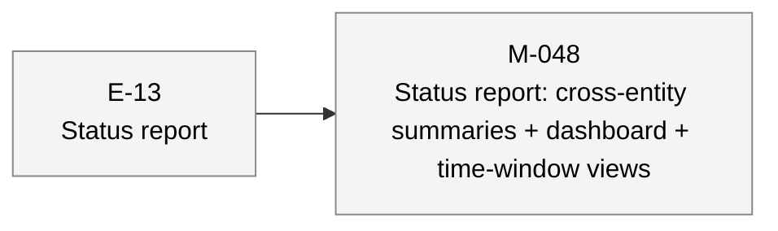
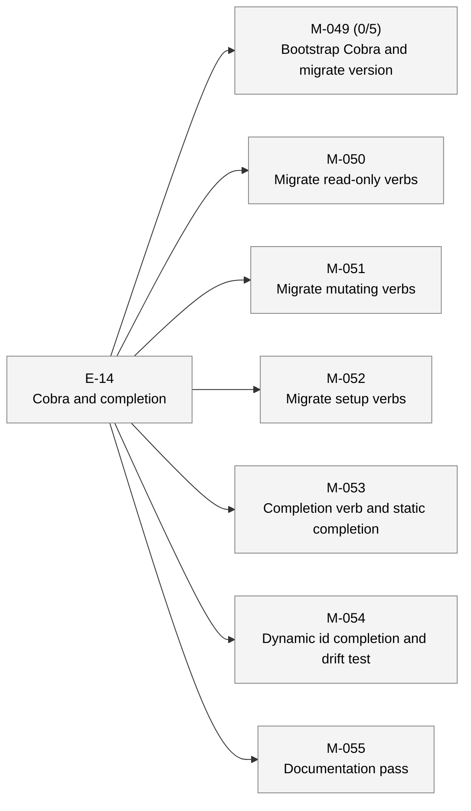

# aiwf status — 2026-05-06

_118 entities · 0 errors · 0 warnings_

## In flight

_(no active epics)_

## Roadmap

### E-13 — Status report _(proposed)_

- **M-048** — Status report: cross-entity summaries + dashboard + time-window views _(draft)_

### E-14 — Cobra and completion _(proposed)_

- **M-049** — Bootstrap Cobra and migrate version _(draft)_ — ACs 0/5 met (5 open)
- **M-050** — Migrate read-only verbs _(draft)_
- **M-051** — Migrate mutating verbs _(draft)_
- **M-052** — Migrate setup verbs _(draft)_
- **M-053** — Completion verb and static completion _(draft)_
- **M-054** — Dynamic id completion and drift test _(draft)_
- **M-055** — Documentation pass _(draft)_

## Open decisions

_(none)_

## Open gaps

| ID | Title | Discovered in |
|----|-------|---------------|
| G-022 | Provenance model extension surface |  |
| G-023 | Delegated \`--force\` via \`aiwf authorize --allow-force\` |  |

## Warnings

_(none)_

## Recent activity

| Date | Actor | Verb | Detail |
|------|-------|------|--------|
| 2026-05-06 | human/peter | add | aiwf add ac M-049/AC-4 'Exit codes 0/1/2/3 preserved end-to-end through Cobra dispatch' |
| 2026-05-06 | human/peter | add | aiwf add ac M-049/AC-3 'version verb migrated; --format=json envelope shape preserved byte-exact' |
| 2026-05-06 | human/peter | add | aiwf add ac M-049/AC-2 'Cobra root command and subcommand routing structure in cmd/aiwf' |
| 2026-05-06 | human/peter | add | aiwf add ac M-049/AC-1 'Cobra dependency added to go.mod with one-line justification in commit message' |
| 2026-05-06 | human/peter | add | aiwf add milestone M-055 'Documentation pass' |

