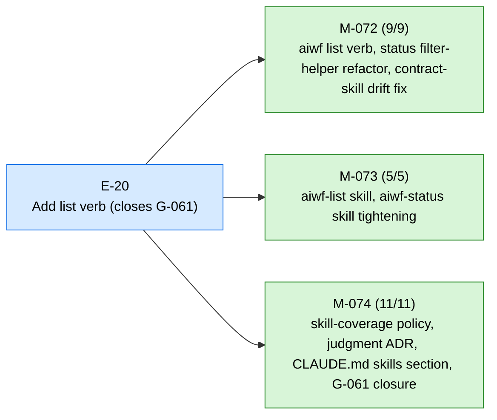
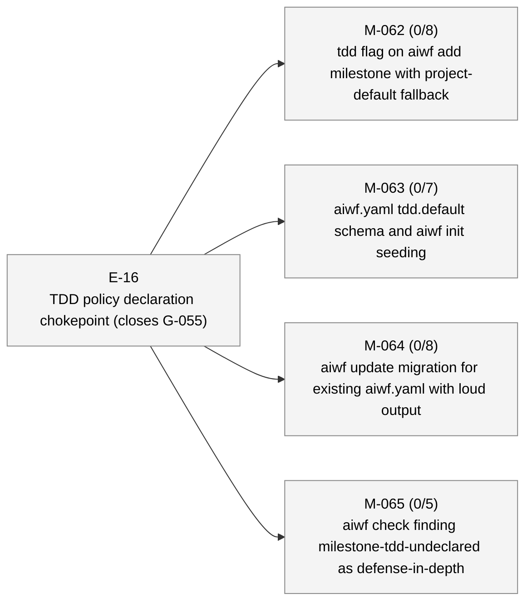

# aiwf status — 2026-05-08

_192 entities · 0 errors · 11 warnings · run `aiwf check` for details_

## In flight

### E-20 — Add list verb (closes G-061) _(active)_

- ✓ **M-072** — aiwf list verb, status filter-helper refactor, contract-skill drift fix _(done)_ — ACs 9/9 met — tdd: required
- ✓ **M-073** — aiwf-list skill, aiwf-status skill tightening _(done)_ — ACs 5/5 met — tdd: advisory
- ✓ **M-074** — skill-coverage policy, judgment ADR, CLAUDE.md skills section, G-061 closure _(done)_ — ACs 11/11 met — tdd: required

## Roadmap

### E-16 — TDD policy declaration chokepoint (closes G-055) _(proposed)_

- **M-062** — tdd flag on aiwf add milestone with project-default fallback _(draft)_ — ACs 0/8 met (8 open) — tdd: required
- **M-063** — aiwf.yaml tdd.default schema and aiwf init seeding _(draft)_ — ACs 0/7 met (7 open) — tdd: required
- **M-064** — aiwf update migration for existing aiwf.yaml with loud output _(draft)_ — ACs 0/8 met (8 open) — tdd: required
- **M-065** — aiwf check finding milestone-tdd-undeclared as defense-in-depth _(draft)_ — ACs 0/5 met (5 open) — tdd: required

### E-19 — Parallel TDD subagents with finding-gated AC closure _(proposed)_

_(no milestones)_

### E-21 — Open-work synthesis: recommended-sequence skill (replaces critical-path.md) _(proposed)_

_(no milestones)_

## Open decisions

| ID | Kind | Title | Status |
|----|------|-------|--------|
| ADR-0001 | adr | Mint entity ids at trunk integration via per-kind inbox state | proposed |
| ADR-0003 | adr | Add finding (F-NNN) as a seventh entity kind | proposed |
| ADR-0004 | adr | Uniform archive convention for terminal-status entities | proposed |
| ADR-0005 | adr | Verb hygiene contract: complete, consistent, pre-flighted aiwf verbs | proposed |
| ADR-0006 | adr | Skills policy: per-verb default; topical multi-verb when concept-shaped; no skill when --help suffices | proposed |

## Open gaps

| ID | Title | Discovered in |
|----|-------|---------------|
| G-022 | Provenance model extension surface |  |
| G-023 | Delegated \`--force\` via \`aiwf authorize --allow-force\` |  |
| G-056 | aiwf render output (site/) is not gitignored; pollutes consumer working tree | E-14 |
| G-057 | Stray aiwf binary in repo root from local builds is not gitignored |  |
| G-058 | AC body sections ship empty; no chokepoint enforces prose intent | E-16 |
| G-059 | Branch model: no canonical mapping from entity hierarchy to git branches; epic/milestone work lands on whichever branch is current | M-069 |
| G-060 | Patch ritual is loosely defined; no kernel-level rules for shape, scope, branch, or audit trail |  |
| G-063 | No defined start-epic ritual: epic activation is a deliberate sovereign act with preflight + optional delegation, but kernel treats it as a one-line FSM flip |  |
| G-065 | No aiwf retitle verb: scope refactors that change an entity's or AC's intent leave frontmatter title fields permanently misleading; only slug rename is supported |  |
| G-067 | wf-tdd-cycle is LLM-honor-system advisory; under load the LLM bypasses RED-first and the branch-coverage HARD RULE without anything mechanical catching it (M-066/AC-1 cycle wrote ~165 lines of impl before any test existed) | M-066 |
| G-068 | Discoverability policy misses dynamic finding subcodes | M-066 |
| G-069 | aiwf init's printRitualsSuggestion hardcodes the CLI install form, which defaults to user scope and won't satisfy doctor.recommended_plugins; nudge silently steers fresh operators away from project-scope outcome | M-070 |
| G-070 | aiwf doctor has no --format=json envelope; M-070's recommended-plugin-not-installed finding-code surfaces only as human text. Add JSON envelope when a JSON-consuming caller appears | M-070 |
| G-073 | depends_on is restricted to milestone→milestone edges; cross-kind blocking lives in body prose only; subsumes G-072 in scope | E-21 |
| G-074 | docs/pocv3/ body prose still uses PoC framing; needs sweep |  |
| G-075 | docs/pocv3/ directory naming is now historical; rename or accept |  |
| G-076 | CONTRIBUTING.md describes PR-based workflow at odds with trunk-based model on main |  |
| G-077 | Post-promotion working paper (aiwf's thesis) not yet written |  |
| G-078 | No priority field on entities; backlog isn't filterable or sortable by importance |  |
| G-079 | aiwfx-plan-milestones plugin skill needs --depends-on documentation; M-076 added the verb but the plugin lives in ai-workflow-rituals upstream | M-076 |
| G-080 | Wide-table verbs wrap mid-row and break column scan; no TTY-aware sizing, glyph palette, or truncation surface | M-076 |
| G-081 | aiwf rename does not pre-flight trunk-collision check | E-21 |
| G-082 | Planning closure should default-merge to main before implementation begins | E-21 |
| G-083 | aiwf retitle does not sync entity body H1 with frontmatter title | E-21 |
| G-084 | Verb hygiene contract is undocumented; G-081/G-082/G-083 lack umbrella | E-21 |
| G-086 | docs/pocv3/contracts.md still references non-existent aiwf list contracts (lines 98, 114-117); same drift class as G-061/G-085, different file | M-072 |
| G-087 | no aiwf-show embedded skill; show is the per-entity inspection verb every AI reaches for, but --help-only coverage misses body-rendering and composite-id discovery | M-074 |

## Warnings

| Code | Entity | Path | Message |
|------|--------|------|---------|
| acs-tdd-audit | M-073/AC-1 | work/epics/E-20-add-list-verb-closes-g-061/M-073-aiwf-list-skill-aiwf-status-skill-tightening.md | M-073/AC-1 status: met under tdd: advisory but tdd_phase is (absent) (expected done) |
| acs-tdd-audit | M-073/AC-2 | work/epics/E-20-add-list-verb-closes-g-061/M-073-aiwf-list-skill-aiwf-status-skill-tightening.md | M-073/AC-2 status: met under tdd: advisory but tdd_phase is (absent) (expected done) |
| acs-tdd-audit | M-073/AC-3 | work/epics/E-20-add-list-verb-closes-g-061/M-073-aiwf-list-skill-aiwf-status-skill-tightening.md | M-073/AC-3 status: met under tdd: advisory but tdd_phase is (absent) (expected done) |
| acs-tdd-audit | M-073/AC-4 | work/epics/E-20-add-list-verb-closes-g-061/M-073-aiwf-list-skill-aiwf-status-skill-tightening.md | M-073/AC-4 status: met under tdd: advisory but tdd_phase is (absent) (expected done) |
| acs-tdd-audit | M-073/AC-5 | work/epics/E-20-add-list-verb-closes-g-061/M-073-aiwf-list-skill-aiwf-status-skill-tightening.md | M-073/AC-5 status: met under tdd: advisory but tdd_phase is (absent) (expected done) |
| entity-body-empty | G-086 | work/gaps/G-086-docs-pocv3-contracts-md-still-references-non-existent-aiwf-list-contracts-lines-98-114-117-same-drift-class-as-g-061-g-085-different-file.md | G-086 body section \`## What's missing\` is empty |
| entity-body-empty | G-086 | work/gaps/G-086-docs-pocv3-contracts-md-still-references-non-existent-aiwf-list-contracts-lines-98-114-117-same-drift-class-as-g-061-g-085-different-file.md | G-086 body section \`## Why it matters\` is empty |
| entity-body-empty | G-087 | work/gaps/G-087-no-aiwf-show-embedded-skill-show-is-the-per-entity-inspection-verb-every-ai-reaches-for-but-help-only-coverage-misses-body-rendering-and-composite-id-discovery.md | G-087 body section \`## What's missing\` is empty |
| entity-body-empty | G-087 | work/gaps/G-087-no-aiwf-show-embedded-skill-show-is-the-per-entity-inspection-verb-every-ai-reaches-for-but-help-only-coverage-misses-body-rendering-and-composite-id-discovery.md | G-087 body section \`## Why it matters\` is empty |
| gap-resolved-has-resolver | G-061 | work/gaps/G-061-generic-aiwf-list-kind-verb-referenced-as-canonical-in-contracts-plan-and-shipped-contract-skill-but-never-implemented-ai-assistants-are-instructed-to-invoke-a-non-existent-verb.md | gap is marked addressed but addressed_by and addressed_by_commit are both empty |
| gap-resolved-has-resolver | G-085 | work/gaps/G-085-aiwf-status-kind-gap-advertised-in-claude-md-docs-pocv3-3-files-and-a-gap-body-but-kind-flag-doesn-t-exist-on-the-status-verb-canonical-fix-is-aiwf-list-kind-gap-once-e-20-ships.md | gap is marked addressed but addressed_by and addressed_by_commit are both empty |

## Recent activity

| Date | Actor | Verb | Detail |
|------|-------|------|--------|
| 2026-05-09 | human/peter | promote | aiwf promote M-074/AC-11 open -> met |
| 2026-05-09 | human/peter | promote | aiwf promote M-074/AC-11 --phase green -> done |
| 2026-05-09 | human/peter | promote | aiwf promote M-074/AC-11 --phase red -> green |
| 2026-05-09 | human/peter | promote | aiwf promote M-074/AC-10 open -> met |
| 2026-05-09 | human/peter | promote | aiwf promote M-074/AC-10 --phase green -> done |

