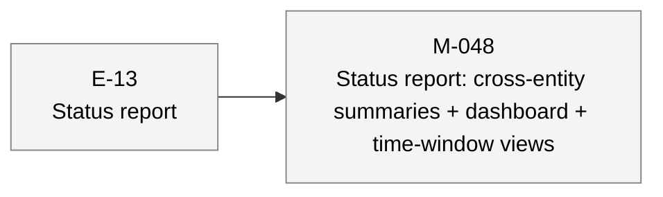

# aiwf status — 2026-05-07

_133 entities · 0 errors · 0 warnings_

## In flight

_(no active epics)_

## Roadmap

### E-13 — Status report _(proposed)_

- **M-048** — Status report: cross-entity summaries + dashboard + time-window views _(draft)_

### E-16 — TDD policy declaration chokepoint (closes G-055) _(proposed)_

_(no milestones)_

## Open decisions

_(none)_

## Open gaps

| ID | Title | Discovered in |
|----|-------|---------------|
| G-022 | Provenance model extension surface |  |
| G-023 | Delegated \`--force\` via \`aiwf authorize --allow-force\` |  |
| G-055 | Milestone creation does not require a TDD policy declaration | E-14 |
| G-056 | aiwf render output (site/) is not gitignored; pollutes consumer working tree | E-14 |
| G-057 | Stray aiwf binary in repo root from local builds is not gitignored |  |

## Warnings

_(none)_

## Recent activity

| Date | Actor | Verb | Detail |
|------|-------|------|--------|
| 2026-05-07 | human/peter | add | aiwf add gap G-057 'Stray aiwf binary in repo root from local builds is not gitignored' |
| 2026-05-07 | human/peter | add | aiwf add gap G-056 'aiwf render output (site/) is not gitignored; pollutes consumer working tree' |
| 2026-05-07 | human/peter | add | aiwf add gap G-055 'Milestone creation does not require a TDD policy declaration' |
| 2026-05-07 | human/peter | promote | aiwf promote E-14 active -> done |
| 2026-05-07 | human/peter | promote | aiwf promote M-061 in_progress -> done |

