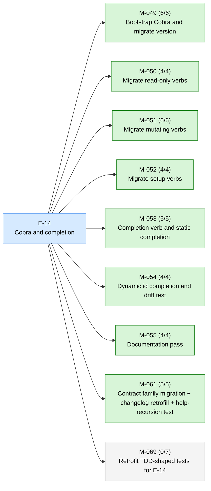
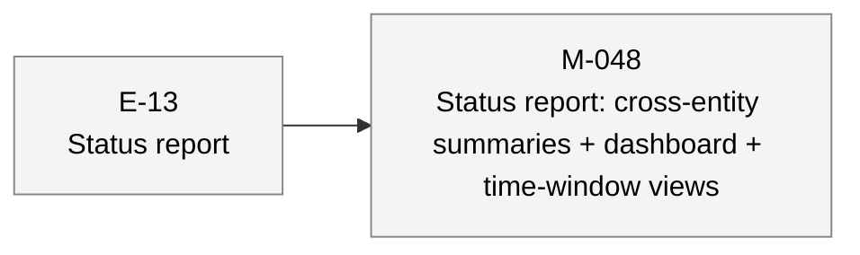
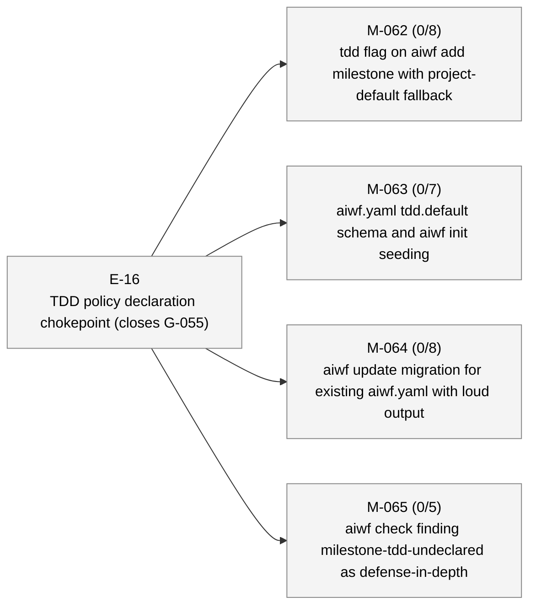
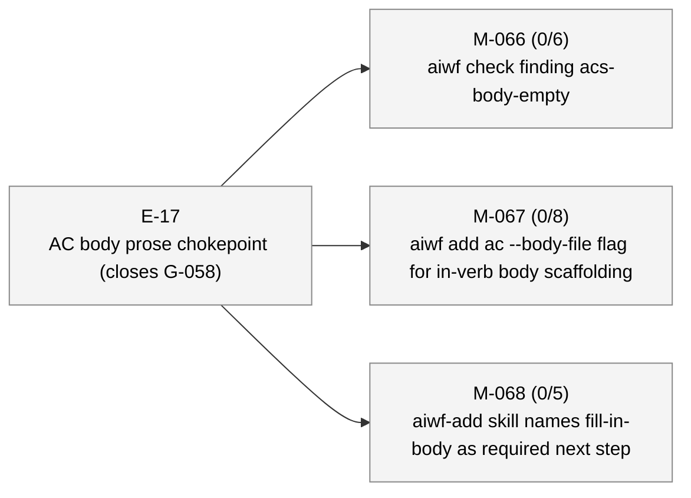

# aiwf status — 2026-05-07

_143 entities · 0 errors · 0 warnings_

## In flight

### E-14 — Cobra and completion _(active)_

- ✓ **M-049** — Bootstrap Cobra and migrate version _(done)_ — ACs 6/6 met
- ✓ **M-050** — Migrate read-only verbs _(done)_ — ACs 4/4 met
- ✓ **M-051** — Migrate mutating verbs _(done)_ — ACs 6/6 met
- ✓ **M-052** — Migrate setup verbs _(done)_ — ACs 4/4 met
- ✓ **M-053** — Completion verb and static completion _(done)_ — ACs 5/5 met
- ✓ **M-054** — Dynamic id completion and drift test _(done)_ — ACs 4/4 met
- ✓ **M-055** — Documentation pass _(done)_ — ACs 4/4 met
- ✓ **M-061** — Contract family migration + changelog retrofill + help-recursion test _(done)_ — ACs 5/5 met
- **M-069** — Retrofit TDD-shaped tests for E-14 _(draft)_ — ACs 0/7 met (7 open) — tdd: required

## Roadmap

### E-13 — Status report _(proposed)_

- **M-048** — Status report: cross-entity summaries + dashboard + time-window views _(draft)_

### E-16 — TDD policy declaration chokepoint (closes G-055) _(proposed)_

- **M-062** — tdd flag on aiwf add milestone with project-default fallback _(draft)_ — ACs 0/8 met (8 open) — tdd: required
- **M-063** — aiwf.yaml tdd.default schema and aiwf init seeding _(draft)_ — ACs 0/7 met (7 open) — tdd: required
- **M-064** — aiwf update migration for existing aiwf.yaml with loud output _(draft)_ — ACs 0/8 met (8 open) — tdd: required
- **M-065** — aiwf check finding milestone-tdd-undeclared as defense-in-depth _(draft)_ — ACs 0/5 met (5 open) — tdd: required

### E-17 — AC body prose chokepoint (closes G-058) _(proposed)_

- **M-066** — aiwf check finding acs-body-empty _(draft)_ — ACs 0/6 met (6 open) — tdd: required
- **M-067** — aiwf add ac --body-file flag for in-verb body scaffolding _(draft)_ — ACs 0/8 met (8 open) — tdd: required
- **M-068** — aiwf-add skill names fill-in-body as required next step _(draft)_ — ACs 0/5 met (5 open) — tdd: required

## Open decisions

_(none)_

## Open gaps

| ID | Title | Discovered in |
|----|-------|---------------|
| G-022 | Provenance model extension surface |  |
| G-023 | Delegated \`--force\` via \`aiwf authorize --allow-force\` |  |
| G-056 | aiwf render output (site/) is not gitignored; pollutes consumer working tree | E-14 |
| G-057 | Stray aiwf binary in repo root from local builds is not gitignored |  |
| G-058 | AC body sections ship empty; no chokepoint enforces prose intent | E-16 |

## Warnings

_(none)_

## Recent activity

| Date | Actor | Verb | Detail |
|------|-------|------|--------|
| 2026-05-07 | human/peter | promote | aiwf promote M-069/AC-6 --phase red -> green |
| 2026-05-07 | human/peter | edit-body | aiwf edit-body M-069 |
| 2026-05-07 | human/peter | promote | aiwf promote M-069/AC-5 --phase green -> done |
| 2026-05-07 | human/peter | promote | aiwf promote M-069/AC-5 --phase red -> green |
| 2026-05-07 | human/peter | edit-body | aiwf edit-body M-069 |

