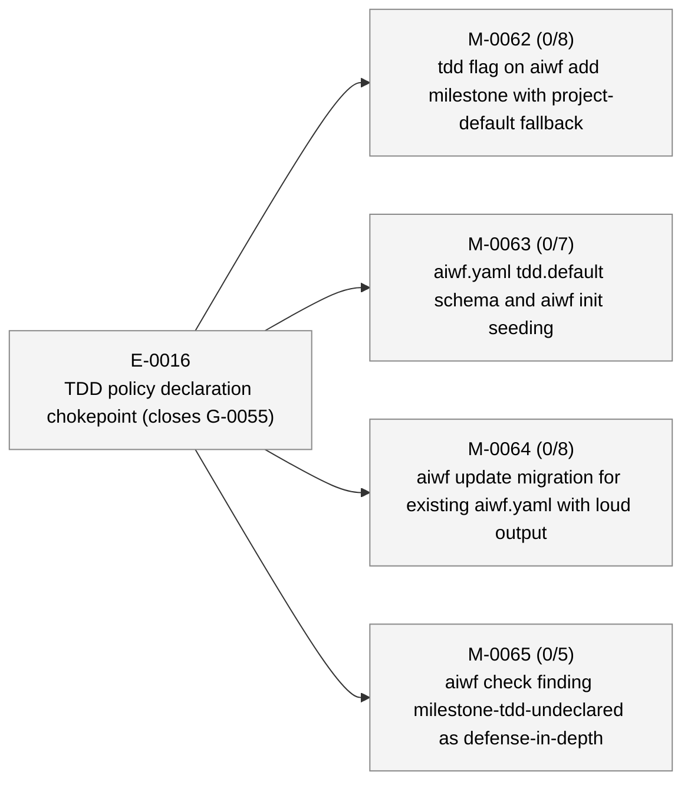
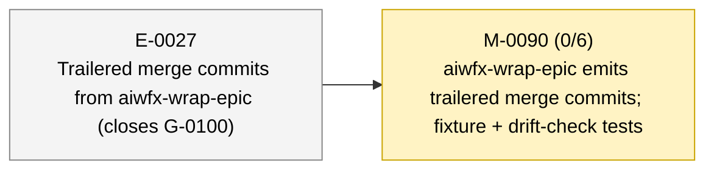

# aiwf status — 2026-05-11

_227 entities · 0 errors · 8 warnings · run `aiwf check` for details_

> Sweep pending: 1 terminal entity not yet archived (run `aiwf archive --dry-run` to preview)

## In flight

_(no active epics)_

## Roadmap

### E-0016 — TDD policy declaration chokepoint (closes G-0055) _(proposed)_

- **M-0062** — tdd flag on aiwf add milestone with project-default fallback _(draft)_ — ACs 0/8 met (8 open) — tdd: required
- **M-0063** — aiwf.yaml tdd.default schema and aiwf init seeding _(draft)_ — ACs 0/7 met (7 open) — tdd: required
- **M-0064** — aiwf update migration for existing aiwf.yaml with loud output _(draft)_ — ACs 0/8 met (8 open) — tdd: required
- **M-0065** — aiwf check finding milestone-tdd-undeclared as defense-in-depth _(draft)_ — ACs 0/5 met (5 open) — tdd: required

### E-0019 — Parallel TDD subagents with finding-gated AC closure _(proposed)_

_(no milestones)_

### E-0025 — Test-suite parallelism and fixture-sharing pass — closes G-0097 _(proposed)_

_(no milestones)_

### E-0027 — Trailered merge commits from aiwfx-wrap-epic (closes G-0100) _(proposed)_

- → **M-0090** — aiwfx-wrap-epic emits trailered merge commits; fixture + drift-check tests _(in_progress)_ — ACs 0/6 met (6 open) — tdd: required

## Open decisions

| ID | Kind | Title | Status |
|----|------|-------|--------|
| ADR-0001 | adr | Mint entity ids at trunk integration via per-kind inbox state | proposed |
| ADR-0005 | adr | Verb hygiene contract: complete, consistent, pre-flighted aiwf verbs | proposed |
| ADR-0009 | adr | Orchestration substrate: substrate-vs-driver split, trailer-only cycle events, isolation as parent-side precondition | proposed |

## Open gaps

| ID | Title | Discovered in |
|----|-------|---------------|
| G-0022 | Provenance model extension surface |  |
| G-0023 | Delegated \`--force\` via \`aiwf authorize --allow-force\` |  |
| G-0059 | Branch model: no canonical mapping from entity hierarchy to git branches; epic/milestone work lands on whichever branch is current | M-0069 |
| G-0060 | Patch ritual is loosely defined; no kernel-level rules for shape, scope, branch, or audit trail |  |
| G-0063 | No defined start-epic ritual: epic activation is a deliberate sovereign act with preflight + optional delegation, but kernel treats it as a one-line FSM flip |  |
| G-0067 | wf-tdd-cycle is LLM-honor-system advisory; under load the LLM bypasses RED-first and the branch-coverage HARD RULE without anything mechanical catching it (M-0066/AC-1 cycle wrote ~165 lines of impl before any test existed) | M-0066 |
| G-0068 | Discoverability policy misses dynamic finding subcodes | M-0066 |
| G-0069 | aiwf init's printRitualsSuggestion hardcodes the CLI install form, which defaults to user scope and won't satisfy doctor.recommended_plugins; nudge silently steers fresh operators away from project-scope outcome | M-0070 |
| G-0070 | aiwf doctor has no --format=json envelope; M-0070's recommended-plugin-not-installed finding-code surfaces only as human text. Add JSON envelope when a JSON-consuming caller appears | M-0070 |
| G-0073 | depends_on is restricted to milestone→milestone edges; cross-kind blocking lives in body prose only; subsumes G-0072 in scope | E-0021 |
| G-0074 | docs/pocv3/ body prose still uses PoC framing; needs sweep |  |
| G-0075 | docs/pocv3/ directory naming is now historical; rename or accept |  |
| G-0076 | CONTRIBUTING.md describes PR-based workflow at odds with trunk-based model on main |  |
| G-0077 | Post-promotion working paper (aiwf's thesis) not yet written |  |
| G-0078 | No priority field on entities; backlog isn't filterable or sortable by importance |  |
| G-0079 | aiwfx-plan-milestones plugin skill needs --depends-on documentation; M-0076 added the verb but the plugin lives in ai-workflow-rituals upstream | M-0076 |
| G-0080 | Wide-table verbs wrap mid-row and break column scan; no TTY-aware sizing, glyph palette, or truncation surface | M-0076 |
| G-0081 | aiwf rename does not pre-flight trunk-collision check | E-0021 |
| G-0082 | Planning closure should default-merge to main before implementation begins | E-0021 |
| G-0083 | aiwf retitle does not sync entity body H1 with frontmatter title | E-0021 |
| G-0084 | Verb hygiene contract is undocumented; G-0081/G-0082/G-0083 lack umbrella | E-0021 |
| G-0087 | no aiwf-show embedded skill; show is the per-entity inspection verb every AI reaches for, but --help-only coverage misses body-rendering and composite-id discovery | M-0074 |
| G-0088 | Skill-coverage policy walks internal/skills/embedded/ only; plugin skills (aiwf-extensions/skills/aiwfx-*) are not policed by the kernel — equivalent invariants must be re-applied per-skill in test code as M-0079 did | M-0079 |
| G-0090 | AC-8 materialisation drift-check has three branches not unit-tested; refactor lookup to take cache root as parameter for hermetic testing with synthetic temp dirs | M-0079 |
| G-0091 | No preventive check for body-prose path-form refs to entity files; archive-move drift surfaces only via post-hoc CI link-check, after the break has already shipped |  |
| G-0092 | No documented hierarchy of doc authority across docs/; LLMs and humans cannot tell normative from exploratory from archival without reading every file |  |
| G-0097 | Test-suite wall time dominated by serial execution and per-test fixture setup; internal/verb spike shows ~4× headroom |  |
| G-0099 | Orchestration design's worktree isolation depends on Agent kwarg honor; materialisation should be a parent-side precondition (git worktree add → check git worktree list → invoke agent with path) so isolation does not depend on LLM/harness behavior |  |
| G-0100 | aiwfx-wrap-epic emits untrailered merge commits; ritual should produce aiwf-verb/entity/actor trailers on the merge so provenance is self-describing | M-0089 |

## Warnings

| Code | Entity | Path | Message |
|------|--------|------|---------|
| entity-body-empty | M-0090/AC-1 | work/epics/E-0027-trailered-merge-commits-from-aiwfx-wrap-epic-closes-g-0100/M-0090-aiwfx-wrap-epic-emits-trailered-merge-commits-fixture-drift-check-tests.md | M-0090/AC-1 body under \`### AC-1\` is empty |
| entity-body-empty | M-0090/AC-2 | work/epics/E-0027-trailered-merge-commits-from-aiwfx-wrap-epic-closes-g-0100/M-0090-aiwfx-wrap-epic-emits-trailered-merge-commits-fixture-drift-check-tests.md | M-0090/AC-2 body under \`### AC-2\` is empty |
| entity-body-empty | M-0090/AC-3 | work/epics/E-0027-trailered-merge-commits-from-aiwfx-wrap-epic-closes-g-0100/M-0090-aiwfx-wrap-epic-emits-trailered-merge-commits-fixture-drift-check-tests.md | M-0090/AC-3 body under \`### AC-3\` is empty |
| entity-body-empty | M-0090/AC-4 | work/epics/E-0027-trailered-merge-commits-from-aiwfx-wrap-epic-closes-g-0100/M-0090-aiwfx-wrap-epic-emits-trailered-merge-commits-fixture-drift-check-tests.md | M-0090/AC-4 body under \`### AC-4\` is empty |
| entity-body-empty | M-0090/AC-5 | work/epics/E-0027-trailered-merge-commits-from-aiwfx-wrap-epic-closes-g-0100/M-0090-aiwfx-wrap-epic-emits-trailered-merge-commits-fixture-drift-check-tests.md | M-0090/AC-5 body under \`### AC-5\` is empty |
| entity-body-empty | M-0090/AC-6 | work/epics/E-0027-trailered-merge-commits-from-aiwfx-wrap-epic-closes-g-0100/M-0090-aiwfx-wrap-epic-emits-trailered-merge-commits-fixture-drift-check-tests.md | M-0090/AC-6 body under \`### AC-6\` is empty |
| terminal-entity-not-archived | G-0101 | work/gaps/G-0101-ids-unique-trunk-collision-rule-is-not-archive-aware-first-aiwf-archive-apply-triggers-176-false-positive-errors-that-block-the-pre-push-hook.md | entity G-0101 has terminal status 'addressed' but file is still in the active tree; awaiting \`aiwf archive --apply\` sweep |

## Recent activity

| Date | Actor | Verb | Detail |
|------|-------|------|--------|
| 2026-05-11 | human/peter | promote | aiwf promote M-0090/AC-3 --phase red -> green |
| 2026-05-11 | human/peter | promote | aiwf promote M-0090/AC-2 --phase red -> green |
| 2026-05-11 | human/peter | promote | aiwf promote M-0090/AC-1 --phase red -> green |
| 2026-05-11 | human/peter | add | aiwf add ac M-0090/AC-6 'Drift-check structurally asserts merge-step trailered-commit instructions.' |
| 2026-05-11 | human/peter | add | aiwf add ac M-0090/AC-5 'Kernel rule unchanged.' |

