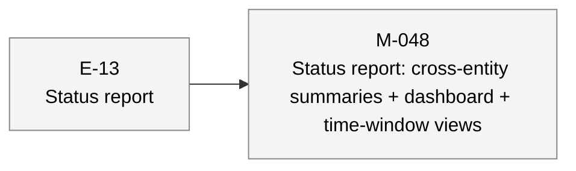

# aiwf status — 2026-05-06

_110 entities · 0 errors · 0 warnings_

## In flight

_(no active epics)_

## Roadmap

### E-13 — Status report _(proposed)_

- **M-048** — Status report: cross-entity summaries + dashboard + time-window views _(draft)_

## Open decisions

_(none)_

## Open gaps

| ID | Title | Discovered in |
|----|-------|---------------|
| G-022 | Provenance model extension surface |  |
| G-023 | Delegated \`--force\` via \`aiwf authorize --allow-force\` |  |

## Warnings

_(none)_

## Recent activity

| Date | Actor | Verb | Detail |
|------|-------|------|--------|
| 2026-05-06 | human/peter | promote | aiwf promote G-049 addressed [audit-only] |
| 2026-05-06 | human/peter | promote | aiwf promote G-048 open -> addressed |
| 2026-05-06 | human/peter | promote | aiwf promote G-050 open -> addressed |
| 2026-05-06 | human/peter | add | aiwf add gap G-050 'Pre-commit hook aborts when STATUS.md is gitignored — violates 'tolerant by design' contract, orphans .git/index.lock' |
| 2026-05-06 | human/peter | promote | aiwf promote G-049 addressed [audit-only] |

