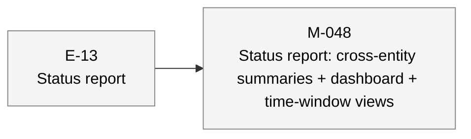
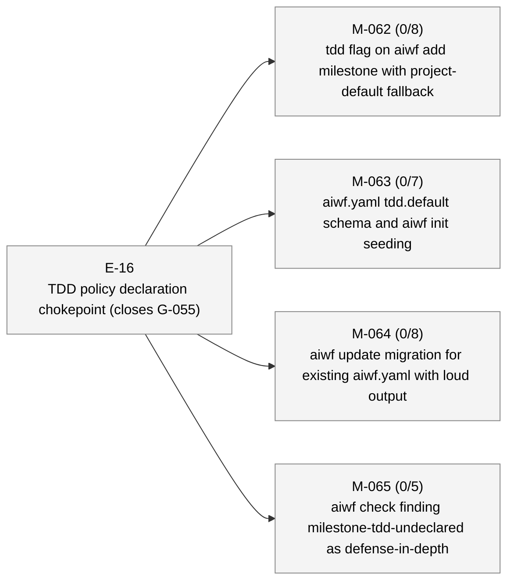
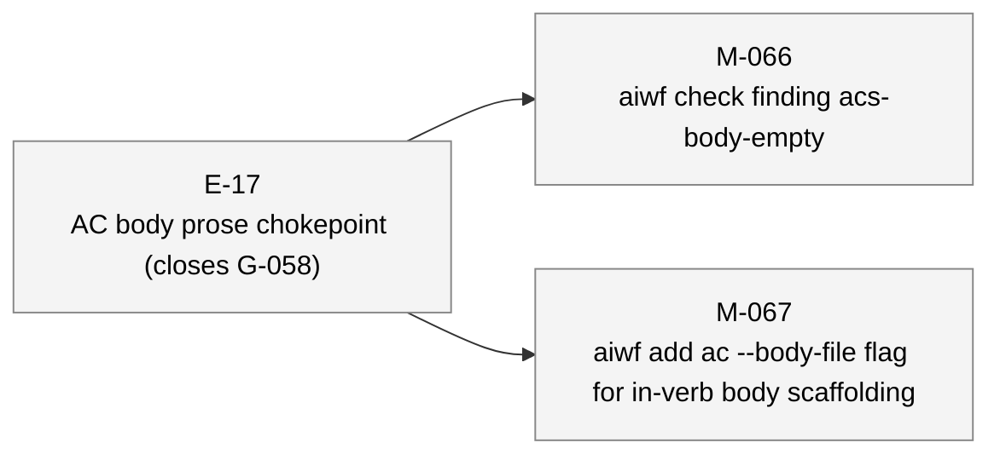

# aiwf status — 2026-05-07

_141 entities · 0 errors · 0 warnings_

## In flight

_(no active epics)_

## Roadmap

### E-13 — Status report _(proposed)_

- **M-048** — Status report: cross-entity summaries + dashboard + time-window views _(draft)_

### E-16 — TDD policy declaration chokepoint (closes G-055) _(proposed)_

- **M-062** — tdd flag on aiwf add milestone with project-default fallback _(draft)_ — ACs 0/8 met (8 open) — tdd: required
- **M-063** — aiwf.yaml tdd.default schema and aiwf init seeding _(draft)_ — ACs 0/7 met (7 open) — tdd: required
- **M-064** — aiwf update migration for existing aiwf.yaml with loud output _(draft)_ — ACs 0/8 met (8 open) — tdd: required
- **M-065** — aiwf check finding milestone-tdd-undeclared as defense-in-depth _(draft)_ — ACs 0/5 met (5 open) — tdd: required

### E-17 — AC body prose chokepoint (closes G-058) _(proposed)_

- **M-066** — aiwf check finding acs-body-empty _(draft)_
- **M-067** — aiwf add ac --body-file flag for in-verb body scaffolding _(draft)_

## Open decisions

_(none)_

## Open gaps

| ID | Title | Discovered in |
|----|-------|---------------|
| G-022 | Provenance model extension surface |  |
| G-023 | Delegated \`--force\` via \`aiwf authorize --allow-force\` |  |
| G-055 | Milestone creation does not require a TDD policy declaration | E-14 |
| G-056 | aiwf render output (site/) is not gitignored; pollutes consumer working tree | E-14 |
| G-057 | Stray aiwf binary in repo root from local builds is not gitignored |  |
| G-058 | AC body sections ship empty; no chokepoint enforces prose intent | E-16 |

## Warnings

_(none)_

## Recent activity

| Date | Actor | Verb | Detail |
|------|-------|------|--------|
| 2026-05-07 | human/peter | add | aiwf add milestone M-066 'aiwf check finding acs-body-empty' |
| 2026-05-07 | human/peter | add | aiwf add epic E-17 'AC body prose chokepoint (closes G-058)' |
| 2026-05-07 | human/peter | add | aiwf add gap G-058 'AC body sections ship empty; no chokepoint enforces prose intent' |
| 2026-05-07 | human/peter | add | aiwf add ac M-065 AC-1..AC-5 (5 criteria) |
| 2026-05-07 | human/peter | add | aiwf add ac M-064 AC-1..AC-8 (8 criteria) |

