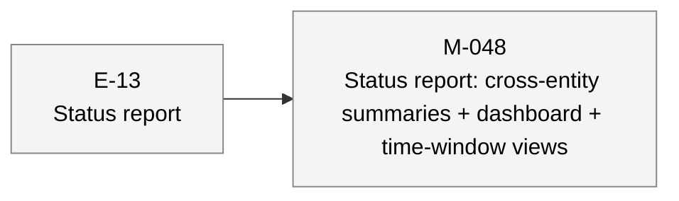

# aiwf status — 2026-05-05

_109 entities · 0 errors · 1 warnings · run `aiwf check` for details_

## In flight

_(no active epics)_

## Roadmap

### E-13 — Status report _(proposed)_

- **M-048** — Status report: cross-entity summaries + dashboard + time-window views _(draft)_

## Open decisions

_(none)_

## Open gaps

| ID | Title | Discovered in |
|----|-------|---------------|
| G-022 | Provenance model extension surface |  |
| G-023 | Delegated \`--force\` via \`aiwf authorize --allow-force\` |  |
| G-048 | \`aiwf init\` doesn't honor \`core.hooksPath\` — installs hooks into \`.git/hooks/\` regardless |  |

## Warnings

| Code | Entity | Path | Message |
|------|--------|------|---------|
| gap-resolved-has-resolver | G-049 | work/gaps/G-049-gap-resolved-has-resolver-fires-chronically-on-legacy-imported-gaps.md | gap is marked addressed but addressed_by and addressed_by_commit are both empty |

## Recent activity

| Date | Actor | Verb | Detail |
|------|-------|------|--------|
| 2026-05-05 | human/peter | import | feat(aiwf): G38 follow-up — bulk-import historical epics + milestones from poc-plan |
| 2026-05-05 | human/peter | promote | aiwf promote G-049 open [audit-only] |
| 2026-05-05 | human/peter | promote | aiwf promote G-038 open -> addressed |
| 2026-05-05 | human/peter | add | aiwf add gap G-049 'gap-resolved-has-resolver fires chronically on legacy-imported gaps' |
| 2026-05-05 | human/peter | import | feat(aiwf): G38 — bulk-import legacy gaps from gaps.md into the entity tree |

