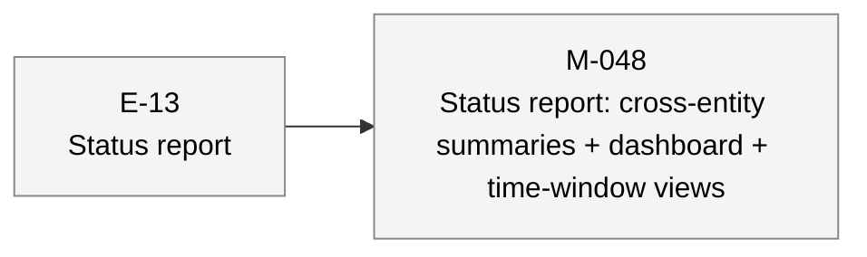
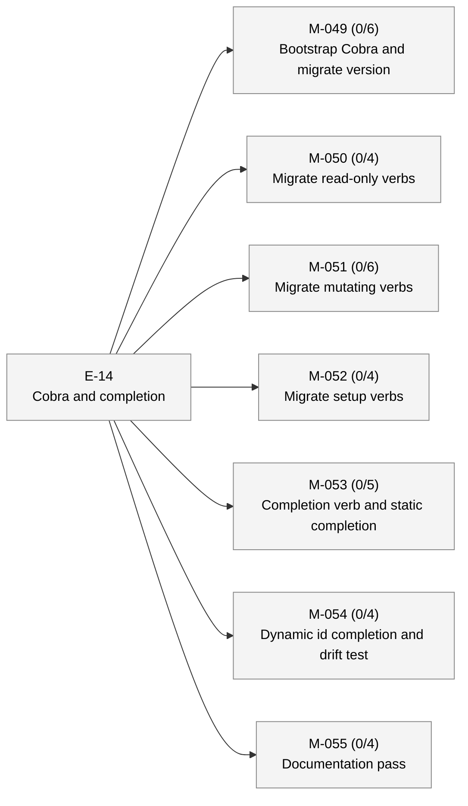
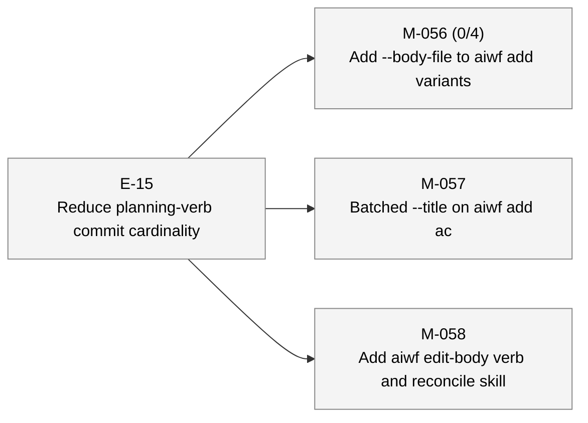

# aiwf status — 2026-05-06

_124 entities · 0 errors · 0 warnings_

## In flight

_(no active epics)_

## Roadmap

### E-13 — Status report _(proposed)_

- **M-048** — Status report: cross-entity summaries + dashboard + time-window views _(draft)_

### E-14 — Cobra and completion _(proposed)_

- **M-049** — Bootstrap Cobra and migrate version _(draft)_ — ACs 0/6 met (6 open)
- **M-050** — Migrate read-only verbs _(draft)_ — ACs 0/4 met (4 open)
- **M-051** — Migrate mutating verbs _(draft)_ — ACs 0/6 met (6 open)
- **M-052** — Migrate setup verbs _(draft)_ — ACs 0/4 met (4 open)
- **M-053** — Completion verb and static completion _(draft)_ — ACs 0/5 met (5 open)
- **M-054** — Dynamic id completion and drift test _(draft)_ — ACs 0/4 met (4 open)
- **M-055** — Documentation pass _(draft)_ — ACs 0/4 met (4 open)

### E-15 — Reduce planning-verb commit cardinality _(proposed)_

- **M-056** — Add --body-file to aiwf add variants _(draft)_ — ACs 0/4 met (4 open)
- **M-057** — Batched --title on aiwf add ac _(draft)_
- **M-058** — Add aiwf edit-body verb and reconcile skill _(draft)_

## Open decisions

_(none)_

## Open gaps

| ID | Title | Discovered in |
|----|-------|---------------|
| G-022 | Provenance model extension surface |  |
| G-023 | Delegated \`--force\` via \`aiwf authorize --allow-force\` |  |
| G-051 | Planning sessions emit one commit per entity, not per logical mutation | E-14 |
| G-052 | Plain-git body edits trigger warnings despite skill permitting them | E-14 |

## Warnings

_(none)_

## Recent activity

| Date | Actor | Verb | Detail |
|------|-------|------|--------|
| 2026-05-06 | human/peter | add | aiwf add ac M-056/AC-3 '--body-file is optional; absence preserves current behavior' |
| 2026-05-06 | human/peter | add | aiwf add ac M-056/AC-2 'Body content from file replaces empty body in created entity' |
| 2026-05-06 | human/peter | add | aiwf add ac M-056/AC-1 '--body-file flag on aiwf add for all six kinds' |
| 2026-05-06 | human/peter | add | aiwf add milestone M-058 'Add aiwf edit-body verb and reconcile skill' |
| 2026-05-06 | human/peter | add | aiwf add milestone M-057 'Batched --title on aiwf add ac' |

