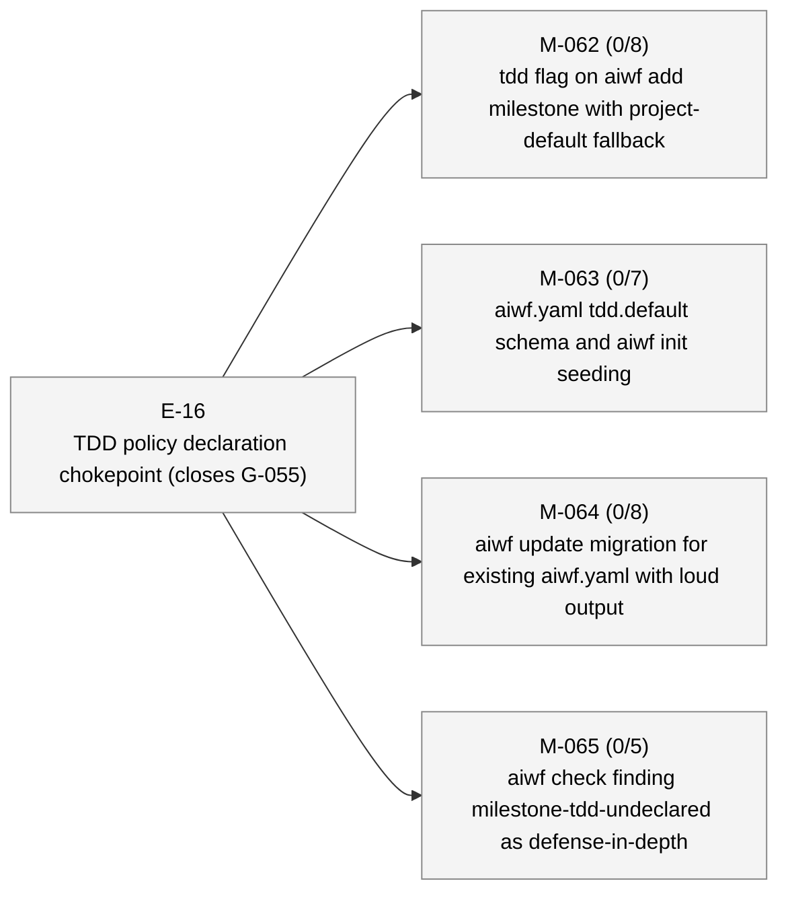

# aiwf status — 2026-05-09

_201 entities · 0 errors · 0 warnings_

## In flight

_(no active epics)_

## Roadmap

### E-16 — TDD policy declaration chokepoint (closes G-055) _(proposed)_

- **M-062** — tdd flag on aiwf add milestone with project-default fallback _(draft)_ — ACs 0/8 met (8 open) — tdd: required
- **M-063** — aiwf.yaml tdd.default schema and aiwf init seeding _(draft)_ — ACs 0/7 met (7 open) — tdd: required
- **M-064** — aiwf update migration for existing aiwf.yaml with loud output _(draft)_ — ACs 0/8 met (8 open) — tdd: required
- **M-065** — aiwf check finding milestone-tdd-undeclared as defense-in-depth _(draft)_ — ACs 0/5 met (5 open) — tdd: required

### E-19 — Parallel TDD subagents with finding-gated AC closure _(proposed)_

_(no milestones)_

## Open decisions

| ID | Kind | Title | Status |
|----|------|-------|--------|
| ADR-0001 | adr | Mint entity ids at trunk integration via per-kind inbox state | proposed |
| ADR-0003 | adr | Add finding (F-NNN) as a seventh entity kind | proposed |
| ADR-0005 | adr | Verb hygiene contract: complete, consistent, pre-flighted aiwf verbs | proposed |
| ADR-0007 | adr | Planning-conversation skills: rituals-plugin placement; pure-skill first, kernel verb only if usage demands it | proposed |

## Open gaps

| ID | Title | Discovered in |
|----|-------|---------------|
| G-022 | Provenance model extension surface |  |
| G-023 | Delegated \`--force\` via \`aiwf authorize --allow-force\` |  |
| G-056 | aiwf render output (site/) is not gitignored; pollutes consumer working tree | E-14 |
| G-057 | Stray aiwf binary in repo root from local builds is not gitignored |  |
| G-058 | AC body sections ship empty; no chokepoint enforces prose intent | E-16 |
| G-059 | Branch model: no canonical mapping from entity hierarchy to git branches; epic/milestone work lands on whichever branch is current | M-069 |
| G-060 | Patch ritual is loosely defined; no kernel-level rules for shape, scope, branch, or audit trail |  |
| G-063 | No defined start-epic ritual: epic activation is a deliberate sovereign act with preflight + optional delegation, but kernel treats it as a one-line FSM flip |  |
| G-067 | wf-tdd-cycle is LLM-honor-system advisory; under load the LLM bypasses RED-first and the branch-coverage HARD RULE without anything mechanical catching it (M-066/AC-1 cycle wrote ~165 lines of impl before any test existed) | M-066 |
| G-068 | Discoverability policy misses dynamic finding subcodes | M-066 |
| G-069 | aiwf init's printRitualsSuggestion hardcodes the CLI install form, which defaults to user scope and won't satisfy doctor.recommended_plugins; nudge silently steers fresh operators away from project-scope outcome | M-070 |
| G-070 | aiwf doctor has no --format=json envelope; M-070's recommended-plugin-not-installed finding-code surfaces only as human text. Add JSON envelope when a JSON-consuming caller appears | M-070 |
| G-073 | depends_on is restricted to milestone→milestone edges; cross-kind blocking lives in body prose only; subsumes G-072 in scope | E-21 |
| G-074 | docs/pocv3/ body prose still uses PoC framing; needs sweep |  |
| G-075 | docs/pocv3/ directory naming is now historical; rename or accept |  |
| G-076 | CONTRIBUTING.md describes PR-based workflow at odds with trunk-based model on main |  |
| G-077 | Post-promotion working paper (aiwf's thesis) not yet written |  |
| G-078 | No priority field on entities; backlog isn't filterable or sortable by importance |  |
| G-079 | aiwfx-plan-milestones plugin skill needs --depends-on documentation; M-076 added the verb but the plugin lives in ai-workflow-rituals upstream | M-076 |
| G-080 | Wide-table verbs wrap mid-row and break column scan; no TTY-aware sizing, glyph palette, or truncation surface | M-076 |
| G-081 | aiwf rename does not pre-flight trunk-collision check | E-21 |
| G-082 | Planning closure should default-merge to main before implementation begins | E-21 |
| G-083 | aiwf retitle does not sync entity body H1 with frontmatter title | E-21 |
| G-084 | Verb hygiene contract is undocumented; G-081/G-082/G-083 lack umbrella | E-21 |
| G-086 | docs/pocv3/contracts.md still references non-existent aiwf list contracts (lines 98, 114-117); same drift class as G-061/G-085, different file | M-072 |
| G-087 | no aiwf-show embedded skill; show is the per-entity inspection verb every AI reaches for, but --help-only coverage misses body-rendering and composite-id discovery | M-074 |
| G-088 | Skill-coverage policy walks internal/skills/embedded/ only; plugin skills (aiwf-extensions/skills/aiwfx-*) are not policed by the kernel — equivalent invariants must be re-applied per-skill in test code as M-079 did | M-079 |
| G-090 | AC-8 materialisation drift-check has three branches not unit-tested; refactor lookup to take cache root as parameter for hermetic testing with synthetic temp dirs | M-079 |
| G-091 | No preventive check for body-prose path-form refs to entity files; archive-move drift surfaces only via post-hoc CI link-check, after the break has already shipped |  |
| G-092 | No documented hierarchy of doc authority across docs/; LLMs and humans cannot tell normative from exploratory from archival without reading every file |  |

## Warnings

_(none)_

## Recent activity

| Date | Actor | Verb | Detail |
|------|-------|------|--------|
| 2026-05-09 | human/peter | promote | aiwf promote G-065 open -> addressed |
| 2026-05-09 | human/peter | promote | aiwf promote G-089 addressed -> addressed |
| 2026-05-09 | human/peter | edit-body | aiwf edit-body G-090 |
| 2026-05-09 | human/peter | edit-body | aiwf edit-body G-088 |
| 2026-05-09 | human/peter | edit-body | aiwf edit-body ADR-0004 |

