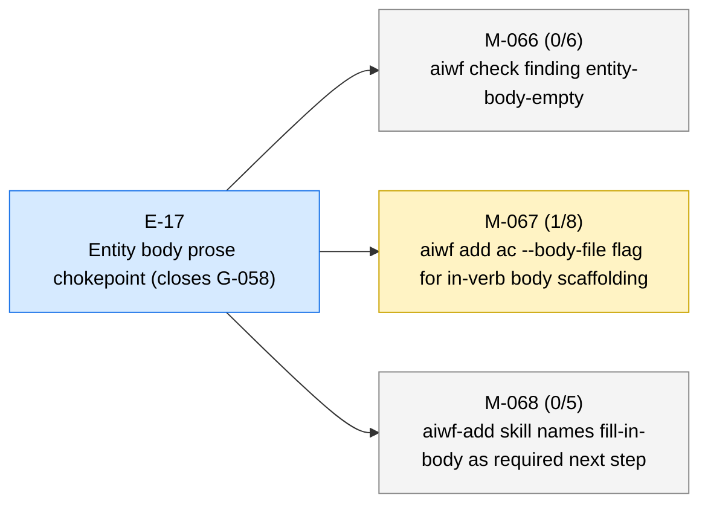
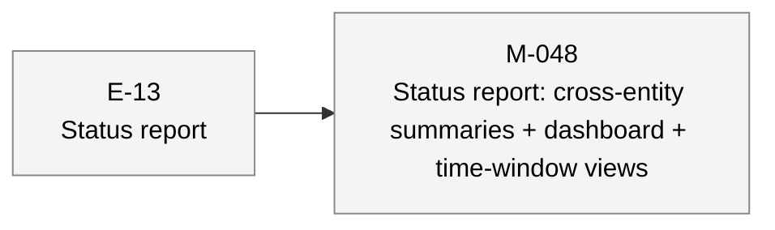
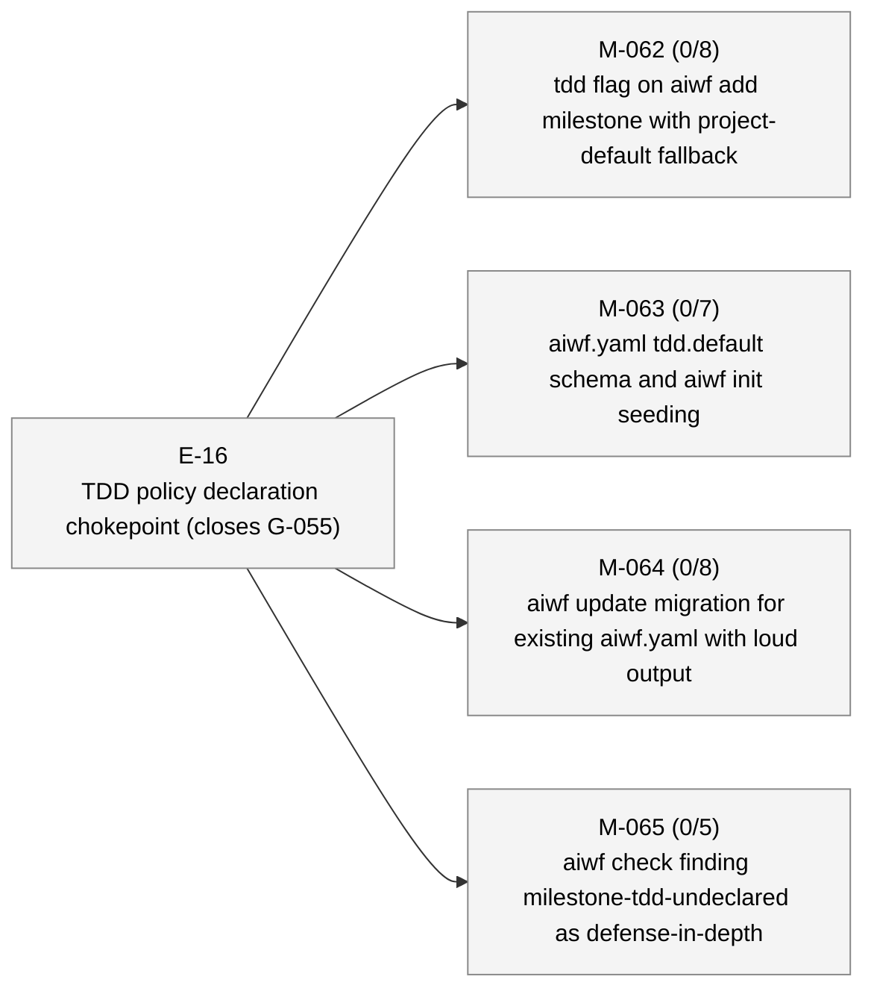
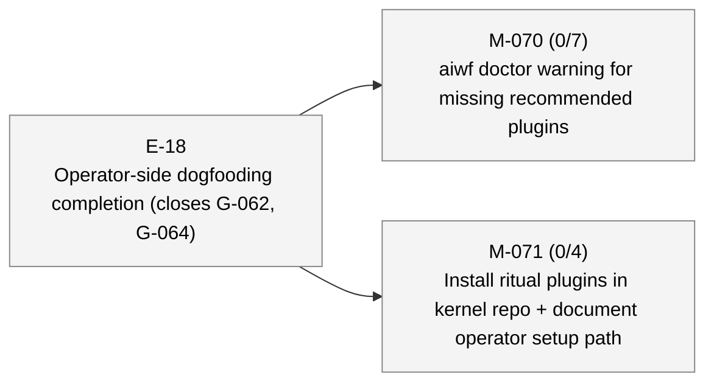

# aiwf status — 2026-05-07

_155 entities · 0 errors · 0 warnings_

## In flight

### E-17 — Entity body prose chokepoint (closes G-058) _(active)_

- **M-066** — aiwf check finding entity-body-empty _(draft)_ — ACs 0/6 met (6 open) — tdd: required
- → **M-067** — aiwf add ac --body-file flag for in-verb body scaffolding _(in_progress)_ — ACs 1/8 met (7 open) — tdd: required
- **M-068** — aiwf-add skill names fill-in-body as required next step _(draft)_ — ACs 0/5 met (5 open) — tdd: required

## Roadmap

### E-13 — Status report _(proposed)_

- **M-048** — Status report: cross-entity summaries + dashboard + time-window views _(draft)_

### E-16 — TDD policy declaration chokepoint (closes G-055) _(proposed)_

- **M-062** — tdd flag on aiwf add milestone with project-default fallback _(draft)_ — ACs 0/8 met (8 open) — tdd: required
- **M-063** — aiwf.yaml tdd.default schema and aiwf init seeding _(draft)_ — ACs 0/7 met (7 open) — tdd: required
- **M-064** — aiwf update migration for existing aiwf.yaml with loud output _(draft)_ — ACs 0/8 met (8 open) — tdd: required
- **M-065** — aiwf check finding milestone-tdd-undeclared as defense-in-depth _(draft)_ — ACs 0/5 met (5 open) — tdd: required

### E-18 — Operator-side dogfooding completion (closes G-062, G-064) _(proposed)_

- **M-070** — aiwf doctor warning for missing recommended plugins _(draft)_ — ACs 0/7 met (7 open) — tdd: required
- **M-071** — Install ritual plugins in kernel repo + document operator setup path _(draft)_ — ACs 0/4 met (4 open) — tdd: required

## Open decisions

| ID | Kind | Title | Status |
|----|------|-------|--------|
| ADR-0001 | adr | Mint entity ids at trunk integration via per-kind inbox state | proposed |

## Open gaps

| ID | Title | Discovered in |
|----|-------|---------------|
| G-022 | Provenance model extension surface |  |
| G-023 | Delegated \`--force\` via \`aiwf authorize --allow-force\` |  |
| G-056 | aiwf render output (site/) is not gitignored; pollutes consumer working tree | E-14 |
| G-057 | Stray aiwf binary in repo root from local builds is not gitignored |  |
| G-058 | AC body sections ship empty; no chokepoint enforces prose intent | E-16 |
| G-059 | Branch model: no canonical mapping from entity hierarchy to git branches; epic/milestone work lands on whichever branch is current | M-069 |
| G-060 | Patch ritual is loosely defined; no kernel-level rules for shape, scope, branch, or audit trail |  |
| G-061 | Generic \`aiwf list <kind>\` verb referenced as canonical in contracts plan and shipped contract skill, but never implemented; AI assistants are instructed to invoke a non-existent verb |  |
| G-062 | aiwf doctor does not surface missing recommended plugins; ritual skills (aiwf-extensions, wf-rituals) can be silently absent from a consumer repo with no signal to operator or AI assistant |  |
| G-063 | No defined start-epic ritual: epic activation is a deliberate sovereign act with preflight + optional delegation, but kernel treats it as a one-line FSM flip |  |
| G-064 | Kernel repo dogfooding closed partial (G-038) without installing the ritual plugins (aiwf-extensions, wf-rituals); operator-side surface incomplete here despite framework design assuming rituals are present |  |
| G-065 | No aiwf retitle verb: scope refactors that change an entity's or AC's intent leave frontmatter title fields permanently misleading; only slug rename is supported |  |
| G-066 | aiwf add epic/milestone/gap/adr/decision/contract verbs lack --body-file flag for in-verb body scaffolding; only aiwf add ac will gain it via M-067, leaving the other six entity-creation verbs reliant on post-add aiwf edit-body |  |

## Warnings

_(none)_

## Recent activity

| Date | Actor | Verb | Detail |
|------|-------|------|--------|
| 2026-05-07 | human/peter | promote | aiwf promote M-067/AC-2 --phase red -> green |
| 2026-05-07 | human/peter | edit-body | test(aiwf): pin multi-AC --body-file positional pairing (M-067/AC-2) |
| 2026-05-07 | human/peter | edit-body | aiwf edit-body M-067 |
| 2026-05-07 | human/peter | promote | aiwf promote M-067/AC-1 open -> met |
| 2026-05-07 | human/peter | promote | aiwf promote M-067/AC-1 --phase green -> done |

