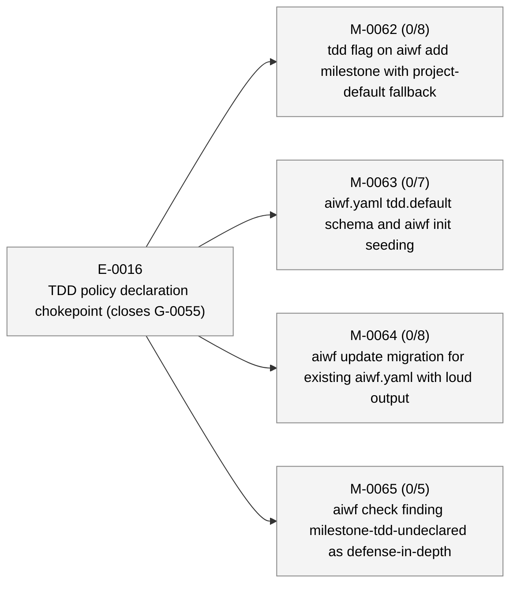
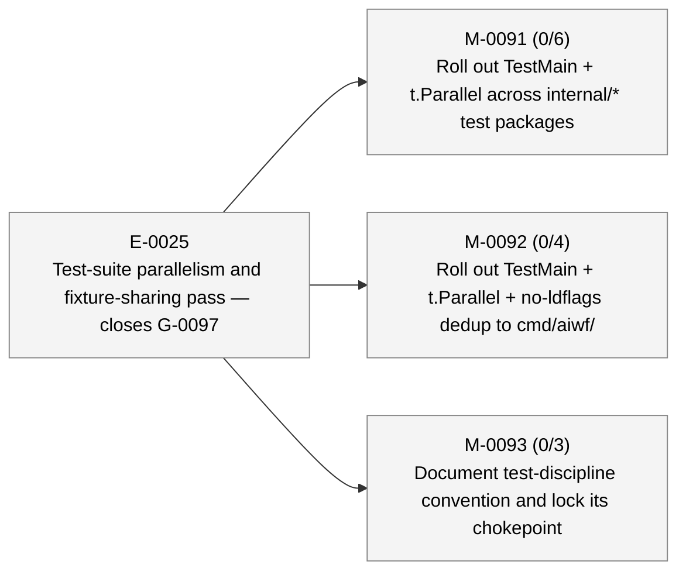
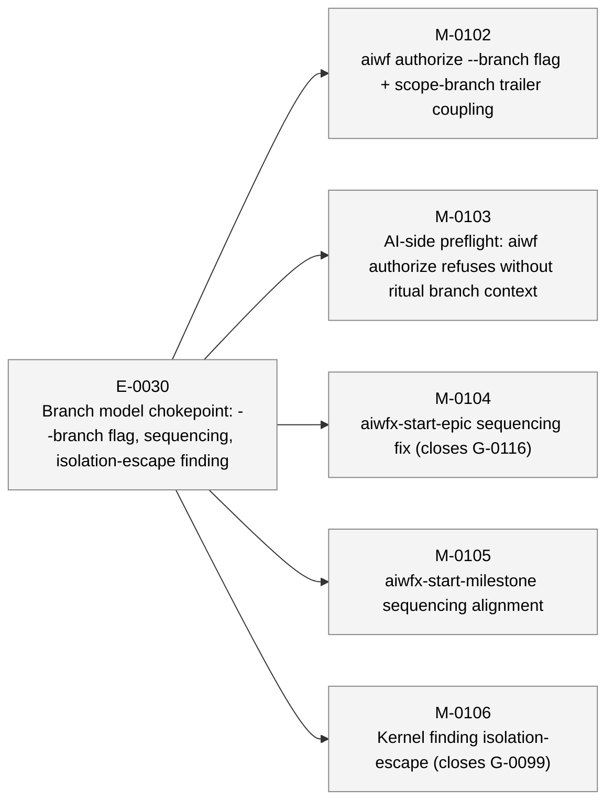

# aiwf status — 2026-05-11

_264 entities · 0 errors · 14 warnings · run `aiwf check` for details_

> Sweep pending: 6 terminal entities not yet archived (run `aiwf archive --dry-run` to preview)

## In flight

_(no active epics)_

## Roadmap

### E-0016 — TDD policy declaration chokepoint (closes G-0055) _(proposed)_

- **M-0062** — tdd flag on aiwf add milestone with project-default fallback _(draft)_ — ACs 0/8 met (8 open) — tdd: required
- **M-0063** — aiwf.yaml tdd.default schema and aiwf init seeding _(draft)_ — ACs 0/7 met (7 open) — tdd: required
- **M-0064** — aiwf update migration for existing aiwf.yaml with loud output _(draft)_ — ACs 0/8 met (8 open) — tdd: required
- **M-0065** — aiwf check finding milestone-tdd-undeclared as defense-in-depth _(draft)_ — ACs 0/5 met (5 open) — tdd: required

### E-0019 — Parallel TDD subagents with finding-gated AC closure _(proposed)_

_(no milestones)_

### E-0025 — Test-suite parallelism and fixture-sharing pass — closes G-0097 _(proposed)_

- **M-0091** — Roll out TestMain + t.Parallel across internal/* test packages _(draft)_ — ACs 0/6 met (6 open) — tdd: none
- **M-0092** — Roll out TestMain + t.Parallel + no-ldflags dedup to cmd/aiwf/ _(draft)_ — ACs 0/4 met (4 open) — tdd: none
- **M-0093** — Document test-discipline convention and lock its chokepoint _(draft)_ — ACs 0/3 met (3 open) — tdd: none

### E-0030 — Branch model chokepoint: --branch flag, sequencing, isolation-escape finding _(proposed)_

- **M-0102** — aiwf authorize --branch flag + scope-branch trailer coupling _(draft)_ — tdd: required
- **M-0103** — AI-side preflight: aiwf authorize refuses without ritual branch context _(draft)_ — tdd: required
- **M-0104** — aiwfx-start-epic sequencing fix (closes G-0116) _(draft)_ — tdd: required
- **M-0105** — aiwfx-start-milestone sequencing alignment _(draft)_ — tdd: required
- **M-0106** — Kernel finding isolation-escape (closes G-0099) _(draft)_ — tdd: required

## Open decisions

| ID | Kind | Title | Status |
|----|------|-------|--------|
| ADR-0001 | adr | Mint entity ids at trunk integration via per-kind inbox state | proposed |
| ADR-0009 | adr | Orchestration substrate: substrate-vs-driver split with trailer-only events | proposed |

## Open gaps

| ID | Title | Discovered in |
|----|-------|---------------|
| G-0022 | Provenance model extension surface |  |
| G-0023 | Delegated \`--force\` via \`aiwf authorize --allow-force\` |  |
| G-0060 | Patch ritual is loosely defined; no kernel-level rules for shape, scope, branch, or audit trail |  |
| G-0067 | wf-tdd-cycle is LLM-honor-system advisory; no mechanical RED-first guard | M-0066 |
| G-0068 | Discoverability policy misses dynamic finding subcodes | M-0066 |
| G-0070 | aiwf doctor lacks --format=json envelope | M-0070 |
| G-0073 | depends_on restricted to milestone→milestone; cross-kind blocking via body prose | E-0021 |
| G-0074 | docs/pocv3/ body prose still uses PoC framing; needs sweep |  |
| G-0075 | docs/pocv3/ directory naming is now historical; rename or accept |  |
| G-0077 | Post-promotion working paper (aiwf's thesis) not yet written |  |
| G-0078 | No priority field on entities; backlog isn't filterable or sortable by importance |  |
| G-0080 | Wide-table verbs wrap mid-row; no TTY-aware sizing or truncation | M-0076 |
| G-0087 | No aiwf-show embedded skill | M-0074 |
| G-0088 | Skill-coverage policy doesn't police plugin skills under aiwf-extensions/ | M-0079 |
| G-0090 | M-0079 AC-8 drift-check has untested branches; refactor for hermetic tests | M-0079 |
| G-0092 | No documented hierarchy of doc authority across docs/ |  |
| G-0097 | Test-suite wall time dominated by serial execution and per-test setup |  |
| G-0099 | Worktree isolation must be a parent-side precondition, not an Agent kwarg honor |  |
| G-0103 | absolute-path leak lint | M-0089 |
| G-0104 | Test-parallelism discipline: ship to consumers via wf-rituals or BYO? | E-0025 |
| G-0107 | reorganize cmd/aiwf into idiomatic per-verb packages |  |
| G-0110 | gremlins --diff <ref> filter excludes new files entirely; manual mutation review needed for M-0094/95/96 | M-0097 |
| G-0111 | Wrap-side ritual: scope ends before done, human-only on done, wrap-epic update | M-0096 |
| G-0112 | STATUS.md pre-commit regen produces merge conflicts on a derived artifact |  |
| G-0113 | rendered HTML site has no publish path; only viewable via local aiwf render |  |
| G-0114 | HTML render gap surface: status and archive state not glanceable from sidebar |  |
| G-0116 | aiwfx-start-epic creates worktree before promote/authorize on trunk-based repos | E-0029 |
| G-0117 | aiwf render html: project tree once, render via SPA instead of N files |  |

## Warnings

| Code | Entity | Path | Message |
|------|--------|------|---------|
| acs-tdd-audit | M-0107/AC-1 | work/epics/E-0029-glanceable-governance-html-render-layout-sidebar-chips-closes-g-0114/M-0107-repair-playwright-e2e-suite-for-current-kernel-state.md | M-0107/AC-1 status: met under tdd: advisory but tdd_phase is (absent) (expected done) |
| acs-tdd-audit | M-0107/AC-2 | work/epics/E-0029-glanceable-governance-html-render-layout-sidebar-chips-closes-g-0114/M-0107-repair-playwright-e2e-suite-for-current-kernel-state.md | M-0107/AC-2 status: met under tdd: advisory but tdd_phase is (absent) (expected done) |
| entity-body-empty | M-0102 | work/epics/E-0030-branch-model-chokepoint-branch-flag-sequencing-isolation-escape-finding/M-0102-aiwf-authorize-branch-flag-scope-branch-trailer-coupling.md | M-0102 body section \`## Acceptance criteria\` is empty |
| entity-body-empty | M-0103 | work/epics/E-0030-branch-model-chokepoint-branch-flag-sequencing-isolation-escape-finding/M-0103-ai-side-preflight-aiwf-authorize-refuses-without-ritual-branch-context.md | M-0103 body section \`## Acceptance criteria\` is empty |
| entity-body-empty | M-0104 | work/epics/E-0030-branch-model-chokepoint-branch-flag-sequencing-isolation-escape-finding/M-0104-aiwfx-start-epic-sequencing-fix-closes-g-0116.md | M-0104 body section \`## Acceptance criteria\` is empty |
| entity-body-empty | M-0105 | work/epics/E-0030-branch-model-chokepoint-branch-flag-sequencing-isolation-escape-finding/M-0105-aiwfx-start-milestone-sequencing-alignment.md | M-0105 body section \`## Acceptance criteria\` is empty |
| entity-body-empty | M-0106 | work/epics/E-0030-branch-model-chokepoint-branch-flag-sequencing-isolation-escape-finding/M-0106-kernel-finding-isolation-escape-closes-g-0099.md | M-0106 body section \`## Acceptance criteria\` is empty |
| terminal-entity-not-archived | M-0098 | work/epics/E-0029-glanceable-governance-html-render-layout-sidebar-chips-closes-g-0114/M-0098-render-site-layout-overhaul-viewport-fill-body-flush-left-sidebar-prose-cap.md | entity M-0098 has terminal status 'done' but file is still in the active tree; awaiting \`aiwf archive --apply\` sweep |
| terminal-entity-not-archived | M-0099 | work/epics/E-0029-glanceable-governance-html-render-layout-sidebar-chips-closes-g-0114/M-0099-kind-index-chip-filter-single-emitted-file-per-kind-with-target-chips.md | entity M-0099 has terminal status 'done' but file is still in the active tree; awaiting \`aiwf archive --apply\` sweep |
| terminal-entity-not-archived | M-0100 | work/epics/E-0029-glanceable-governance-html-render-layout-sidebar-chips-closes-g-0114/M-0100-sidebar-adds-gap-entry-epic-archive-chip-filter.md | entity M-0100 has terminal status 'done' but file is still in the active tree; awaiting \`aiwf archive --apply\` sweep |
| terminal-entity-not-archived | M-0101 | work/epics/E-0029-glanceable-governance-html-render-layout-sidebar-chips-closes-g-0114/M-0101-in-page-status-hierarchy-in-gaps-html.md | entity M-0101 has terminal status 'cancelled' but file is still in the active tree; awaiting \`aiwf archive --apply\` sweep |
| terminal-entity-not-archived | M-0107 | work/epics/E-0029-glanceable-governance-html-render-layout-sidebar-chips-closes-g-0114/M-0107-repair-playwright-e2e-suite-for-current-kernel-state.md | entity M-0107 has terminal status 'done' but file is still in the active tree; awaiting \`aiwf archive --apply\` sweep |
| terminal-entity-not-archived | E-0029 | work/epics/E-0029-glanceable-governance-html-render-layout-sidebar-chips-closes-g-0114/epic.md | entity E-0029 has terminal status 'done' but file is still in the active tree; awaiting \`aiwf archive --apply\` sweep |

## Recent activity

| Date | Actor | Verb | Detail |
|------|-------|------|--------|
| 2026-05-12 | human/peter | add | aiwf add gap G-0117 'aiwf render html: project tree once, render via SPA instead of N files' |
| 2026-05-12 | human/peter | archive | aiwf archive: sweep 2 entities into archive/ (2 gap) |
| 2026-05-12 | human/peter | promote | aiwf promote G-0115 open -> addressed |
| 2026-05-12 | human/peter | render-roadmap | aiwf render roadmap |
| 2026-05-12 | human/peter | edit-body | aiwf edit-body E-0030 |

