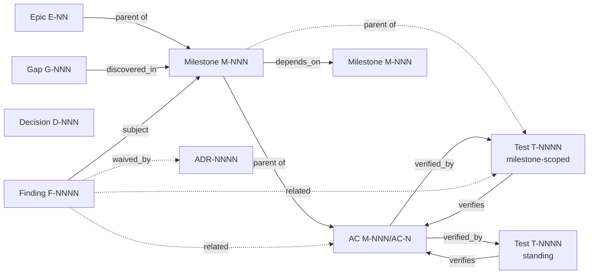

# AIWF architecture proposal — TDD-aware milestone workflow

**Status.** Architecture proposal. Supersedes the prior single-axis TDD model and the AC-as-step coupling. Compatible with the current entity ids, status terminology, and skill names where possible; explicit about what changes.

**Audience.** AIWF maintainers and contributors evaluating the workflow's redesign. Assumes familiarity with the existing `aiwf` kernel and the `aiwfx-*` and `wf-*` skill families.

**Companion document.** *AIWF workflow diagnostic — current state analysis* describes the structural tensions in the current design that motivate this proposal. The diagnostic and the proposal are independently readable.

---

## 1. Goals

The redesign targets six concrete outcomes:

1. **TDD discipline as a first-class concept.** A milestone declares which TDD model it uses (`classical | outside-in | property | contract | hybrid | none`); the kernel and skills behave accordingly. The current binary `tdd: required | none` flag captures enforcement intent but not which model.

2. **Decoupling of acceptance criteria from test artifacts.** An AC describes observable behavior; it can be verified by one or more test artifacts at one or more layers. The current 1:1 FSM coupling between AC and TDD cycle dissolves.

3. **Structural cheating defenses.** Test deletion, modification of immutable acceptance suites, and silent quarantine become structurally impossible (refused at the verb layer) or structurally visible (recorded as findings). The defenses do not depend on agent good behavior.

4. **HITL surface via persistent findings.** `aiwf check` produces persistent `F-NNNN` entities with severity, status, and acknowledgement state. Findings are the channel through which audits raise issues that need human attention; a progression gate prevents the next milestone from starting while blocking findings exist.

5. **Autonomous execution compatibility.** Milestones can run end-to-end without HITL during implementation. The wrap flow phases cleanly into a non-interactive audit, conditional human review, and a non-interactive commit. Subagent execution is supported as a special case of this phasing.

6. **Light determinism preserved.** The kernel stays small and strict on a focused set of invariants. The skills carry the LLM-facing flexibility. Adding a discipline or an audit code does not require kernel surface expansion beyond the registered enums.

---

## 2. Design principles

**P1 — Kernel = small core of strict invariants. Skills = flexible LLM-facing layer.**
The kernel knows about entities, ids, FSM transitions, tree shape, and audit registration. Discipline rules, cycle shape, branch-coverage policy, mocking conventions, and prompting heuristics live in skills. Adding a new TDD discipline is a skill addition; the kernel notices only if a new enum value or audit code is registered.

**P2 — Acceptance criteria and test artifacts are separate first-class entities.**
ACs (`M-NNN/AC-N`) describe observable behavior. Test artifacts (`T-NNNN`) are the verifying tests. Each AC's `verified_by` is a list of `T-NNNN`; each `T-NNNN`'s `verifies` is the inverse. The relation is many-to-many. Test artifacts have their own status FSM, separate from AC status.

**P3 — TDD discipline is declared at the milestone level and drives skill dispatch.**
The milestone's `tdd.discipline` value selects the cycle skill (`wf-tdd-cycle`, `wf-bdd-cycle`, `wf-property-cycle`, `wf-contract-cycle`, or hybrid composition). The discipline also determines default branch-coverage policy, default mocking policy, and the wrap gate.

**P4 — Test integrity is enforced structurally at the verb layer.**
`aiwf` refuses to delete a test artifact except via the quarantine path, which requires a gap entity and a recorded reason. Modifications to test artifacts marked `immutable_during_milestone` are blocked at the verb layer. Test-file changes are diffed and audited at wrap.

**P5 — Findings persist as entities; severity is on the rule, gating is on the runner.**
`aiwf check` produces `F-NNNN` entities with `severity` (error/warning/info) and `requires_human_decision` (a property of the rule code). Whether a finding blocks merge or proceeds is the runner's responsibility — `aiwf check` reports, `aiwf check --strict` blocks. This separates "the rule's verdict" from "what the runner does with the verdict."

**P6 — Just-in-time authoring with explicit strategic/tactical split.**
Strategic metadata (TDD discipline, epic mode, milestone shape) is set at plan time and is stable. Tactical detail (test strategy prose, AC bodies, design notes, surfaces touched) is filled at start time against current context. The skill family enforces this split — `aiwfx-plan-milestones` does not write what `aiwfx-start-milestone` is meant to write.

**P7 — Autonomous and interactive modes are runtime properties, not entity properties.**
The same milestone spec runs cleanly under either mode. The runner picks at invocation. Skills are mode-aware; the entities and findings produced are identical.

**P8 — Wrap phases cleanly: audit → review → commit.**
Wrap is three phases (A: audit, B: review, C: commit). A and C are non-interactive; B is conditional on findings and HITL when present. Subagent execution maps onto this naturally — a subagent runs implementation + Phase A and returns; the parent context handles Phase B with HITL; Phase C completes.

---

## 3. Entity model

### 3.1. Entity catalog

Eight entities total: six preserved from the current kernel, two new.

| Entity | ID | Parent | Status FSM | Notes |
|---|---|---|---|---|
| Epic | `E-NN` | none | `proposed → active → done \| cancelled` | Coordination unit; gains `mode: planned \| exploratory` |
| Milestone | `M-NNN` | epic | `draft → in_progress → done \| cancelled` | Independently shippable; gains richer `tdd:` block |
| Acceptance Criterion | `M-NNN/AC-N` | milestone | `open → met \| deferred \| cancelled` | Compound id (preserved); loses `tdd_phase`; gains `verified_by[]` |
| Test Artifact | `T-NNNN` | milestone OR none (standing) | `red → green → done \| quarantined` | New; backed by a file under `tests/` |
| Finding | `F-NNNN` | none | `open → acknowledged → resolved \| waived` | New; produced by `aiwf check` and other audits |
| ADR | `ADR-NNNN` | none | (existing) | Durable architectural decision |
| Decision | `D-NNN` | none | (existing) | Project-scoped decision |
| Gap | `G-NNN` | discovered-in milestone | (existing) | Deferred work that survives milestone close |

**Asymmetric ownership:**
- ACs stay compound (`M-NNN/AC-N`). Position-stable allocation, parent-scoped reordering, no global churn when an AC is added.
- Test artifacts have an optional milestone parent. If `parent` is null, the test is *standing* (project-level); if `parent` is `M-NNN`, the test is *milestone-scoped* (created during M-NNN's work).
- ADRs, Decisions, Gaps, Findings have no parent; they reference subjects via explicit fields.

### 3.2. Entity relationships



### 3.3. Frontmatter schemas

#### Epic

```yaml
---
id: E-12
title: <imperative title>
status: active                 # proposed | active | done | cancelled
mode: planned                  # planned | exploratory
success_criteria:              # observable outcomes; references for trace
  - id: SC-1
    title: <criterion>
    carrier_acs: []            # filled at plan-milestones; M-NNN/AC-N references
  - id: SC-2
    title: <criterion>
    carrier_acs: [M-042/AC-1, M-043/AC-2]
---
```

`success_criteria` becomes a structured list (replacing the prior prose-only block). Each criterion has an id (`SC-N`, scoped within the epic) and a `carrier_acs` array filled by `aiwfx-plan-milestones` and validated at wrap-epic.

#### Milestone

```yaml
---
id: M-042
title: <imperative title>
parent: E-12
status: in_progress            # draft | in_progress | done | cancelled
depends_on: [M-041]
tdd:
  discipline: outside-in       # classical | outside-in | property | contract | hybrid | none
  enforcement: required        # required | advisory | none
  gate: acceptance_suite       # acceptance_suite | unit_suite | property_suite | mixed | none
  branch_coverage: targeted    # exhaustive | targeted | none
acs:
  - id: AC-1
    title: <observable behavior>
    status: open               # open | met | deferred | cancelled
    verified_by: [T-1001]
  - id: AC-2
    title: <observable behavior>
    status: open
    verified_by: [T-1001, T-1002]
---
```

Frontmatter changes from the current schema:
- `tdd:` block replaces the single-axis enum.
- ACs gain `verified_by`; lose `tdd_phase`.
- Everything else preserved (id, parent, status, depends_on).

#### Test Artifact

```yaml
---
id: T-1001
title: empty cart cannot proceed to checkout
parent: M-042                  # null for standing tests
scope: milestone               # milestone | standing — derived from parent, validated
status: green                  # red | green | done | quarantined
kind: acceptance               # acceptance | integration | unit | property | contract
file: tests/acceptance/checkout/empty_cart.bdd
verifies: [M-042/AC-1, M-042/AC-2]
immutable_during_milestone: true
quarantine_gap: null           # G-NNN required when status is quarantined
---
```

Test artifacts are fully kernel-tracked. The `file` field is the path on disk; the kernel verifies file presence on `aiwf check`. The `kind` is one of five enums and drives the wrap gate's interpretation. `immutable_during_milestone` blocks edits at the verb layer for the milestone's lifetime.

#### Finding

```yaml
---
id: F-1023
code: standing-test-red
severity: error                # error | warning | info
status: open                   # open | acknowledged | resolved | waived
requires_human_decision: false # property of the code, not the instance
subject: T-0042                # primary entity the finding concerns
related: [M-042, M-042/AC-1]   # optional, any entity types
discovered_at: 2026-05-09T10:14:00Z
discovered_by: aiwf-check
resolved_by: null              # commit SHA, ADR-NNNN, D-NNN, or G-NNN
waived_by: null                # ADR-NNNN required for waivers
body_path: work/findings/F-1023.md
---
```

Findings are first-class entities. The kernel maintains them across runs: `aiwf check` reconciles current findings against persisted ones — new issues create new findings, resolved issues move to `resolved`, waived findings stay sticky.

`requires_human_decision` is a property of the *code* (registered with the kernel), not of the individual finding instance. Some codes are agent-resolvable (`acs-shape`, `mutation-survival-detected`); others require a human judgment (`discipline-shipped-mismatch`, `tests-deleted-without-adr`).

### 3.4. Status FSMs

#### Milestone

```
draft ─────────────► in_progress ─────────────► done
  │                       │                      ▲
  │                       └──────► cancelled     │
  └─────► cancelled                              │
                                                 │
        (from in_progress, only via wrap completion)
```

#### Acceptance Criterion

```
open ──► met
  │       
  ├──► deferred       (work moved to a gap or future milestone)
  └──► cancelled      (no longer applies)
```

`met` requires every test artifact in `verified_by` to be at `done` (or `quarantined` with a kernel-recognized waiver path). The kernel's audit (replaces `acs-tdd-audit`) checks this.

#### Test Artifact

```
       ┌────► refactor ─┐
       │                │
red ──► green ──────────┴──► done
 │       │
 │       └──► quarantined  (with mandatory quarantine_gap: G-NNN)
 └──► quarantined  (rare; usually only with import via aiwf import test)
```

`refactor` is an optional intermediate state for green→green transitions during a refactor pass. `done` is terminal for living tests; `quarantined` is terminal until the quarantine is resolved (either by reopening the test via `aiwf reopen test T-NNNN --reason ...` or by closing the gap).

#### Finding

```
open ──► acknowledged ──► resolved
  │                          ▲
  │                          │
  └──► waived (sticky) ──────┘
              │
              └─► (no auto-reopen on subsequent aiwf check runs)
```

Auto-reconciliation: when `aiwf check` runs and the rule that produced a finding no longer fires for that subject, the finding moves to `resolved` automatically (with `resolved_by` set to the run's audit reference). `waived` findings do not re-open even if the rule fires again — the waiver is sticky until explicitly revoked.

### 3.5. Verb surface (additions and changes)

New verbs:

```bash
aiwf add test --milestone M-NNN --kind <kind> --file <path>
aiwf add test --scope standing --kind <kind> --file <path>
aiwf import test --file <path> [--scope standing | --milestone M-NNN]
aiwf promote T-NNNN green | refactor | done
aiwf quarantine T-NNNN --gap G-NNN --reason "<text>"
aiwf reopen test T-NNNN --reason "<text>"
aiwf modify test T-NNNN --reason "<text>"  # explicit unlock for standing tests

aiwf record finding --code <code> --subject <id> [--severity <s>] [--related <ids>]
aiwf acknowledge F-NNNN --note "<text>"
aiwf resolve F-NNNN [--by <commit-sha | ADR-NNNN | D-NNN | G-NNN>]
aiwf waive F-NNNN --adr ADR-NNNN

aiwf promote E-NN --mode planned    # one-way exploratory → planned transition
```

Changed verbs:

```bash
aiwf add ac M-NNN --title "<observable behavior>"
  # No longer seeds tdd_phase. ACs get verified_by populated as test artifacts are added.

aiwf promote M-NNN/AC-<N> met
  # Now refused if any verified_by[T-NNNN] is not at status: done or quarantined-with-waiver.
  # No longer requires per-AC tdd_phase progression.
```

Removed verbs:

```bash
aiwf promote M-NNN/AC-<N> --phase red | green | refactor | done
  # Phase tracking moves to test artifacts. AC-level phase no longer exists.
```

### 3.6. Audit codes

The current registered codes are preserved where they still apply. New codes register with the kernel:

| Code | Severity | Requires Human | Trigger |
|---|---|---|---|
| `acs-shape` | error | no | AC frontmatter structurally invalid |
| `acs-body-coherence` | warning | no | Frontmatter `acs[]` ↔ body headings drift |
| `milestone-done-incomplete-acs` | error | no | Milestone at `done` with `open` ACs |
| `unexpected-tree-file` | error | no | File under `work/` not recognized or whitelisted |
| `verified-by-points-at-missing-test` | error | no | AC's `verified_by` references nonexistent T-NNNN |
| `test-file-missing` | error | no | T-NNNN's `file` does not exist on disk |
| `tests-deleted-without-adr` | error | yes | Test files deleted from `tests/` without recorded action |
| `acceptance-test-modified-mid-milestone` | error | yes | T-NNNN with `immutable_during_milestone: true` modified |
| `quarantined-test-without-gap` | error | yes | T-NNNN at `quarantined` with no `quarantine_gap` |
| `mocks-outside-declared-seams` | warning | no | Heuristic; only fires if Test integrity declares seams |
| `epic-criterion-uncovered` | error | yes | Success criterion has no `carrier_acs` (planned epics) |
| `discipline-shipped-mismatch` | warning | yes | What shipped diverges from declared `tdd.discipline` |
| `standing-test-red` | error | yes | Standing T-NNNN at status `red` (project health) |
| `mutation-survival-detected` | warning | no | External tool reports surviving mutant (opt-in) |

The `requires_human_decision` column governs the progression gate (§5.3). Codes flagged `yes` block the next milestone from starting until the finding is resolved, waived, or deferred to a gap; codes flagged `no` are agent-fixable.


---

## 4. TDD discipline as a first-class concept

### 4.1. The discipline enum

A milestone's `tdd.discipline` is one of:

- **`classical`** — Detroit-school. State-based unit tests. Exhaustive branch coverage. Mocks at external dependencies (network, clock, filesystem). One AC typically maps to one or a small group of unit tests. The current `wf-tdd-cycle` behavior is preserved here unchanged.
- **`outside-in`** — London-school flavor at boundaries with state-based core. Acceptance/integration tests against real surfaces; targeted unit tests for risky internals. Branch coverage is *targeted* (exhaustive on declared core, cascade-covered for glue). Mocks only at declared seams (network, clock, true integration boundaries).
- **`property`** — Property-based. ACs assert invariants; test artifacts of `kind: property` exercise generated cases. Branch coverage is targeted; the property suite is the gate.
- **`contract`** — Contract-first. Public surface is defined by an OpenAPI/JSON Schema/protobuf artifact; test artifacts of `kind: contract` verify conformance. Branch coverage is targeted; the contract suite is the gate.
- **`hybrid`** — Multiple disciplines composed within one milestone. Each AC declares its own discipline-flavored verification via `verified_by` pointing at test artifacts of different kinds. The wrap gate is `mixed` and verifies each component.
- **`none`** — No formal TDD. Used for documentation sweeps, refactors, exploratory work. The Test strategy section is optional. The cycle skills are not invoked.

### 4.2. The `tdd:` block fields and their effects

```yaml
tdd:
  discipline: outside-in
  enforcement: required
  gate: acceptance_suite
  branch_coverage: targeted
```

**`discipline`** drives:
- Which cycle skill is dispatched per AC.
- Default Test strategy templates and prompts in `aiwfx-start-milestone`.
- Default mocking policy (uniform mock-everything for `classical`; declared-seams-only for `outside-in`; per-component for `hybrid`).

**`enforcement`** drives:
- `required` — kernel audits fire as `error`. `acs-shape`, `verified-by-points-at-missing-test`, and the integrity codes are non-negotiable.
- `advisory` — same audits fire as `warning`. Useful for legacy milestones being retrofitted.
- `none` — the test-related audits (`verified-by-points-at-missing-test`, etc.) do not fire. Structural audits (`acs-shape`, `unexpected-tree-file`) still apply.

**`gate`** drives:
- The wrap audit's verdict. `acceptance_suite` requires every T-NNNN of `kind: acceptance` parented to this milestone to be `done`. `unit_suite` requires every `kind: unit`. `property_suite` requires every `kind: property`. `mixed` (for hybrid) requires every test artifact at `kind`'s declared layer to be `done`. `none` skips the test-suite gate (but build/lint/type still gate).

**`branch_coverage`** drives:
- The cycle skills' branch-coverage audit behavior.
- `exhaustive` — every reachable branch in the diff has an explicit test. Default for `classical`.
- `targeted` — branches in declared-core surfaces have tests; glue/wiring is covered by acceptance cascade. Cascade-covered branches are documented in `## Coverage notes`. Default for `outside-in`, `property`, `contract`.
- `none` — no branch-coverage audit. Default for `discipline: none`; permitted under any discipline as an explicit override.

### 4.3. Default values

When the `tdd:` block is omitted entirely (preserving backward compatibility for current milestones):

```yaml
tdd:
  discipline: classical
  enforcement: none
  gate: unit_suite
  branch_coverage: targeted
```

This is intentionally permissive for unspecified milestones. Existing milestones continue to behave roughly as today; new milestones opt into stricter behavior by writing the block.

### 4.4. Per-discipline cycle skill dispatch

`aiwfx-start-milestone` step 4 (per-AC iteration) dispatches based on the discipline of the milestone or, in hybrid milestones, the kind of the AC's primary test artifact:

| `tdd.discipline` | AC's primary test kind | Cycle skill invoked |
|---|---|---|
| `classical` | (any) | `wf-tdd-cycle` |
| `outside-in` | acceptance/integration | `wf-bdd-cycle` |
| `outside-in` | unit | `wf-tdd-cycle` (for the targeted-units beat) |
| `property` | property | `wf-property-cycle` |
| `contract` | contract | `wf-contract-cycle` |
| `hybrid` | per-AC | dispatch per the AC's primary test kind |
| `none` | (none) | no cycle skill; implementation runs without TDD framing |

The cycle skills share an FSM shape (red → green → done, with optional refactor) but differ in defaults: the test layer they target, mocking conventions, branch-coverage application, and what "minimum to pass" means in their context.

---

## 5. Skill family architecture

### 5.1. The skill catalog

Existing skills retained (with modifications):

| Skill | Phase | Modifications |
|---|---|---|
| `aiwfx-plan-epic` | Plan | Adds `mode: planned \| exploratory`; structures `success_criteria` as a list with ids |
| `aiwfx-plan-milestones` | Plan | Sets `tdd:` block per milestone; checks epic-criterion coverage (planned epics only) |
| `aiwfx-start-milestone` | Execute | Runtime `--autonomous \| --interactive` flag; authors Test strategy + Test integrity sections; populates AC `verified_by` |
| `wf-tdd-cycle` | Execute | Behavior preserved for `discipline: classical`; no longer the only cycle skill |
| `aiwfx-wrap-milestone` | Close | Three-phase wrap (audit / review / commit); discipline-compliance check; test-integrity audit |
| `aiwfx-wrap-epic` | Close | Epic-criterion coverage check; discipline retrospective in wrap artefact |
| `aiwfx-record-decision` | Cross-cutting | Unchanged |

New skills:

| Skill | Phase | Role |
|---|---|---|
| `wf-bdd-cycle` | Execute | Outside-in cycle: acceptance test against real surface, no mocks at the test seam, targeted-units afterwards |
| `wf-property-cycle` | Execute | Property cycle: declare property, exercise generated cases, verify |
| `wf-contract-cycle` | Execute | Contract cycle: define/update contract artifact, verify conformance |
| `wf-finding-review` | Wrap Phase B | HITL walkthrough of blocking findings |

### 5.2. Skill behavior under runtime mode

The runtime mode (`autonomous` vs `interactive`) is set at invocation:

```bash
aiwfx-start-milestone M-042                 # default per project config
aiwfx-start-milestone M-042 --autonomous    # no HITL during implementation
aiwfx-start-milestone M-042 --interactive   # HITL allowed throughout
```

Behavioral differences:

```
Skill: aiwfx-start-milestone preflight (AC vagueness check)
  autonomous  → vague AC fails preflight; do not promote to in_progress;
                surface as F-NNNN finding pointing at the spec; halt.
  interactive → ask the user; refine via aiwf add ac.

Skill: cycle (wf-tdd-cycle, wf-bdd-cycle, wf-property-cycle, wf-contract-cycle)
  autonomous  → record assumption (D-NNN); open finding if questionable; proceed.
                Test-integrity violations refused at verb layer (kernel-blocked, not
                policy-blocked).
  interactive → ask the user inline; record decision per their answer.

Skill: aiwfx-wrap-milestone Phase B (finding review)
  autonomous  → wait for parent / human; do not auto-resolve.
                In subagent contexts, the subagent returns Phase A artifacts
                and the parent runs Phase B with HITL.
  interactive → walk through findings inline with the user; resolve each.
```

The skills check the runtime mode flag; the entities and findings produced are identical either way. A subagent running M-042 autonomously emits the same artifacts as a human running M-042 interactively.

### 5.3. Progression gate

The kernel enforces an inter-milestone progression rule:

> A milestone cannot promote to `in_progress` if any milestone in its `depends_on` chain has an open finding with `severity: error` OR `requires_human_decision: true`.

This is the structural guarantee that the agent (autonomous or interactive) cannot steamroll past unresolved questions. The next milestone is blocked until the prior milestone's findings are at terminal states (`resolved` or `waived`).

The gate is implemented as a kernel check on the `aiwf promote M-NNN in_progress` verb. It runs before status transition and fails with a structured error message listing the blocking findings.

### 5.4. The Test strategy and Test integrity sections

Two new body sections in the milestone template, populated at `aiwfx-start-milestone`:

**`## Test strategy`** — declarative prose summarizing what tests at what layers verify which ACs.

For a small milestone, one paragraph is sufficient:

> Single unit test against `format_error_message`. No external dependencies.

For a larger or hybrid milestone, the section grows to explain layer choices, mock strategy, and gate composition:

> Outside-in for the API surface (one BDD scenario covering AC-1, AC-2);
> classical state-based for `PricingEngine` (covers AC-3 in isolation).
> Mocks only at the `HttpClient` seam to ExternalPricingService.
> Gate: acceptance scenario green + pricing unit suite green.

The section is required when `tdd.discipline != none`. The kernel does not parse its prose; the structure that audits operate on lives in the entity model (`tdd:` block, AC `verified_by`, T-NNNN kinds).

**`## Test integrity`** — declarative invariants for the test suite during the milestone:

> - Acceptance tests under `tests/acceptance/` are immutable for this milestone.
> - Mocks permitted only at: `HttpClient`, `Clock`. Adding mocks elsewhere is a finding.
> - Test-file deletions require an ADR.

The section is descriptive of the structural rules (which the verb layer enforces) plus heuristic rules (which the wrap audit checks via the `mocks-outside-declared-seams` code). For projects that don't customize integrity rules, defaults inherit from `tdd.discipline`.


---

## 6. Findings system

### 6.1. Why findings are entities

The current architecture treats `aiwf check` as a producer of ephemeral output: codes and severities printed to stdout, regenerated each run. This works for one-shot validation but fails for three real workflows:

- **Acknowledged-but-not-fixed.** A warning the team has reviewed and decided to address later cannot be marked as such; it fires on every run, becomes noise, gets ignored.
- **Cross-run continuity.** A finding raised at one wrap and not yet resolved should still be open at the next milestone start; ephemeral output cannot persist this state.
- **Reference target.** ADRs and gaps need to reference specific findings ("we waived F-1023 because..."); ephemeral output has no addressable identity.

Findings as `F-NNNN` entities resolve all three. A finding raised once persists until resolved or waived. Auto-reconciliation handles the case where the underlying issue is silently fixed: on the next `aiwf check`, the rule no longer fires for that subject, so the finding moves to `resolved` automatically. Waived findings are sticky — they don't re-open even if the rule fires again, until the waiver is explicitly revoked.

### 6.2. Severity vs runner gating

Severity is a property of the finding's *code* (registered with the kernel; e.g., `tests-deleted-without-adr` is registered as `severity: error`).

Gating is a property of the runner:

```bash
aiwf check                  # dev mode: print findings, exit 0 even on errors
aiwf check --strict         # CI mode: exit non-zero on any open error-severity finding
aiwf check --strict-warn    # paranoid mode: block on warnings too
```

This separation lets a project use the same audit set across dev and CI without reconfiguring rules: a `mutation-survival-detected` finding is *always* a warning in semantic terms; whether it blocks merge depends on whether you're in CI.

### 6.3. `requires_human_decision` and the progression gate

The `requires_human_decision` flag on a finding code declares whether resolution can be agent-automated:

- `requires_human_decision: false` — the agent can fix the underlying issue (e.g., `acs-shape` is structural; the agent edits frontmatter to comply).
- `requires_human_decision: true` — only a human can decide (e.g., `discipline-shipped-mismatch` requires judgment: was the spec wrong, or did the implementation drift?).

The progression gate (§5.3) blocks the next milestone if any prior milestone has open findings with either `severity: error` or `requires_human_decision: true`. Both halves matter: an `error` is structurally problematic regardless of who fixes it; `requires_human_decision` flags issues that fundamentally need a human even if their severity is lower.

### 6.4. Resolution paths

A finding can move from `open` to a terminal state via several paths:

| Path | Verb | Use case |
|---|---|---|
| Auto-resolve | (kernel reconciliation) | Underlying rule no longer fires |
| Acknowledge | `aiwf acknowledge F-NNNN --note "<text>"` | Seen, will fix, not yet done |
| Resolve via fix | `aiwf resolve F-NNNN --by <commit-sha>` | Code change addresses the issue |
| Resolve via gap | `aiwf resolve F-NNNN --by G-NNN` | Deferred to a tracked gap |
| Resolve via decision | `aiwf resolve F-NNNN --by D-NNN` | Project-scoped decision settles it |
| Waive | `aiwf waive F-NNNN --adr ADR-NNNN` | Permanent exemption with architectural reason |

Waivers require an ADR (not a Decision) because they're durable architectural escape hatches. The ADR's prose explains why the rule's verdict is wrong for this case.

### 6.5. Findings interaction with other entities

- **Gaps** can be opened from a finding: `aiwf add gap --from F-NNNN`. The gap inherits the subject and prose; the finding moves to `acknowledged` with `resolved_by: G-NNN` once the gap exists. Findings track "we noticed this"; gaps track "we plan to do something about it later."
- **ADRs** can waive findings (above). The waiver is recorded in both directions: the ADR references the finding's id; the finding's `waived_by` references the ADR.
- **Wrap-milestone Phase A** produces findings. **Phase B** resolves them with HITL when needed. **Phase C** runs only after all blocking findings are terminal.
- **Wrap-epic** checks for open blocking findings on the epic and any of its milestones. An epic cannot wrap with blocking findings.

---

## 7. Test integrity

### 7.1. Verb-layer enforcement

The kernel's verb layer is where structural cheating defenses live. The principle: convert the agent's "easy cheat" path into something that requires explicit, recorded action.

| Action | Verb-layer behavior |
|---|---|
| Delete a test file (`rm tests/foo.py`) | `aiwf check` produces `tests-deleted-without-adr` (error, requires_human_decision). Wrap-milestone Phase A blocks. |
| Modify a test marked `immutable_during_milestone` | The verb that wraps file edits refuses; produces `acceptance-test-modified-mid-milestone`. Bypass requires explicit `aiwf modify test T-NNNN --reason "<text>"` which records an audit entry. |
| Quarantine a test silently | `aiwf quarantine T-NNNN` requires `--gap G-NNN` and `--reason`. Without both, the verb refuses. |
| Add a mock outside declared seams | Heuristic: `mocks-outside-declared-seams` warning if the milestone's `## Test integrity` declares the seam set. Not blocked, but visible. |

The verb-layer enforcement is what distinguishes structural defenses from policy defenses. The current system relies on the agent following written rules; the proposed system makes the rules unenforceable to violate without producing recorded artifacts.

### 7.2. Standing tests vs milestone-scoped tests

A test artifact's `scope` is derived from its `parent`:

- **`parent: M-NNN`, `scope: milestone`** — created during a milestone's work. `immutable_during_milestone` flag governs editability for the milestone's lifetime, then lapses at wrap. The test continues running after wrap; its `parent` stays as M-NNN forever (provenance), but the active immutability flag is gone.
- **`parent: null`, `scope: standing`** — long-lived, project-level. Not bound to any single milestone. Modification requires explicit `aiwf modify test T-NNNN --reason "<text>"`. Deletion requires an ADR. Multiple milestones can reference a standing test via `verified_by`.

Wrap-milestone audits the milestone-scoped tests. Wrap-epic spot-checks both. Standing test health (e.g., a standing test going `red` between milestones) produces `standing-test-red` findings; this is the project-health surface mentioned in §3.6 of the diagnostic.

### 7.3. Retrofit migration

The system supports a bimodal codebase indefinitely: some tests are entities (`T-NNNN`), most existing tests are not. New milestones get full integrity guarantees; legacy tests continue running unaffected.

Migration mechanics:

```bash
# When a new milestone's AC wants to be verified by a pre-existing test:
aiwf import test --file tests/smoke/checkout.bdd --scope standing
# That test now has a T-NNNN as a standing entity.
# Subsequent ACs can reference it via verified_by.
```

Retrofitting is incremental and on-demand: only tests that participate in the new workflow get pulled into the entity system. The kernel does not warn about untracked test files in `tests/` — non-entity tests are first-class citizens of the codebase, just outside the integrity audit's scope.

---

## 8. Epic execution modes

### 8.1. Planned vs exploratory

An epic's `mode` is declared in frontmatter:

- **`planned`** — All milestones are decomposed up front. The epic-criterion coverage check fires at `aiwfx-plan-milestones` time: every Success criterion needs at least one carrier AC before the epic can promote to `active`.
- **`exploratory`** — Milestones are added just-in-time during execution. Coverage check is advisory during the epic's middle and only blocks at `aiwfx-wrap-epic`. The "iterate, add milestones if needed" pattern.

The two axes (epic mode and runner mode) are independent:

| Epic mode | Runner mode | Use case |
|---|---|---|
| planned | autonomous | Subagent-driven implementation of well-specified work |
| planned | interactive | Traditional pair-programming flow |
| exploratory | interactive | Human-driven discovery; add milestones as patterns surface |
| exploratory | autonomous | Unusual; agent decides when to add milestones — possible but hard |

### 8.2. Mode transition

`exploratory → planned` is supported as a one-way transition:

```bash
aiwf promote E-NN --mode planned
```

The kernel re-runs the epic-criterion coverage check on transition. If any criterion is uncovered (no `carrier_acs`), the transition fails with a finding; the operator must add a milestone or amend the epic, then retry.

`planned → exploratory` is **not** supported. A planned epic that needs to reopen for further exploration is conceptually a different epic; the operator cancels the current epic (or amends its scope via spec update) and starts new work.

### 8.3. Epic-criterion coverage trace

The `success_criteria` array in epic frontmatter has structured ids:

```yaml
success_criteria:
  - id: SC-1
    title: Users can recover their password without contacting support
    carrier_acs: [M-042/AC-2, M-043/AC-1]
  - id: SC-2
    title: Recovery emails are delivered within 60 seconds in 99% of cases
    carrier_acs: [M-044/AC-1]
```

`carrier_acs` is filled by `aiwfx-plan-milestones` (or `aiwfx-start-milestone` for exploratory epics). The kernel validates that referenced ACs exist; the wrap-epic audit verifies that every criterion has at least one carrier with `status: met`.

The `epic-criterion-uncovered` finding fires at the timing appropriate to the mode (§8.1). The wrap artefact gains a `## Success-criteria evidence` section that walks each criterion and lists its carrier ACs and their verifying test artifacts — the full trace from epic intent to executable test.

---

## 9. Wrap phasing

### 9.1. Three phases

`aiwfx-wrap-milestone` is restructured into three phases that map cleanly onto autonomous and interactive execution:

```
Phase A — Wrap audit (non-interactive)
  - Run aiwf check; produce findings.
  - Run discipline-compliance check.
  - Run test-integrity audit (test-file diff).
  - Run doc-lint sweep.
  - Finalize wrap-side spec sections (Work log, Validation, Deferrals, Reviewer notes).
  - Compute the blocking-findings set.

Phase B — HITL review (conditional on findings)
  - Skipped entirely if no blocking findings exist.
  - Otherwise: walk each blocking finding with a human:
      - Resolve (with --by commit-sha | ADR-NNNN | D-NNN | G-NNN)
      - Waive (with --adr ADR-NNNN)
      - Defer (open gap, link)
  - End condition: every blocking finding is at a terminal state.

Phase C — Wrap commit (non-interactive)
  - Stage milestone spec changes.
  - Show diff and proposed commit message.
  - Human commit gate (preserved from current wrap).
  - Commit.
  - Promote milestone to done.
  - Human push gate (preserved).
  - Push.
  - Update roadmap.
```

Phase A and Phase C are agent-runnable end-to-end. Phase B is human-time when present and skipped entirely when not. The current wrap's commit and push gates are preserved within Phase C.

### 9.2. Subagent-compatibility

A subagent implementing a milestone:

1. Runs `aiwfx-start-milestone M-NNN --autonomous`.
2. Runs the per-AC cycles (autonomous mode: never prompts).
3. Runs Phase A (audit).
4. Returns control to the parent with the findings list and the staged-but-uncommitted state.

The parent context (with HITL):

5. Runs Phase B if blocking findings exist; resolves each.
6. Runs Phase C (commit gate, commit, promote, push).

The kernel's progression gate (§5.3) ensures that the next milestone cannot start while Phase B's blocking findings remain open, so the parent has time and structural permission to handle them.

### 9.3. Wrap-epic phasing

`aiwfx-wrap-epic` follows the same A/B/C pattern, with epic-scoped checks:

- **Phase A** — Verify every milestone is `done`; verify Success-criteria coverage; harvest ADRs; doc-lint sweep at epic scope.
- **Phase B** — Resolve any open blocking findings on the epic or its milestones (rare but possible — e.g., a `discipline-shipped-mismatch` from a milestone wrap that was acknowledged but not yet resolved).
- **Phase C** — Merge the epic branch; commit the wrap artefact; promote the epic to `done`; cleanup branches on origin.


---

## 10. Workflow walkthroughs

### 10.1. Walkthrough 1 — Planned + autonomous (subagent-driven)

A small payments-team milestone implemented end-to-end by a subagent.

**Plan-time (parent context, interactive).**

The user runs `aiwfx-plan-epic` for E-08 (checkout improvements). The epic has three Success criteria:
- SC-1: Empty cart cannot proceed to checkout.
- SC-2: Discount codes apply correctly across cart edge cases.
- SC-3: Checkout response time stays under 200ms p95.

Mode set: `planned`.

The user runs `aiwfx-plan-milestones`. The skill reads E-08, decomposes into M-042 (empty-cart error), M-043 (discount engine), M-044 (perf instrumentation). It sets `tdd.discipline` per milestone:

- M-042 → `outside-in` (the AC verbs cluster around "responds with", "rejects", "returns" — boundary behavior)
- M-043 → `hybrid` (computational core with property invariants + boundary behavior)
- M-044 → `none` (instrumentation only; no observable user behavior to assert)

Each Success criterion gets carrier ACs filled in the epic frontmatter:
- SC-1 → [M-042/AC-1, M-042/AC-2]
- SC-2 → [M-043/AC-1, M-043/AC-2, M-043/AC-3]
- SC-3 → [M-044/AC-1]

The kernel's `epic-criterion-uncovered` check passes (every SC has carriers). The epic promotes to `active`.

**Start-time for M-042 (subagent context, autonomous).**

The parent dispatches a subagent: `aiwfx-start-milestone M-042 --autonomous`.

The subagent's preflight runs: read M-042's spec, confirm ACs are concrete (they are), confirm baseline build/test green. It authors the Test strategy section against current context:

> Outside-in for the API surface. One BDD scenario covering AC-1 and AC-2
> end-to-end through the HTTP router. No mocks at the test seam.
> Gate: `tests/acceptance/checkout/empty_cart.bdd` green.

It authors Test integrity:

> Acceptance test under `tests/acceptance/checkout/` is immutable for this milestone.
> No new mocks introduced anywhere in this milestone.

It declares test artifacts:
- `aiwf add test --milestone M-042 --kind acceptance --file tests/acceptance/checkout/empty_cart.bdd` → T-1001
- AC frontmatter updated: AC-1.verified_by = [T-1001]; AC-2.verified_by = [T-1001].

The subagent dispatches `wf-bdd-cycle` for the acceptance test:
- RED: writes the BDD scenario; runs it; confirms it fails for the right reason.
- GREEN: implements the empty-cart guard in the handler, the error message function, and the wiring; runs the BDD scenario; green.
- DONE: `aiwf promote T-1001 done`.

`aiwf promote M-042/AC-1 met` — kernel allows it because AC-1's verified_by[T-1001] is at done.
`aiwf promote M-042/AC-2 met` — same.

**Wrap Phase A (subagent, non-interactive).**

`aiwfx-wrap-milestone` Phase A runs:
- Build green, full test suite green, BDD scenario green.
- Discipline-compliance check: declared `outside-in`, gate `acceptance_suite`, T-1001 (kind=acceptance) is `done`. Pass.
- Test-integrity audit: `git diff tests/` shows only T-1001's new file. No deletions. Pass.
- Doc-lint sweep: clean.
- Spec sections finalized; pasted test output recorded.

No blocking findings. The subagent returns to the parent.

**Wrap Phase C (parent context, interactive gates).**

The parent presents the diff and proposed commit message to the user. User approves. The subagent commits, promotes M-042 to `done`, asks for push approval. User approves. The subagent pushes.

The parent dispatches the next subagent for M-043 (or holds for the user). The progression gate finds no blocking findings on M-042; M-043 is unblocked.

### 10.2. Walkthrough 2 — Exploratory + interactive (human-driven discovery)

A larger refactor whose milestone shape isn't clear at the start.

**Plan-time (interactive).**

The user runs `aiwfx-plan-epic` for E-13 (data-layer cleanup). The epic has two Success criteria:
- SC-1: Dead code paths in the legacy ORM layer are removed without breaking existing tests.
- SC-2: New ORM call sites use the modernized API.

Mode set: `exploratory`. The user expects to discover scope as they go.

The user runs `aiwfx-plan-milestones` and decomposes only the first milestone, M-051 (audit dead code paths). The remaining milestones will be added during execution.

The kernel's `epic-criterion-uncovered` check is *advisory* (exploratory mode) — it surfaces a finding noting SC-1 has carrier (M-051), SC-2 does not. Severity: `warning`. Does not block.

**Execution of M-051 (interactive).**

`aiwfx-start-milestone M-051 --interactive`. The user is in the loop.

M-051's discipline is `none` — it's a discovery sweep. No Test strategy section needed. The skill confirms this is intentional ("are you sure no observable behaviors to verify?") and proceeds.

During execution, the user discovers two distinct refactor patterns. They decide one needs its own milestone.

The user runs `aiwf add milestone --epic E-13 --title "Migrate user-service to modern ORM"` from inside M-051's context. M-052 is created at `draft`. The user notes in M-051's `## Decisions made during implementation` that the discovery surfaced M-052.

M-051 wraps green via Phase A → no blocking findings → Phase C. Wrap completes; M-051 is `done`.

**Plan-time for M-052 (interactive, just-in-time).**

The user runs `aiwfx-plan-milestones` again, scoped to E-13. The skill reads M-052 (just allocated, no body) and works with the user to fill in ACs. AC verbs cluster around "uses modern API" and "preserves behavior on inputs X, Y, Z" — the planner sets `discipline: classical` (state-based, preserve-behavior tests).

The carrier_acs for SC-2 is updated: SC-2 → [M-052/AC-1, M-052/AC-2].

The advisory `epic-criterion-uncovered` finding (SC-2) is reconciled: now SC-2 has carriers. The finding moves to `resolved` automatically.

**Execution of M-052 → wrap-epic.**

M-052 runs interactively. At wrap-time the user reviews findings inline. M-052 wraps `done`.

`aiwfx-wrap-epic E-13` runs. Phase A:
- Both milestones are `done`.
- Epic-criterion coverage check: SC-1 → M-051/AC-1 (met); SC-2 → M-052/AC-1, M-052/AC-2 (both met). Pass.
- ADR harvest: the user records ADR-0023 ("Modernized ORM API is project default for new code"). The wrap artefact's `## ADRs ratified` lists it.
- Doc-lint sweep: clean.

No blocking findings. Phase C runs: merge to main, commit wrap artefact, promote E-13 to `done`, branch cleanup. Done.

---

## 11. Migration path

The redesign is intended to roll out incrementally. Existing milestones continue to work under the current rules; new milestones opt into the new shape; the kernel handles a bimodal codebase indefinitely.

### Phase 0 — Schema definition

Define the kernel schemas for the new entity types (`T-NNNN`, `F-NNNN`) and the extended frontmatter (`tdd:` block, AC `verified_by`, Epic `mode`, structured `success_criteria`). No code changes yet. Document review.

### Phase 1 — Template additions, optional everywhere

Update the milestone template with the new sections (Test strategy, Test integrity) and the richer `tdd:` block. All optional; defaults preserve current behavior. Existing milestones keep working unchanged.

### Phase 2 — Plan-time discipline steering

Add the AC-verb heuristic to `aiwfx-plan-milestones` to set `tdd.discipline` per milestone. Discipline is visible in frontmatter; doesn't enforce anything yet.

### Phase 3 — Test artifact entity

Implement `T-NNNN` as a kernel entity with FSM, verbs (`add`, `import`, `promote`, `quarantine`), and the `verified_by`/`verifies` relations. New milestones can declare test artifacts; old milestones don't have to.

### Phase 4 — Cycle skill family

Implement `wf-bdd-cycle`, `wf-property-cycle`, `wf-contract-cycle`. `aiwfx-start-milestone` dispatches based on `tdd.discipline`. `wf-tdd-cycle` continues to work for `discipline: classical` (and as the default).

### Phase 5 — Finding entity and progression gate

Implement `F-NNNN` as a kernel entity with FSM, persistence, and reconciliation. Wire the audit codes to produce findings. Implement the progression gate on `aiwf promote M-NNN in_progress`.

### Phase 6 — Wrap phasing

Restructure `aiwfx-wrap-milestone` and `aiwfx-wrap-epic` into A/B/C phases. Add the `wf-finding-review` skill for Phase B. Test the autonomous-with-subagent workflow end-to-end.

### Phase 7 — Test integrity verb-layer enforcement

Add the verb-layer guards: refuse silent test deletion; refuse modification of immutable tests; require quarantine via the dedicated verb. Audit codes for violations.

### Phase 8 — Epic mode

Implement `mode: planned | exploratory` on epics. Wire the epic-criterion coverage check to fire at the appropriate timing per mode. Implement the one-way `exploratory → planned` transition.

### Phase 9 — Standing tests and retrofit verb

Implement `aiwf import test`. Audit `standing-test-red` as a periodic check (CI-scheduled). Document the bimodal-codebase migration story.

Phases 1–4 give most of the practical benefit (discipline visibility, test artifact decoupling, cycle skill family) without the kernel surface expansion of the integrity layer. Phases 5–9 land the structural cheating defenses and the autonomous workflow.

---

## 12. Open architectural choice

### Empty `acs[]`

Whether a milestone is allowed to have an empty acceptance-criteria list is unresolved. Both stances are architecturally cleanly supportable; the choice is a project-policy question.

**Permissive stance.** Empty `acs[]` is allowed for `discipline: none` milestones (doc sweeps, refactors, exploratory work). The kernel does not require any AC for these milestones. Wrap proceeds based on build/lint/type-check gates; no test-related audits fire.

**Strict stance.** Every milestone must have at least one AC, regardless of discipline. Doc sweeps have ACs verified by non-test mechanisms — manual review records, doc-lint passes, or build-status checks. This implies the `verified_by` field accepts entity types beyond `T-NNNN`: a hypothetical `R-NNNN` review record, or a flag indicating "verified by build green."

The strict stance has more elegance — every milestone has *something* to verify, the verification mechanism varies by milestone shape. The permissive stance has less ceremony for genuinely small work and a cleaner separation between "milestones with TDD" and "milestones without."

This proposal records the choice as deferred. Either decision is implementable within the rest of the architecture without structural changes; the strict stance requires one additional verification-source entity type.

---

## 13. Extension points

The architecture is intentionally open at three places where future work is anticipated:

**Mutation testing and similar audit tools.** External tools that produce findings — mutation testers (Stryker, mutmut, PIT), contract-diff tools, performance regression checks, security scanners — all fit the same pattern: external runner, emits `aiwf record finding ...` calls against subject entities, dev surfaces them, CI gates on them. No new entity types or schema fields required. The Finding entity is the extension point. A project that decides to enable mutation testing later registers a new audit code (e.g., `mutation-survival-detected`), wires the runner in CI, and the rest of the architecture absorbs it without modification.

**Subagent execution protocol.** The wrap A/B/C phasing is designed to compose with subagent-driven implementation. The protocol details — return shape, error handling, partial failure recovery, parent-child finding propagation — are out of scope of this document and live separately. The architecture's commitment is that subagent execution does not require parallel skill paths or duplicate kernel surface; it uses the same entities, FSMs, verbs, and audits as a human-paired execution.

**Additional TDD disciplines.** The discipline enum is closed in this proposal but extensible. A new discipline (e.g., `mutation-driven`, `metamorphic`, `differential`) is added by registering the enum value, defining defaults for the four `tdd:` block fields, implementing a sibling cycle skill (`wf-mutation-cycle`, etc.), and updating `aiwfx-plan-milestones`'s heuristic. No kernel changes beyond enum registration.

---

## 14. Summary

The aiwf workflow's redesign preserves the parts that work — strict-kernel/flexible-skills separation, just-in-time authoring, observable-behavior AC bar, append-only audit trail, structured deferrals, wrap-as-closure, forward-flowing DAG — while resolving the structural tensions that produce the cheating attractor: AC-as-step coupling dissolves into independent FSMs for ACs and test artifacts; TDD discipline becomes a first-class concept driving cycle skill dispatch; test integrity moves from policy to verb-layer enforcement; findings persist as entities providing the HITL surface for items needing human judgment; epic Success criteria gain structural traceability to milestone ACs; the wrap flow phases cleanly into autonomous audit, conditional human review, and autonomous commit, supporting subagent execution.

Eight entities (six preserved, two new). Six skills (modified). Four new cycle skills (one per discipline). One progression gate. One open architectural choice (empty `acs[]`). Migration in nine phases, with most of the practical benefit landing in the first four.
