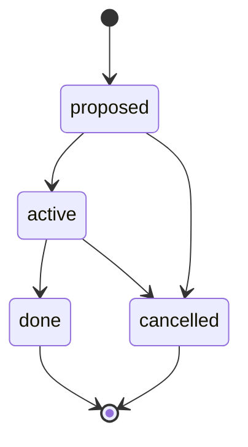
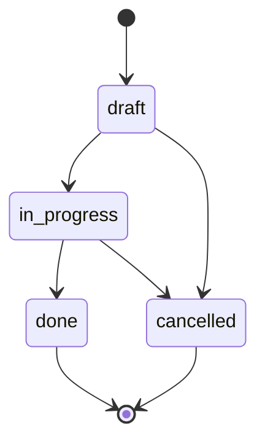
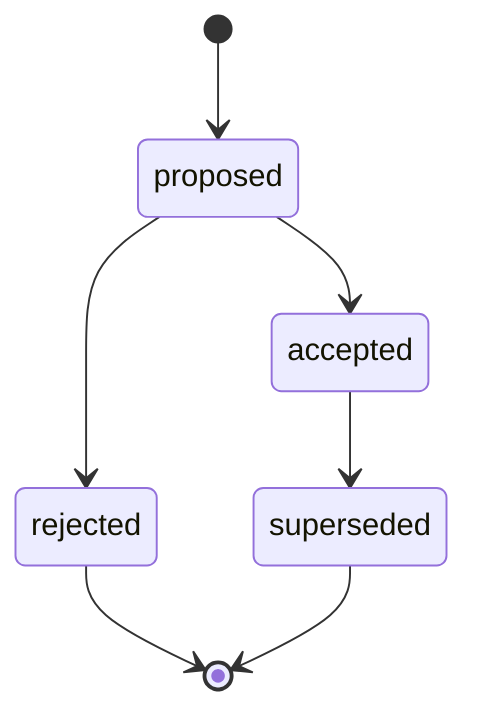
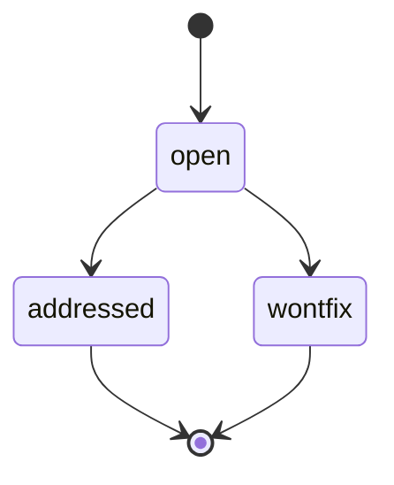
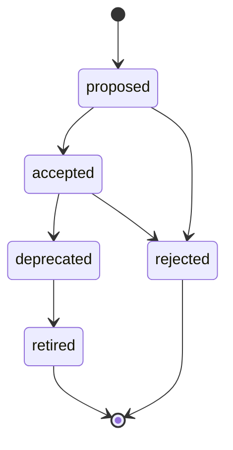
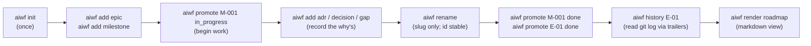

# aiwf — overview

This document is the longer-form companion to the [README](../../README.md). It walks through the entity model, the state machines for each kind, and how the verbs map onto a typical session.

If you only want to install and try the binary, the README is enough. Read this when you want a mental model of *why* the framework looks the way it does.

---

## The six entity kinds

Six kinds, hardcoded in Go. Each has a stable id format, a closed status set, and a small number of reference fields. Six is deliberately small: any change to this set is a kernel-level decision, not a quiet refactor.

| Kind | What it represents | ID format |
|---|---|---|
| **Epic** | A multi-month thread of work; the largest unit. | `E-NN` |
| **Milestone** | A specific deliverable inside an epic; the smallest unit `aiwf` plans against. | `M-NNN` |
| **ADR** | An architectural decision record — the "why" behind a load-bearing technical choice. | `ADR-NNNN` |
| **Gap** | A known shortfall — something the team has noticed is missing or wrong but hasn't yet decided how to address. | `G-NNN` |
| **Decision** | A non-architectural choice that's still worth recording (process, scope, tooling). | `D-NNN` |
| **Contract** | A machine-readable interface (OpenAPI, JSON Schema, .proto) plus its surrounding context. | `C-NNN` |

There is no `task` or `story` entity. The smallest unit `aiwf` tracks is a milestone — anything finer-grained lives in the milestone's body prose, in commits, or in the AI host's working memory, not in the framework. This is a deliberate non-goal: keeping `aiwf` from drifting into territory where issue trackers already win.

---

## State machines

Each kind has a closed status set and a small set of legal transitions. `aiwf promote <id> <status>` and `aiwf cancel <id>` are the only ways status changes — both validate the transition before writing.

### Epic



`proposed` is the default for `aiwf add epic`. `active` once work begins. `done` when every milestone in the epic is itself `done`. `cancelled` is the terminal-cancel target for `aiwf cancel`.

### Milestone



Milestones can declare `depends_on: [M-...]` to express ordering inside an epic. `aiwf check` enforces the resulting graph is a DAG.

### ADR



`superseded` requires a `superseded_by: ADR-NNNN` reference. The reverse-side `supersedes:` list on the new ADR is checked for mutual consistency (warning, not error). The chain is also enforced acyclic by `no-cycles`.

### Gap



A gap moves to `addressed` when one or more milestones (`addressed_by:`) close it. `wontfix` is the cancel target — it records the conscious choice not to fix.

### Decision


Same shape as ADR. The split between ADR and Decision is intentional: ADRs are the architectural record (durable, load-bearing, expected to be reviewed); Decisions are the lighter-weight log of process and scope calls. Same FSM, different audience.

### Contract



`rejected` is the cancel target. The contract entity is a registry record only — `id`, `title`, `status`, optional `linked_adrs`. Schemas, fixtures, and validator bindings live in `aiwf.yaml`'s `contracts:` block, not on the entity.

---

## A typical session

A natural rhythm with `aiwf` looks like this. The verbs and the commits they produce are deliberately a 1:1 mapping — the git history is the audit trail.



The pre-push hook installed by `aiwf init` runs `aiwf check` on every push, so an inconsistent tree never reaches the remote. The hook is the chokepoint that makes the framework's guarantees real — skills are advisory, validation is authoritative.

---

## Identity is stable

A common failure mode in markdown-based planning is that ids drift: someone renames a file, references in other files break. `aiwf` separates id (the primary key, in frontmatter) from slug (the display name, in the path):

```
work/epics/E-01-discovery-and-ramp-up/
├── epic.md           ← frontmatter has id: E-01
└── M-001-map-the-system.md
```

Renaming the slug (`aiwf rename E-01 ramp-up`) does a `git mv`. The id is unchanged; references in other files still resolve. The git log preserves rename history.

After a merge collision where two branches both allocate `M-007`, `aiwf reallocate work/epics/.../M-007-foo.md` picks the next free id, walks every entity's frontmatter and rewrites reference fields, and commits with both an `aiwf-entity:` (new id) and `aiwf-prior-entity:` (old id) trailer — so `aiwf history M-007` and `aiwf history M-008` both find the relevant events.

---

## What's deliberately not here

These are non-goals for the PoC. Each one was considered and deferred; see [`design-decisions.md`](design/design-decisions.md) for the full reasoning.

- **No separate event-log file.** `git log` is the event log; structured commit trailers (`aiwf-verb:`, `aiwf-entity:`, `aiwf-actor:`) make it queryable.
- **No graph projection or hash chain.** `aiwf check` reconstructs the graph in memory from the markdown files; there is no separate cache to invalidate.
- **No multi-host adapter generation.** Skills are materialized for Claude Code only. A second AI host can be added when there is one to integrate.
- **No `task` or `story` entity.** Issue trackers do that better. The framework's smallest unit is the milestone.
- **No FSM-as-YAML.** The six kinds and their statuses are hardcoded in Go. External configuration is the move when there's a second consumer who needs to customize — not before.
- **No GitHub Issues / Linear / Jira / Azure DevOps sync.** Out of scope for the PoC. A modular backend adapter is an explicit longer-term aspiration — see [README — Beyond the PoC](../../README.md#beyond-the-poc) — but no adapter is implemented today and the adapter interface is not yet designed.

---

## Where to go next

- [`README.md`](../../README.md) — install, quick start, full verb list.
- [`workflows.md`](workflows.md) — narrative walk-throughs (standard flow, realistic flow with ADRs/gaps/decisions, AI prompts).
- [`poc-plan.md`](plans/poc-plan.md) — the four working sessions that produced this code.
- [`design-decisions.md`](design/design-decisions.md) — the load-bearing decisions any change must preserve.
