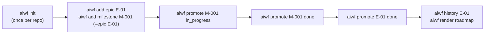
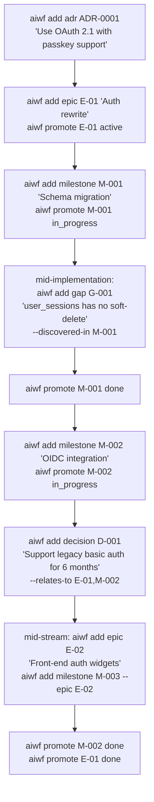

# Workflows

This document is the practical companion to [`overview.md`](overview.md). The overview explains *what* the entity kinds and their state machines are; this doc shows *how they combine in practice* over a real working session.

Three sections:

1. **The standard flow** — architect → plan an epic → plan milestones → implement → wrap. Linear, no detours.
2. **A realistic flow** — adds ADRs, decisions, gaps, and a mid-stream new epic. This is closer to what happens on a real project.
3. **AI prompts** — natural-language phrasings that map cleanly to verb sequences when you're driving `aiwf` through Claude Code (or any AI host with the materialized skills).

Throughout, command output is elided unless it matters. Every mutating verb produces exactly one git commit, so a six-step sequence below is six commits — that is the audit trail.

---

## 1. The standard flow

The shape of a typical project. Linear, no surprises.



### Step by step

**0. Set up the repo (once).**

```bash
git init -q
git config user.email peter@example.com
aiwf init                                 # writes aiwf.yaml, scaffolds dirs, installs pre-push hook
```

After `aiwf init` the repo has the conventional layout, a pre-push hook that runs `aiwf check`, and the materialized `aiwf-*` skills in `.claude/skills/` (gitignored).

**1. Plan the epic.**

```bash
aiwf add epic --title "Auth rewrite"
# → E-01-auth-rewrite/epic.md, status: proposed
```

The epic is `proposed` — the team has acknowledged it as work, but not yet committed to doing it. (`aiwf` doesn't pretend that "we said we'd do it" and "we're actually doing it" are the same thing.)

**2. Plan the first milestone.**

```bash
aiwf add milestone --epic E-01 --title "Schema migration"
# → E-01-auth-rewrite/M-001-schema-migration.md, status: draft
```

Milestones live inside their epic's directory. The frontmatter carries `parent: E-01`; `aiwf check` verifies that reference resolves to a real epic.

**3. Begin work on the epic and the milestone.**

```bash
aiwf promote E-01 active
aiwf promote M-001 in_progress
```

Two commits, two trailers — `aiwf history E-01` and `aiwf history M-001` will both pick these up.

**4. Implement.**

Now the team writes code. `aiwf` is silent during this phase: there is nothing for it to track until a status changes or a new entity needs to land.

**5. Wrap the milestone.**

```bash
aiwf promote M-001 done
```

The pre-push hook will block this commit if anything else in the tree is broken (a stale reference, a missing required field), so a green push is a green tree.

**6. Wrap the epic.**

```bash
aiwf promote E-01 done
```

For `aiwf` an epic can transition to `done` from `active`, regardless of whether every milestone underneath is itself `done`. The framework deliberately does not enforce roll-up — it is descriptive of the team's choice, not prescriptive of when "done" is allowed. (`aiwf check` warns if you cancel an epic with active milestones, but that warning is the only nudge.)

**7. Inspect.**

```bash
aiwf history E-01
# 2026-04-28T..  human/peter  add        "Auth rewrite"   abc1234
# 2026-04-28T..  human/peter  promote    proposed → active  def5678
# 2026-04-28T..  human/peter  promote    active → done  ghi9abc

aiwf render roadmap
# # Roadmap
#
# ## E-01 — Auth rewrite (done)
#
# | Milestone | Title | Status |
# |---|---|---|
# | M-001 | Schema migration | done |
```

---

## 2. A realistic flow

Linear flows are tidy but rare. A more honest scenario weaves in:

- **An ADR** before work starts, locking in an architectural choice.
- **A gap** discovered mid-implementation that needs to be tracked but is out of scope for the current milestone.
- **A decision** that arises mid-stream and needs recording even though it's not architectural.
- **A new epic added in flight** because the team realised the work is bigger than originally planned.

Same project — auth rewrite — but with the texture a real one carries.



### How each kind earns its place

**ADR (`ADR-0001`).** Architectural choice, durable, reviewed. "We're using OAuth 2.1 with passkeys" is exactly the kind of thing a successor to the team needs to find six months later. ADRs have a `superseded_by:` field so a future architectural reversal still preserves the original record:

```bash
aiwf add adr --title "Use OAuth 2.1 with passkey support"
# → docs/adr/ADR-0001-use-oauth-21-with-passkey-support.md, status: proposed
aiwf promote ADR-0001 accepted
```

**Gap (`G-001`).** A noticed shortfall that's *not* this milestone's job. Recording it as a gap keeps it visible without expanding the milestone's scope. The `discovered_in:` field anchors it to the milestone where it was surfaced, so `aiwf history M-001` includes it indirectly via the audit trail.

```bash
aiwf add gap --title "user_sessions table has no soft-delete" --discovered-in M-001
# → work/gaps/G-001-user-sessions-table-has-no-soft-delete.md, status: open
```

Later, when a milestone closes the gap, `aiwf` records the relationship via `addressed_by: [M-007]` on the gap, and `aiwf check` warns if a gap is marked `addressed` without an `addressed_by` set.

**Decision (`D-001`).** Process/scope choice — not architectural, but worth recording. "We'll support legacy basic auth for 6 months" is the kind of thing that disappears from the team's memory in a quarter and reappears as an angry question.

```bash
aiwf add decision --title "Support legacy basic auth for 6 months" --relates-to E-01,M-002
# → work/decisions/D-001-support-legacy-basic-auth-for-6-months.md, status: proposed
aiwf promote D-001 accepted
```

**Mid-stream new epic (`E-02`).** The team realised the front-end widgets need their own thread. Adding a second epic mid-flight is mechanically the same as adding the first; the framework doesn't mind:

```bash
aiwf add epic --title "Front-end auth widgets"
# → E-02-front-end-auth-widgets/epic.md, status: proposed
aiwf add milestone --epic E-02 --title "Login form refactor"
# → E-02-front-end-auth-widgets/M-003-login-form-refactor.md
```

The roadmap surfaces both epics; history queries are scoped per-id.

### Reading it back

```bash
aiwf history M-001
# add        "Schema migration"
# promote    draft → in_progress
# promote    in_progress → done

aiwf history G-001
# add        "user_sessions table has no soft-delete"

aiwf render roadmap
# ## E-01 — Auth rewrite (done)
# | M-001 | Schema migration  | done |
# | M-002 | OIDC integration  | done |
# ## E-02 — Front-end auth widgets (proposed)
# | M-003 | Login form refactor | draft |
```

ADRs, gaps, and decisions don't appear in the roadmap by design — the roadmap is a delivery view, not an everything view. Their lifecycle is still queryable via `aiwf history`.

---

## 3. AI prompts

The verbs above are for you. When you're working *through* an AI host (Claude Code with the `aiwf-*` skills materialized by `aiwf init`), you usually don't need to remember the verb syntax — you describe the intent in English and the AI picks the right command.

These are concrete examples of what to say. The AI's response is the verb sequence in the second column.

| You say | AI runs |
|---|---|
| "Let's start a new epic for the auth rewrite." | `aiwf add epic --title "Auth rewrite"` |
| "Plan three milestones under E-01: schema migration, OIDC integration, passkey rollout." | three `aiwf add milestone --epic E-01 --title "..."` calls |
| "Begin work on M-001." | `aiwf promote M-001 in_progress` (and possibly `aiwf promote E-01 active` if the epic is still `proposed`) |
| "Record an ADR for using OAuth 2.1 with passkey support." | `aiwf add adr --title "Use OAuth 2.1 with passkey support"` then optionally `aiwf promote ADR-0001 accepted` |
| "I noticed the user_sessions table has no soft-delete — that's not in scope here, just track it." | `aiwf add gap --title "user_sessions has no soft-delete" --discovered-in <current milestone>` |
| "Decide: we'll support legacy basic auth for 6 months. Relate it to E-01 and M-002." | `aiwf add decision --title "Support legacy basic auth for 6 months" --relates-to E-01,M-002` then `aiwf promote D-001 accepted` |
| "M-001 is wrapped, start M-002." | `aiwf promote M-001 done`, then `aiwf promote M-002 in_progress` |
| "Wrap up E-01." | `aiwf promote E-01 done` |
| "Cancel D-002, we changed our mind." | `aiwf cancel D-002` |
| "Show me what happened to E-01 over time." | `aiwf history E-01` |
| "Print the roadmap." | `aiwf render roadmap` (or `aiwf render roadmap --write` if you want it committed to `ROADMAP.md`) |
| "Renumber M-007 — we hit a merge collision." | `aiwf reallocate work/epics/<dir>/M-007-<slug>.md` (path form disambiguates the duplicate) |
| "Rename E-01's slug to 'auth-platform-rewrite'." | `aiwf rename E-01 auth-platform-rewrite` (id stays E-01) |
| "Validate the tree before I push." | `aiwf check` (the pre-push hook also does this on `git push`) |
| "Verify my install actually works." | `aiwf doctor --self-check` |

A few guardrails the AI applies automatically because the skills tell it to:

- It will never invent ids — `aiwf add` allocates them, the AI surfaces what was allocated.
- It will not auto-promote past `proposed` for ADRs/decisions; those benefit from a human "accept" beat.
- It will surface validation findings before pushing, not after.
- It will treat `aiwf check` errors as blockers; warnings are surfaced but not blocking.

If you want the AI to behave differently from this default — for example, "always auto-promote new ADRs to accepted because I'm flying solo" — say so once and the assistant will follow that for the session. Persistent-across-sessions changes go in the consumer repo's `CLAUDE.md`, which `aiwf init` seeds with a minimal template.

---

## Where to go next

- [`README.md`](../../README.md) — install, full verb list, validators.
- [`overview.md`](overview.md) — entity kinds, state-machine diagrams, what's deliberately out of scope.
- [`design-decisions.md`](design/design-decisions.md) — the load-bearing decisions any change must preserve.
